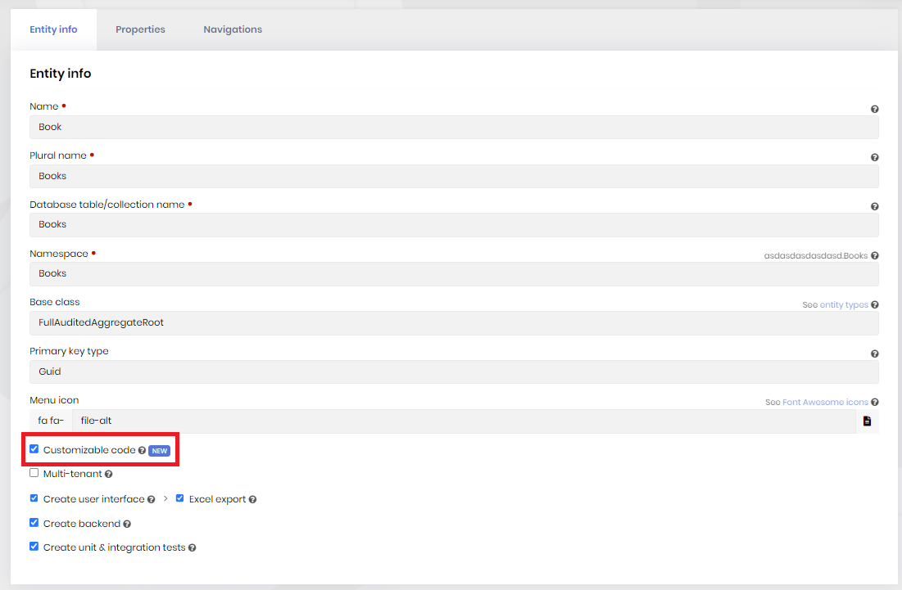
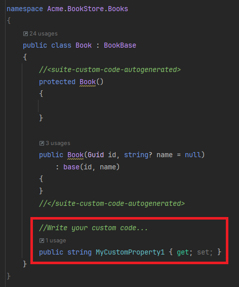
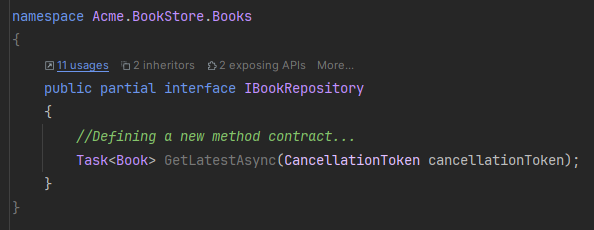
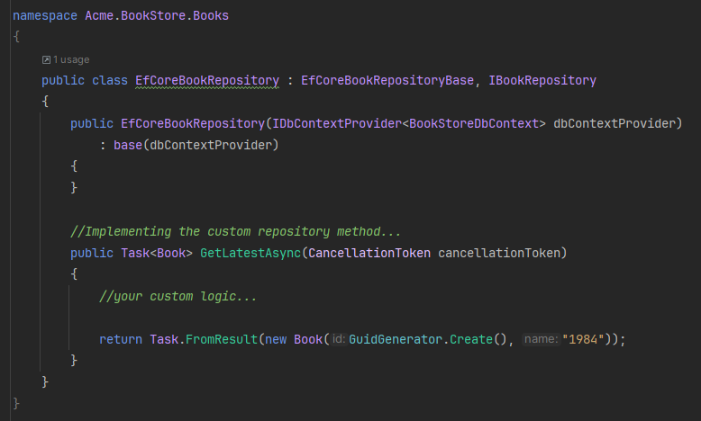
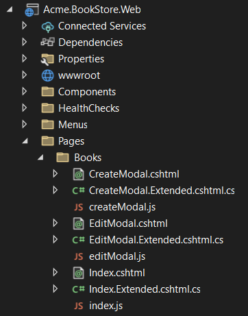
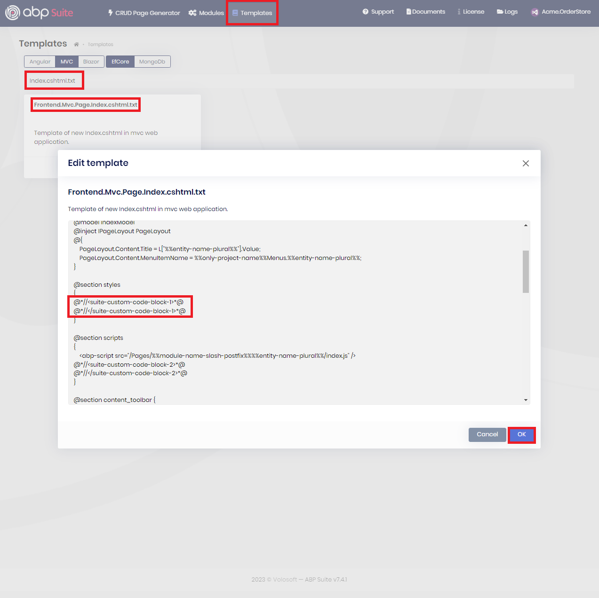
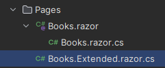
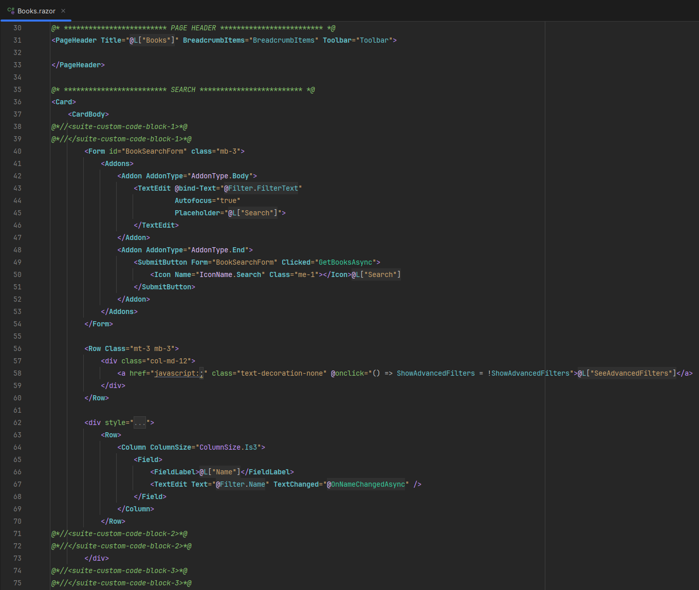
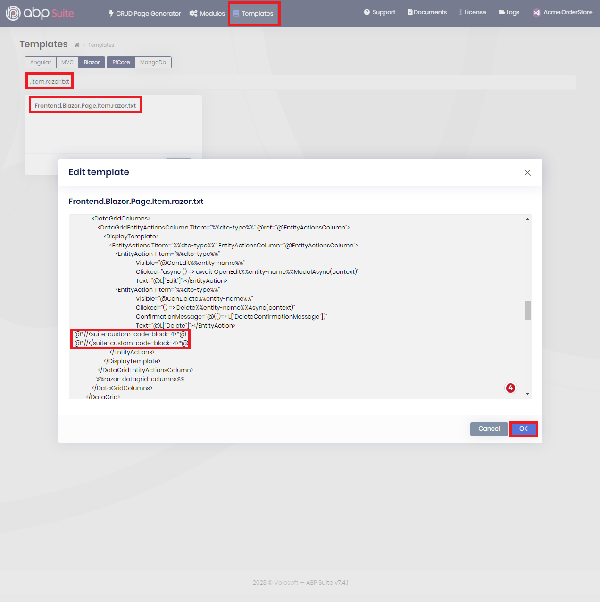

# Customizing the Generated Code

ABP Suite allows you to customize the generated code blocks and preserve your custom code changes in the next CRUD Page Generation. It specifies hook points to allow adding custom code blocks. Then, the code written by you to these hook points will be respected and will not be overridden in the next CRUD Page Generation.

## Enabling the Custom Code Support

To enable custom code support, you should check the _Customizable code_ option in the **CRUD Page Generation** page (it's selected by default). When you enable the custom code support, you will see some hook points in your application on both the backend and UI side.

## Backend - C# Side Customizations

On the C# Side, you'll be seeing some abstract classes and classes that derive from them (for entities, application services, interfaces, domain services, and so on ...) according to the template that you have created.

You can write your custom code in those classes (with `*.Extended.cs` extension) and the next time when you need to re-generate the entity, your custom code will not be overridden (only the base abstract classes will be re-generated and your changes on Suite will be respected).

For example, assume that you have created an entity named `Book` with the custom code support enabled. Then, your domain layer's folder structure will be as follows:

As you can see from the folder structure, some additional classes have been created along with the related entities, repository interface, and domain service classes (also for the application services, DTOs, controllers, etc.).

Custom code can be added to these classes, specifically within files named `*.Extended.cs`. By placing your custom code within these files, you can ensure that your changes will not be overridden during the next entity generation. 

> It's important to note that developers should avoid modifying the code between `<suite-custom-code-autogenerated>...</suite-custom-code-autogenerated>` placeholders, ensuring the constructor of the entity is regenerated when new properties are added.

Also, you can add new method contracts to the interfaces, which are specifically marked as `partial` classes and can be extended with additional methods and then you can implement the related method in your custom code classes (with the `*.Extended.cs` extension). 

You can see the example below, which demonstrates defining a new method in the `IBookRepository` interface (`IBookRepository.Extended.cs`) and implementing it in the custom repository class:

| `IBookRepository.Extended.cs` | `EfCoreBookRepository.Extended.cs` |
|---|---|
|  |  | 
| _defining a new method in the `IBookRepository` interface_ |  _implementing the method in the `EfCoreBookRepository` class_  |

> **Note**: Custom code support is not limited to domain layer components (entities, repository interfaces and managers), all of the things that explained in this section is also applicable for application services, DTOs, controllers and so on... 

## UI Side Customizations

For the UI side, ABP Suite provides convenient comment placeholders within pages for MVC, Blazor, and Angular UIs. These comment sections serve as hook points where you can add your custom code. By placing your custom logic with these hook points, you can enhance the UI to your needs without the fear of losing your changes during the next CRUD page generation.

### Customizations on MVC UI

If you have created your application with MVC UI, you can see the extended classes for _the code-behind classes of your pages_, under the `Pages` folder:

In these files, you can override the `OnGetAsync` and `OnPostAsync` methods and override the default behavior when a _GET_ or _POST_ request made to the URL of the page, or you can add more validations, customize the logic, or anything you want... In the next time, when you re-generate the entity, your changes on these files will be preserved/respected and won't be overridden.

Additionally, if you want to make changes on the page itself, you can see the hook-points (`<suite-custom-code-block-n>...</suite-custom-code-block-n>` placeholders) in the related `.cshtml` file and make your changes between those placeholders:

#### Adding New Custom Hook Points & Changing Their Places

ABP Suite defines hook points where you might want to make a customization. However, it also allows you to decide where hook points should be located in a certain file and change their places. If you want to change the place of the hook points, you can customize the related template and change places of the placeholders or add new placeholders.

As can be seen in the figure above, you can search the related template file, click the _Edit_ button on the card, then make your changes and click the _Ok_ button to save your changes for the template. Then, whenever you generate a CRUD page, the changes that you made in the template (adding or changing placeholders, for example) will be respected and Suite will use the customized template and place the placeholders where you have put them. Thanks to that, you have more freedom to make customization on the UI side and update the UI according to your needs.

> Note: Currently, up to 11 placeholder is allowed in the CRUD page generation and if you have more placeholder then the additional ones will be ignored. From ABP v8.0, up to 20 placeholders are allowed.

### Customizations on Blazor UI

If you have created your application with Blazor UI, you can see the extended classes for _the code-behind classes of your pages_, under the `Pages` folder:

In these files, you can add more validations, customize the logic, or do anything you want... In the next time, when you re-generate the entity, your changes on these files will be preserved/respected and won't be overridden.

Additionally, if you want to make changes on the page itself, you can see the hook-points (`<suite-custom-code-block-n>...</suite-custom-code-block-n>` placeholders) in the related `.razor` file and make your changes between those placeholders:

#### Adding New Custom Hook Points & Changing Their Places

ABP Suite defines hook points where you might want to make a customization. However, it also allows you to decide where hook points should be located in a certain file and change their places. If you want to change the place of the hook points, you can customize the related template and change the places of the placeholders or add new placeholders.

As can be seen in the figure above, you can search the related template file, click the _Edit_ button on the card, then make your changes and click the _Ok_ button to save your changes for the template. Then, whenever you generate a CRUD page, the changes that you made in the template (adding or changing placeholders, for example) will be respected and Suite will use the customized template and place the placeholders where you have put them. Thanks to that, you have more freedom to make customization on the UI side and update the UI according to your needs.

> Note: Currently, up to 11 placeholder is allowed in the CRUD page generation and if you have more placeholder then the additional ones will be ignored. From ABP v8.0, up to 20 placeholders are allowed.

### Customizations on Angular UI

//TODO: @mahmut-gundogdu can you mention the customizations on the Angular side?

## What's next?

[Accessing source code of modules](source-code.md)
