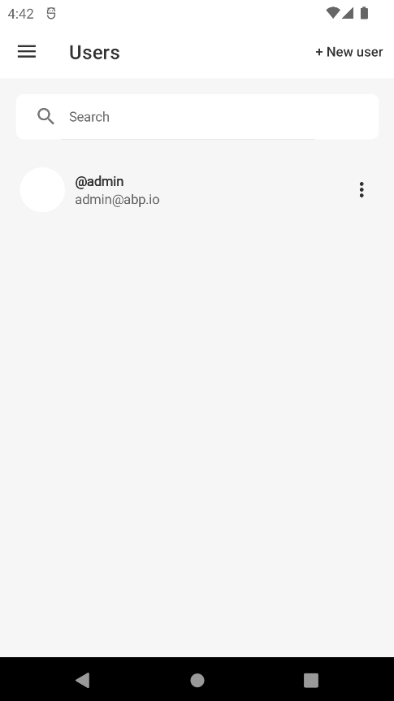
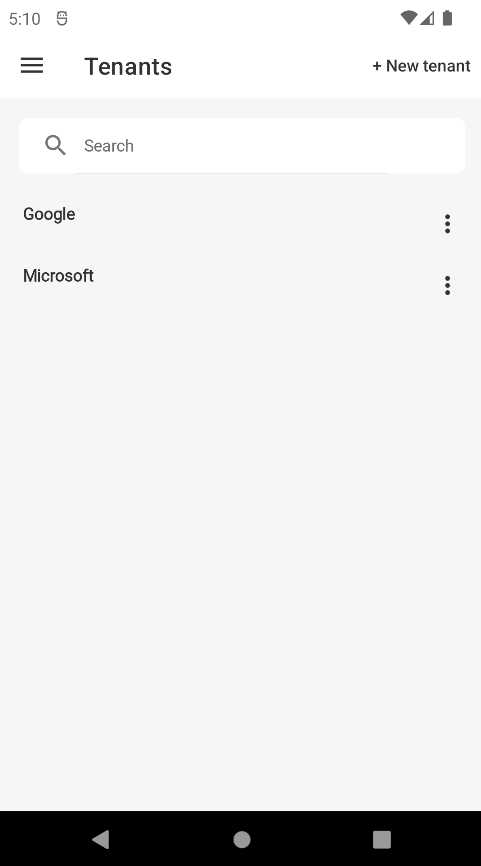
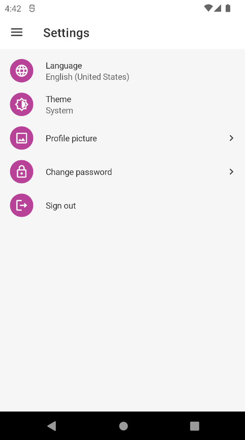

# Getting Started with the MAUI

ABP Commercial platform provides a basic [MAUI](https://docs.microsoft.com/en-us/dotnet/maui/what-is-maui) template to develop mobile applications **integrated to your ABP based backends**.

## Run the Server Application

Run the backend application described in the [getting started document](getting-started.md).

Open the `appsettings.json` in the `MAUI` project:

{{ if Tiered == "Yes" }}

* Make sure that `Authority` matches the running address of the `.AuthServer` project, `BaseUrl` matches the running address of the `.HttpApi.Host` project.

{{else}}

* Make sure that `Authority` and `BaseUrl` match the running address of the `.HttpApi.Host`, `.Web` or `.Blazor`(BlazorServer UI) projects.

{{ end }}

### Android

If you get the following error when connecting to the emulator or a physical phone, you need to set up port mapping.

```
Cannot connect to the backend on localhost. 
```

Open a command line terminal and run the `adb reverse` command to expose a port on your Android device to a port on your computer. For example:

`adb reverse tcp:44305 tcp:44305`

> You should replace "44305" with the real port.
> You should run the command after starting the emulator.

### iOS

The iOS simulator uses the host machine network. Therefore, applications running in the simulator can connect to web services running on your local machine via the machines IP address or via the localhost hostname. For example, given a local secure web service that exposes a GET operation via the /api/todoitems/ relative URI, an application running on the iOS simulator can consume the operation by sending a GET request to https://localhost:<port>/api/todoitems/.

> If the simulator is used from Windows with a remote connection, follow the [Microsoft's documentation](https://docs.microsoft.com/en-us/xamarin/cross-platform/deploy-test/connect-to-local-web-services#specify-the-local-machine-address) to setup a proper configuration.

#### Got could not find any available provisioning profiles for on ios error!

You need some extra steps, please check the [Microsoft document](https://learn.microsoft.com/en-us/xamarin/ios/get-started/installation/device-provisioning/)

#### Remote iOS Simulator for Windows

If you run the MAUI on a Mac agent, the remote iOS Simulator can't access the backend application running on Windows, you need to run the backend application on Mac or make the backend application internally.

## User Interface

The MAUI template consists of four pages: 
* **Homepage**: This is the welcome page of the application.
* **Users**: Management page for your application users. You can search, add, update, or delete users of your application.
* **Tenants**: Management page for your tenants. 
* **Settings**: Management page for your application settings. On this page, you can change **the current language**, **the profile picture**, **the current password**, or/and **the current theme**.

### Homepage


### Users Page



### Tenants Page



### Settings Page



## Run the Mobile Application

You can run the MAUI application through Visual Studio or any other IDE that supports MAUI. After the application is up and running, you can continue to develop your application based on this startup template.

You can examine the [Users Page](#users-page) or any other pre-defined page to see how to use CSharp Client Proxy to request backend API and consume the backend API in the same way in your application.

### Advanced

#### Validation

In the context of the MVVM pattern (Model-View-ViewModel), a view model is responsible to perform data validation and signal any validation errors to the view so that the user can correct them. In MAUI, to perform validation you should define the view model properties as of type `ValidatableObject<T>` and specify related validations rules.

To specify validation rules and add validation rules to a property, you can refer to [Microsoft's Validation documentation](https://learn.microsoft.com/en-us/dotnet/architecture/maui/validation).

## Publishing
There is no custom step for publishing your app. You can follow the official documentation for each platform:
- [Android](https://learn.microsoft.com/en-us/dotnet/maui/android/deployment/?view=net-maui-8.0)
- [iOS](https://learn.microsoft.com/en-us/dotnet/maui/ios/deployment/?view=net-maui-8.0)
- [Mac Catalyst](https://learn.microsoft.com/en-us/dotnet/maui/mac-catalyst/deployment/?view=net-maui-8.0)
- [Windows](https://learn.microsoft.com/en-us/dotnet/maui/windows/deployment/overview?view=net-maui-8.0)

ABP template uses **Secure Storage** to store access & refresh tokens. So, make sure you have completed the following section for each platform to use it in production:
- [Secure Storage - Get Started](https://learn.microsoft.com/en-us/dotnet/maui/platform-integration/storage/secure-storage?view=net-maui-8.0&tabs=android#get-started)
