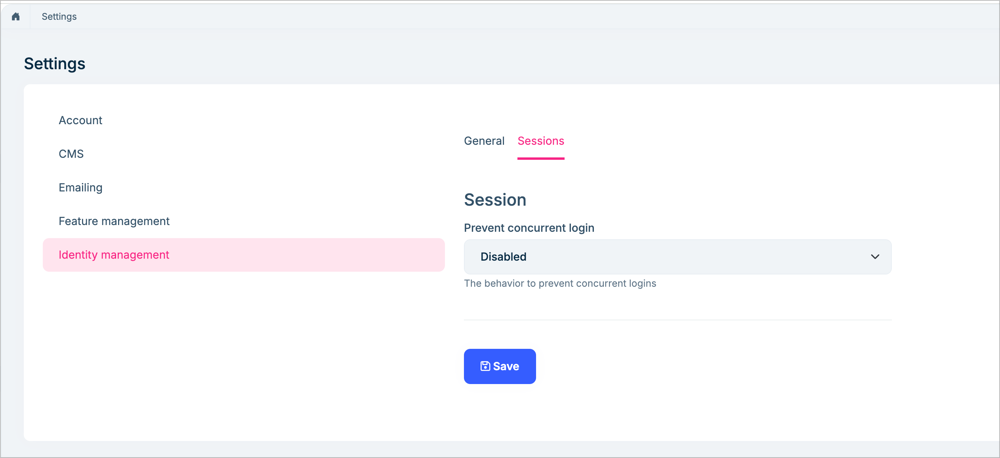

# Session Management

Session Management feature allows you to prevent concurrent login and manage user sessions.

## Prevent concurrent login

There is a setting in the identity section to prevent concurrent login. It has three options:

1. `Disabled`

    No restriction on concurrent login. This is the default.

2. `LogoutFromSameTypeDevices`

    Only one session of the same type can exist. 
    `Same type` means we can restrict single login with browser, but we may still can login with a mobile application without affecting the browser session. So, for each device type, we may allow a single login.

3. `LogoutFromAllDevices`

    All other sessions will be logged out when a new session is created.

## Manage user sessions

You can view and manage user sessions in the `Users` page of the Identity module.

Once you revoke a session, the user will be logged out.

## How it works

This feature is dependent on the [Dynamic Claims](https://docs.abp.io/en/abp/latest/Dynamic-Claims) feature of the ABP framework.

* The `IdentitySessionClaimsPrincipalContributor` will generate a random GUID as a `sessionid` to add the `ClaimsPrincipal`, This usually happens when logging in to get the user's claims.
* The `OnSignedIn` event of `Identity` and `ProcessSignIn` event of `OpenIddict` will get this `sessionid` and store it in the database(`IdentitySession` table)
* The `Dynamic Claims` system's `IdentitySessionDynamicClaimsPrincipalContributor` will ensure the `sessionid` exists or sign out.
* The `IdentitySessionChecker` will check the `sessionid` that exists and update the `LastAccessed` and `IpAddress`  to the cache.
* The `IdentitySessionManager` is used to get one or a list of sessions and update the` LastAccessed` and `IpAddress` from the cache to the database.
* The module will remove the session when logging out.
* The `IdentitySessionCleanupBackgroundWorker` will remove the inactive sessions.
* Once a new session has been created, we will remove the other sessions based on the `PreventConcurrentLogin` setting.
* The `IdentitySessionManager` is used to manage/maintain the sessions. Please use this class instead of directly using the repository.
