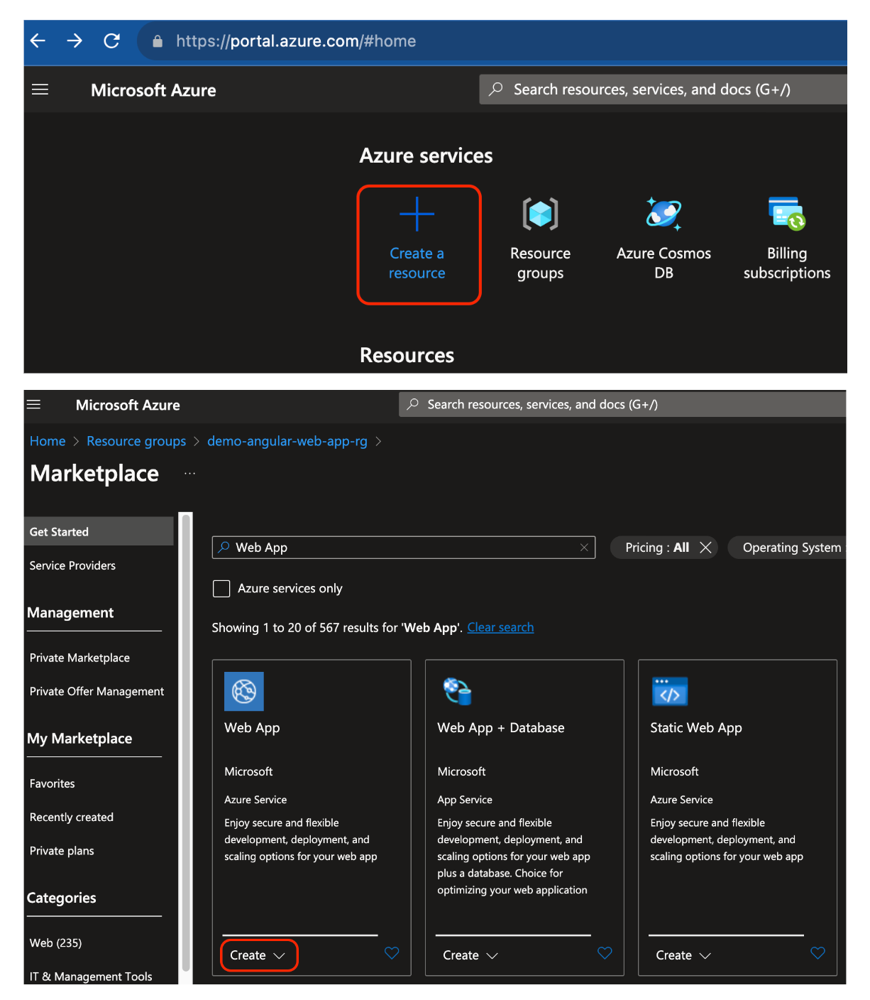
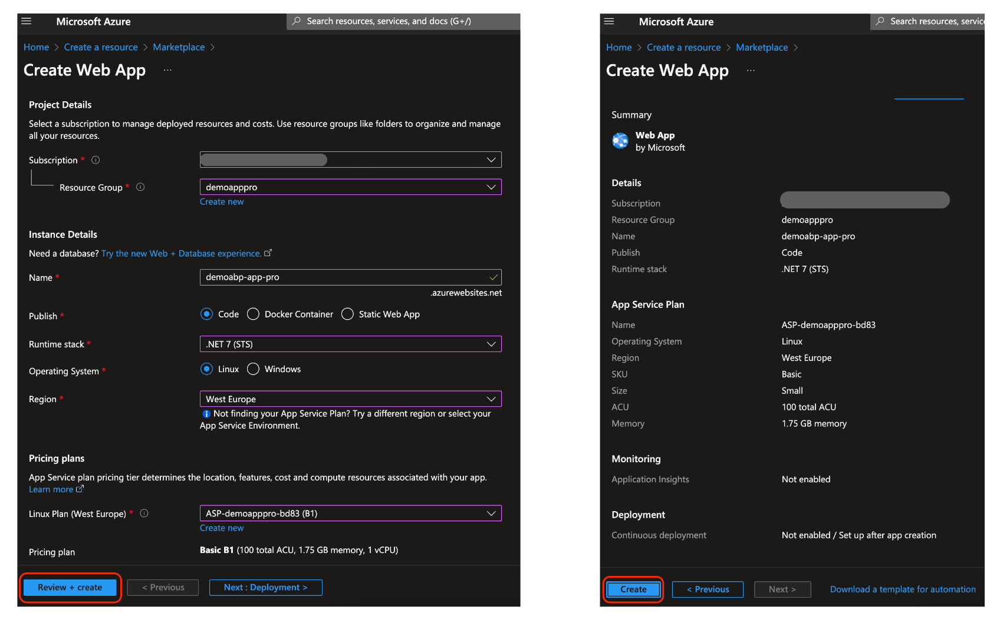
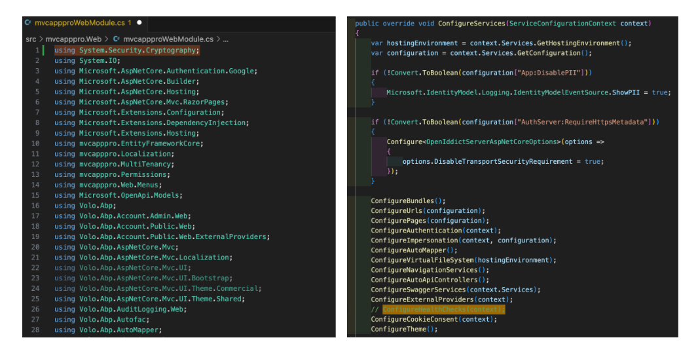
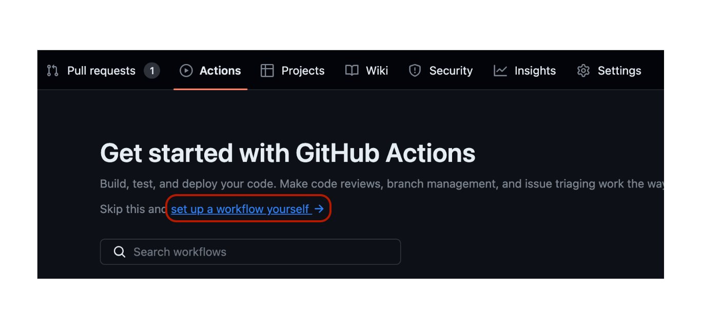
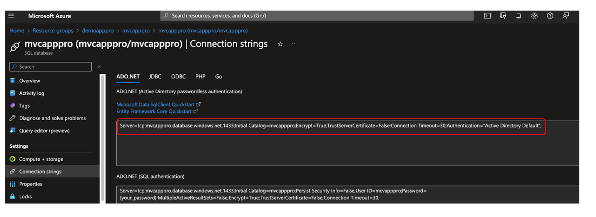
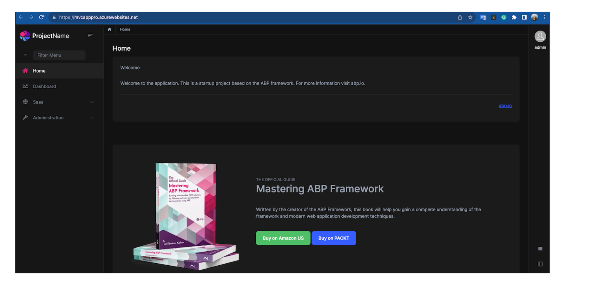

# Azure Deployment using Application Service

````json
//[doc-params]
{
    "UI": ["MVC", "Blazor", "BlazorServer", "NG"],
    "DB": ["EF", "Mongo"],
    "Tiered": ["Yes", "No"]
}
````

> This document assumes that you prefer to use **{{ UI_Value }}** as the UI framework and **{{ DB_Value }}** as the database provider. For other options, please change the preference on top of this document.

## Prerequisites

An active Azure account. If you don't have one, you can sign up for a [free account](https://azure.microsoft.com/en-us/free/)

Your abp **{{ UI_Value }}** project should be ready at github

**{{ DB_Value }}** database should be ready to use with your project


## Description of the process in three steps:

#### 1. Establishing the Azure Web App Service Environment

#### 2. Customizing the Configuration of Your ABP Application

#### 3. Deploying Your Application to Azure Web App Service


## Step 1: Establishing the Azure Web App Service Environment

To create a new Azure Web App Service, chose one of the following options:

- [Create a new Azure Web App Service using the Azure Portal](#create-a-new-azure-web-app-service-using-the-azure-portal)

- [Create a new Azure Web App Service using the Terraform Template](azure-web-app-terraform.md)

### Create a new Azure Web App Service using the Azure Portal

1. Log in to the [Azure Portal](https://portal.azure.com/).

2. Click the **Create a resource** button.

3. Search for **Web App** and select **Web App** from the results.

    

4. Click the **Create** button.

5. Fill in the required fields and click the **Review + create** button.

6. Click the **Create** button.

    

7. Wait for the deployment to complete.

    


## Step 2: Customizing the Configuration of Your ABP Application

1. Modify the `ConnectionStrings` in every location throughout your project, especially within the **./src/yourapp.DbMigrator/appsettings.json** and **./src/yourapp.Web/appsettings.json** files, to match your database connection string.

    ```json
    "ConnectionStrings": {
        "Default": "Server=yourserver;Database=yourdatabase;User Id=youruser;Password=yourpassword;"
    }
    ```

2. Modify the yourapp.Web url in every location throughout your project, especially within the **./src/yourapp.Web/appsettings.json** file, to match your Azure Web App Service url.

    ```json
    "App": {
        "SelfUrl": "https://yourapp.azurewebsites.net"
    }
    ```

3. Modify the **GetSigningCertificate** method in the **./src/yourapp.Web/yourappWebModule.cs** file

    ```csharp
    private X509Certificate2 GetSigningCertificate(IWebHostEnvironment hostingEnv, IConfiguration configuration)
    {
        var fileName = $"cert-signing.pfx";
        var passPhrase = configuration["MyAppCertificate:X590:PassPhrase"]; 
        var file = Path.Combine(hostingEnv.ContentRootPath, fileName);        
        if (File.Exists(file))
        {
            var created = File.GetCreationTime(file);
            var days = (DateTime.Now - created).TotalDays;
            if (days > 180)          
                File.Delete(file);
            else
                return new X509Certificate2(file, passPhrase,
                            X509KeyStorageFlags.MachineKeySet);
        }
        // file doesn't exist or was deleted because it expired
        using var algorithm = RSA.Create(keySizeInBits: 2048);
        var subject = new X500DistinguishedName("CN=Fabrikam Signing Certificate");
        var request = new CertificateRequest(subject, algorithm, 
                            HashAlgorithmName.SHA256, RSASignaturePadding.Pkcs1);
        request.CertificateExtensions.Add(new X509KeyUsageExtension(
                            X509KeyUsageFlags.DigitalSignature, critical: true));
        var certificate = request.CreateSelfSigned(DateTimeOffset.UtcNow, 
                            DateTimeOffset.UtcNow.AddYears(2));
        File.WriteAllBytes(file, certificate.Export(X509ContentType.Pfx, string.Empty));
        return new X509Certificate2(file, passPhrase, 
                            X509KeyStorageFlags.MachineKeySet);
    }
    private X509Certificate2 GetEncryptionCertificate(IWebHostEnvironment hostingEnv,
                                IConfiguration configuration)
    {
        var fileName = $"cert-encryption.pfx";
        var passPhrase = configuration["MyAppCertificate:X590:PassPhrase"]; 
        var file = Path.Combine(hostingEnv.ContentRootPath, fileName);
        if (File.Exists(file))
        {
            var created = File.GetCreationTime(file);
            var days = (DateTime.Now - created).TotalDays;
            if (days > 180)
                File.Delete(file);
            else
                return new X509Certificate2(file, passPhrase, 
                                X509KeyStorageFlags.MachineKeySet);
        }
        // file doesn't exist or was deleted because it expired
        using var algorithm = RSA.Create(keySizeInBits: 2048);
        var subject = new X500DistinguishedName("CN=Fabrikam Encryption Certificate");
        var request = new CertificateRequest(subject, algorithm, 
                            HashAlgorithmName.SHA256, RSASignaturePadding.Pkcs1);
        request.CertificateExtensions.Add(new X509KeyUsageExtension(
                            X509KeyUsageFlags.KeyEncipherment, critical: true));
        var certificate = request.CreateSelfSigned(DateTimeOffset.UtcNow,
                            DateTimeOffset.UtcNow.AddYears(2));
        File.WriteAllBytes(file, certificate.Export(X509ContentType.Pfx, string.Empty));
        return new X509Certificate2(file, passPhrase, X509KeyStorageFlags.MachineKeySet);
    }
    ```

4. In the same file, modify the **PreConfigureServices** method by ensuring the two methods above are called when your application is not running in a production environment
    
    ```csharp
        if (!hostingEnvironment.IsDevelopment())
        {
            PreConfigure<AbpOpenIddictAspNetCoreOptions>(options =>
            {
                options.AddDevelopmentEncryptionAndSigningCertificate = false;
            });
            PreConfigure<OpenIddictServerBuilder>(builder =>
            {
                // In production, it is recommended to use two RSA certificates, 
                // one for encryption, one for signing.
                builder.AddEncryptionCertificate(
                        GetEncryptionCertificate(hostingEnvironment, context.Services.GetConfiguration()));
                builder.AddSigningCertificate(
                        GetSigningCertificate(hostingEnvironment, context.Services.GetConfiguration()));
            });
        }
    ```

5. In the same file, add ```using System.Security.Cryptography;``` to the top of the file.

6. In the same file, comment ```ConfigureHealthChecks(context);``` in the **ConfigureServices** method.



7. Add a custom passphrase to your **appsettings.json** or Azure configuration:

    ```json
    "MyAppCertificate": {
    "X590": "[custom string]"
    }
    ```

## Step 3: Deploying Your Application to Azure Web App Service

### Deploying Your Application to Azure Web App Service using GitHub Actions

1. Create a new GitHub repository for your project if you don't have one.

2. Push your project to the new GitHub repository.

3. Navigate to the **Actions** tab of your GitHub repository.

4. Click the **set up a workflow yourself** button.

    

5. Copy this content to the opened file and commit it.

    ```yml
    # Docs for the Azure Web Apps Deploy action: https://github.com/Azure/webapps-deploy
    # More GitHub Actions for Azure: https://github.com/Azure/actions

    name: Build and deploy ASP.Net Core app to Azure Web App

    on:
    push:
        branches:
        - main
    workflow_dispatch:

    jobs:
    build:
        runs-on: ubuntu-latest

        steps:
        - uses: actions/checkout@v2

        - name: Set up .NET Core
            uses: actions/setup-dotnet@v1
            with:
            dotnet-version: '7.x'
            include-prerelease: true

        - name: Build with dotnet
            run: dotnet build --configuration Release

        - name: Run migrations
            run: dotnet run -- "${{ secrets.CONNECTION_STRING }}" # Set your connection string as a secret in your repository settings
            working-directory: ./src/yourapp.DbMigrator

        - name: dotnet publish
            run: dotnet publish -c Release -o ${{env.DOTNET_ROOT}}/myapp
            working-directory: ./src/yourapp.Web

        - name: Generate authserver.pfx
            run: dotnet dev-certs https -v -ep ${{env.DOTNET_ROOT}}/myapp/authserver.pfx -p 2D7AA457-5D33-48D6-936F-C48E5EF468ED

        - name: Upload artifact for deployment job
            uses: actions/upload-artifact@v2
            with:
            name: .net-app
            path: ${{env.DOTNET_ROOT}}/myapp

    deploy:
        runs-on: ubuntu-latest
        needs: build
        environment:
        name: 'Production'
        url: ${{ steps.deploy-to-webapp.outputs.webapp-url }}

        steps:
        - name: Download artifact from build job
            uses: actions/download-artifact@v2
            with:
            name: .net-app

        - name: Deploy to Azure Web App
            id: deploy-to-webapp
            uses: azure/webapps-deploy@v2
            with:
            app-name: 'yourapp' # Replace with your azure web app name
            slot-name: 'Production'
            publish-profile: ${{ secrets.AZUREAPPSERVICE_PUBLISHPROFILE }} # Set your Azure Web App publish profile as a secret in your repository settings
            package: .
    ```

7. Navigate to the **Settings** tab of your GitHub repository.

8. Click the **Secrets** button.
    
9. Click the **New repository secret** button.


10. Add the following secrets:

    - **CONNECTION_STRING**: The connection string of your database.
    
        Example of azure sql connection string:
    
    

    - **AZUREAPPSERVICE_PUBLISHPROFILE**: The publish profile of your Azure Web App Service. You can download it from the **Overview** tab of your Azure Web App Service.

    

11. Navigate to the **Actions** tab of your GitHub repository.

12. Click the **Deploy to Azure Web App** workflow.

    

13. Click the **Run workflow** button.

    

14. Navigate to the web app url to see the deployed application.

    

> If you are unsuccessful in deploying your application, you can check the logs of the deployment by clicking the **Deploy to Azure Web App** workflow and then clicking the **deploy-to-webapp** job.

> If deployment is successful, but you get an error when you navigate to the web app url, you can check the logs of the web app by clicking the **Logs** button on the **Overview** tab of your Azure Web App Service.

> Finally you have CI/CD pipeline for your application. Every time you push your code to the main branch, your application will be deployed to Azure Web App Service automatically.


## What's next?

- [Docker Deployment using Docker Compose](deployment-docker-compose.md)

- [IIS Deployment](deployment-iis.md)
