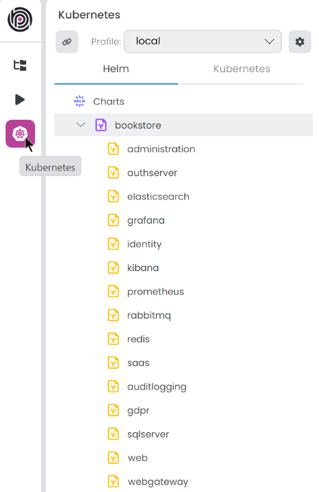

# ABP Studio: Working with Kubernetes

You can use the *Kubernetes* panel to manage your application(s) in a Kubernetes cluster. This panel is specifically designed for microservice projects, so you don't have to run all your microservice projects in the local environment. Instead, deploy them in a Kubernetes cluster and debug one or more projects locally. However, you can still use this panel for monolithic projects as well. Access it by clicking the *Kubernetes* button in the *ABP Studio* sidebar.

> Pre-set configurations are added when you create a project; check the *Kubernetes Configuration* in the *Additional Options* step. The project structure might vary based on your selection. For example, an MVC microservice project looks like the following. You can add or remove the charts as you wish.

## Prerequisites

The *Kubernetes* panel is available only in the [business and enterprise](https://commercial.abp.io/pricing) licenses. You need to install and configure the following tools to use the *Kubernetes* panel.

* [kubectl](https://kubernetes.io/docs/tasks/tools/install-kubectl/)
* [Helm](https://helm.sh/docs/intro/install/)
* [Docker Desktop](https://www.docker.com/products/docker-desktop)
* [NGINX Ingress Controller](https://kubernetes.github.io/ingress-nginx/deploy)

## Profile

You can create multiple profiles to manage different Kubernetes clusters or namespaces within the same cluster. A profile is a set of configurations that you can use to connect to a Kubernetes cluster. If you check the *Kubernetes Configuration* when you create a project in the *Additional Options* step, the *local* profile comes out of the box, including all projects chart. You can view all profiles in the combobox and change the current profile. To edit, click the gear icon located on the right side.

> When you change the current profile, it doesn't affect the *Charts* tree. The *Charts* section is related to the solution, not the profile. You can add or remove charts in the *Charts* section.

It opens the *Manage Kubernetes Profiles* window. You can edit/delete existing profiles or add a new one.

When you click *Add New Profile*, it opens the *New Profile* window. In the *Profile Info* tab you can provide an arbitrary profile name, which should be unique among the profiles. In the *Context* combobox, you'll see existing Kubernetes contexts. Choose one of them. Afterwards, provide a *Namespace* that should be unique among the each *Context*. When creating a new profile, it stores the JSON file at the specified path. For microservice projects, you can specify the path `abp-solution-path/etc/abp-studio/k8s-profiles`, or for other project types, use `abp-solution-path/etc/k8s-profiles` to adhere to the standard format.

In the *Metadata* tab, you can provide additional information about the profile. We're using this informations in our commands such as *Build Docker Image(s)*, *Install Chart(s)*. For example, *dotnetEnvironment* is mandatory for the *Install Chart(s)* command to determine the environment variable. You can also provide additional metadata by clicking the *Add Metadata* button.

