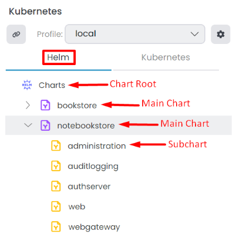

# ABP Studio: Working with Kubernetes

You can use the *Kubernetes* panel to manage your application(s) in a Kubernetes cluster. This panel is specifically designed for microservice projects, so you don't have to run all your microservice projects in the local environment. Instead, deploy them in a Kubernetes cluster and debug one or more projects locally. However, you can still use this panel for monolithic projects as well. Access it by clicking the *Kubernetes* button in the *ABP Studio* sidebar.

> Pre-set configurations are added when you create a project; check the *Kubernetes Configuration* in the *Additional Options* step. The project structure might vary based on your selection. For example, an MVC microservice project looks like the following. You can add or remove the charts as you wish.

## Prerequisites

The *Kubernetes* panel is available only in the [business and enterprise](https://commercial.abp.io/pricing) licenses. You need to install and configure the following tools to use the *Kubernetes* panel.

* [kubectl](https://kubernetes.io/docs/tasks/tools/install-kubectl/)
* [Helm](https://helm.sh/docs/intro/install/)
* [Docker Desktop](https://www.docker.com/products/docker-desktop)
* [NGINX Ingress Controller](https://kubernetes.github.io/ingress-nginx/deploy)

## Profile

You can create multiple profiles to manage different Kubernetes clusters or namespaces within the same cluster. A profile is a set of configurations that you can use to connect to a Kubernetes cluster. If you check the *Kubernetes Configuration* when you create a project in the *Additional Options* step, the *local* profile comes out of the box, including all project charts. You can view all profiles in the combobox and change the current profile. To edit, click the gear icon located on the right side.

> When you change the current profile, it doesn't affect the *Charts* tree. The *Charts* section is related to the solution, not the profile. You can add or remove charts in the *Charts* section.

It opens the *Manage Kubernetes Profiles* window. You can edit/delete existing profiles or add a new one.

When you click *Add New Profile* button, it opens the *New Profile* window. In the *Profile Info* tab you can provide an arbitrary profile name, which should be unique among the profiles. In the *Context* combobox, you'll see existing Kubernetes contexts. Choose one of them. Afterwards, provide a *Namespace* that should be unique among the each *Context*. When creating a new profile, it stores the JSON file at the specified path. For microservice projects, you can specify the path `abp-solution-path/etc/abp-studio/k8s-profiles`, or for other project types, use `abp-solution-path/etc/k8s-profiles` to adhere to the standard format.

In the *Metadata* tab, you can provide additional information about the profile. We use this information in our commands such as *Build Docker Image(s)* and *Install Chart(s)*. For example, *dotnetEnvironment* is mandatory for the *Install Chart(s)* command to determine the environment variable. You can also add more metadata by clicking the *Add* button. It collects all metadata from root to child and overrides existing values by hierarchy. For example, if you define two identical metadata in the profile and a chart, it uses the chart metadata. You can add metadata for the *Kubernetes Profile*, *Main Chart* and *Subcharts*.

In the *Secrets* tab, you can provide secrets for the profile. We use this information in our commands such as *wireGuardPassword*. Similar to the *Metadata* tab, you can add more secrets by clicking the *Add* button. It collects all secrets from root to child and overrides existing values by hierarchy.

You can add secrets to the *Global Secrets* by clicking *Tools* -> *Global Secrets* in the toolbar, *Solution Secrets* by clicking *Solution* -> *Manage Secrets* in *Solution Explorer* root context-menu, and *Kubernetes Profile* by *Add or Edit Profile* -> *Secrets tab* in *Kubernetes* panel. Due to security concerns, *Secrets* information is saved in the local file system, not in the solution file. Therefore, you can't share it with your team members by default.

To create a new profile in the *Profile Info* tab, *Name*, *Context*, and *Namespace* are enough. However, you should provide *dotnetEnvironment* metadata information to use the Install Chart(s) command. Click the *Save* button to create a new profile. It adds the profile to the combobox. Similarly, you can edit or delete an existing profile.

When you create a new profile, you should also create a `values.{chart.name}-{profile.name}.yaml` file in the `abp-solution-path/etc/helm/chart` folder to override default values. For example, *values.bookstore-staging.yaml* is used for the *bookstore* chart in the *staging* Kubernetes profile.

## Charts

In the *Helm* tab we have a tree view of all charts in the solution. There are three chart types: *Chart Root*, *Main Chart* and *Subchart*.

### Chart Root

It is the root of all main charts. You can have multiple main charts in the solution. To add a new chart to the solution, click the *Add Chart* button in the *Chart Root* context-menu. It opens the *Select Helm Chart* window. Pick the chart from the specified location and select the main helm chart. Store the helm chart in the `abp-solution-path/etc/helm/chart-name` folder; otherwise, commands won't work. Also, the main [chart name](https://helm.sh/docs/topics/charts/#the-chartyaml-file) and folder name should be the same. For example, if the main chart name is *notebookstore*, the folder name should be *notebookstore* as well. Similiar to creating new kubernetes profile, you should also create a `values.{chart.name}-{profile.name}.yaml` file in the `abp-solution-path/etc/helm/chart-name` folder to override default values. For example, *values.notebookstore-staging.yaml* is used for the *notebookstore* chart in the *staging* Kubernetes profile.

If you have multiple main charts, you can execute collective commands for all of them.

- `Build Docker Image(s)`: If build docker images available for subchart it builds all of them.
- `Install Chart(s)`: Installs all charts to selected profile.
- `Uninstall Chart(s)`: Uninstalls all charts from selected profile.
