# ABP Studio: Working with Kubernetes

You can use the *Kubernetes* panel to manage your application(s) in a Kubernetes cluster. This panel is specifically designed for microservice projects, so you don't have to run all your microservice projects in the local environment. Instead, deploy them in a Kubernetes cluster and debug one or more projects locally. However, you can still use this panel for monolithic projects as well. Access it by clicking the *Kubernetes* button in the *ABP Studio* sidebar.


> Pre-set configurations are added when you create a project; check the *Kubernetes Configuration* in the *Additional Options* step. The project structure might vary based on your selection. For example, an MVC microservice project looks like the one above. You can add or remove the charts as you wish.

## Prerequisites

The *Kubernetes* panel is available only in the [business and enterprise](https://commercial.abp.io/pricing) licenses. You need to install and configure the following tools to use the *Kubernetes* panel.

* [kubectl](https://kubernetes.io/docs/tasks/tools/install-kubectl/)
* [Helm](https://helm.sh/docs/intro/install/)
* [Docker Desktop](https://www.docker.com/products/docker-desktop) (Enable Kubernetes option if not working with a real cluster)
* [NGINX Ingress Controller](https://kubernetes.github.io/ingress-nginx/deploy)
* [mkcert](https://www.ibm.com/docs/en/fsmmn?topic=commands-mkcert)

## Profile

You can create multiple profiles to manage different Kubernetes clusters or namespaces within the same cluster. A profile is a set of configurations that you can use to connect to a Kubernetes cluster. If you check the *Kubernetes Configuration* when you create a project in the *Additional Options* step, the *local* profile comes out of the box, including all project charts. You can view all profiles in the combobox and change the current profile. To edit, click the gear icon located on the right side.


> When you change the current profile, it doesn't affect the *Charts* tree. The *Charts* section is related to the solution, not the profile. You can add or remove charts in the [Charts](#charts) section.

It opens the *Manage Kubernetes Profiles* window. You can edit/delete existing profiles or add a new one.


When you click *Add New Profile* button, it opens the *New Profile* window. In the *Profile Info* tab you can provide an arbitrary profile name, which should be unique among the profiles. In the *Context* combobox, you'll see existing Kubernetes contexts. Choose one of them. Afterwards, provide a *Namespace* that should be unique among the each *Context*. When creating a new profile, it stores the JSON file at the specified path. For microservice projects, you can specify the path `abp-solution-path/etc/abp-studio/k8s-profiles`, or for other project types, use `abp-solution-path/etc/k8s-profiles` to adhere to the standard format.


In the *Metadata* tab, you can provide additional information about the profile. We use this information in our commands such as *Build Docker Image(s)* and *Install Chart(s)*. For example, *dotnetEnvironment* is mandatory for the *Install Chart(s)* command to determine the environment variable. You can also add more metadata by clicking the *Add* button. It collects all metadata from root to child and overrides existing values by hierarchy. For example, if you define two identical metadata in the profile and a chart, it uses the chart metadata. You can add metadata for the [Kubernetes Profile](#profile), [Main Chart](#main-chart) and [Subchart](#subchart).


In the *Secrets* tab, you can provide secrets for the profile. We use this information in our commands such as *wireGuardPassword*. Similar to the *Metadata* tab, you can add more secrets by clicking the *Add* button. It collects all secrets from root to child and overrides existing values by hierarchy.

You can add secrets to the *Global Secrets* by clicking *Tools* -> *Global Secrets* in the toolbar, *Solution Secrets* by clicking *Solution* -> *Manage Secrets* in *Solution Explorer* root context-menu, and *Kubernetes Profile* by *Add or Edit Profile* -> *Secrets tab* in *Kubernetes* panel. Due to security concerns, *Secrets* information is saved in the local file system, not in the solution file. Therefore, you can't share it with your team members by default.

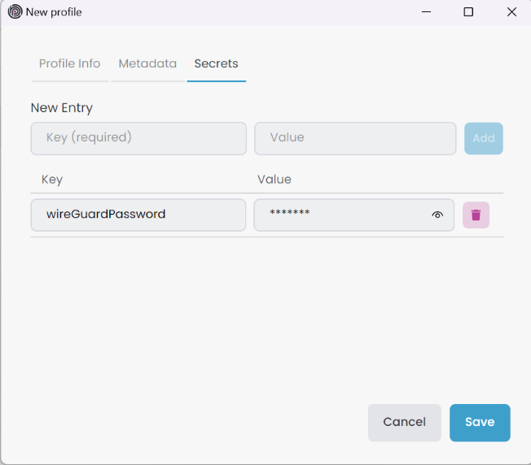

To create a new profile in the *Profile Info* tab, *Name*, *Context*, and *Namespace* are enough. However, you should provide *dotnetEnvironment* metadata information to use the Install Chart(s) command. Click the *Save* button to create a new profile. It adds the profile to the combobox. Similarly, you can edit or delete an existing profile.

When you create a new profile, you should also create a `values.{chart.name}-{profile.name}.yaml` file in the `abp-solution-path/etc/helm/chart` folder to override default values. For example, *values.bookstore-staging.yaml* is used for the *bookstore* chart in the *staging* Kubernetes profile.

## Charts

In the *Helm* tab we have a tree view of all charts in the solution. There are three chart types: *Chart Root*, *Main Chart* and *Subchart*.


### Chart Root

It is the root of all main charts. You can have multiple main charts in the root. To add a new chart to the root, click the *Add Chart* button in the *Chart Root* context-menu. It opens the *Select Helm Chart* window. Pick the chart from the specified location and select the main helm chart. Store the helm chart in the `abp-solution-path/etc/helm/chart-name` folder; otherwise, commands won't work. Also, the main [chart name](https://helm.sh/docs/topics/charts/#the-chartyaml-file) and folder name should be the same. For example, if the main chart name is *notebookstore*, the folder name should be *notebookstore* as well. Similiar to creating new kubernetes profile, you should also create a `values.{chart.name}-{profile.name}.yaml` file in the `abp-solution-path/etc/helm/chart-name` folder to override default values. For example, *values.notebookstore-staging.yaml* is used for the *notebookstore* chart in the *staging* Kubernetes profile.

If you have multiple main charts, you can execute collective commands for all of them. To do that, right-click the *Chart Root* from the context-menu. The following options are available for the *Chart Root*.

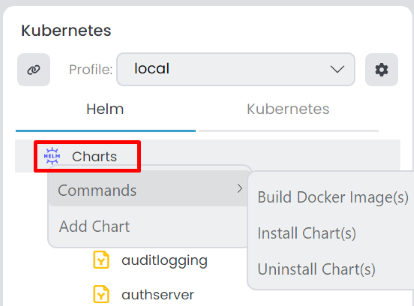

- `Commands`: You have several options to execute commands for all main charts.
  - `Build Docker Image(s)`: If build docker images available for subcharts it builds all of them.
  - `Install Chart(s)`: Installs all charts to selected profile.
  - `Uninstall Chart(s)`: Uninstalls all charts from selected profile.
- `Add Chart`: It opens the *Select Helm Chart* window. Pick the chart from the specified location and select the main helm chart to add a new main chart to the root.

### Main Chart

It is the root of all subcharts. When you add a new main chart to the root, it is automatically added with subcharts related to the main chart. Right click the main chart and select the command from the context-menu. The following options are available for the *Main Chart*.


- `Commands`: You have several options to execute commands for the main chart. 
  - `Build Docker Image(s)`: If build docker images are available for subcharts, it builds all docker images for the selected main chart.
  - `Install Chart(s)`: Installs the selected chart to the current profile.
  - `Uninstall Chart(s)`: Uninstalls the selected chart from the current profile.
- `Properties`: It opens the *Chart Properties* window. You can see the chart information in the *Chart Info* tab. In the *Metadata* tab, you can add metadata for the selected main chart. It overrides the metadata in the profile. In the *Kubernetes Services* tab, you can relate a Kubernetes service with the main chart; however, since the main chart usually doesn't create kubernetes service, we can leave it empty.
- `Refrest Sub Charts`: Refreshes the subcharts of the selected main chart.
- `Open With`: You can open the selected chart with *Visual Studio Code* or *File Explorer*.
- `Remove`: Removes the selected main chart from the solution.

### Subchart

A subchart is a component associated with a main chart. When you add a new main chart to the root, it is automatically added with subcharts related to the main chart. Subcharts has specific configurations and functionalities that contribute to the overall functionality of the main chart. Right click the subchart and select the command from the context-menu. The following options are available for the *Subchart*.

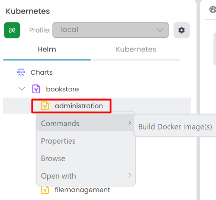

- `Commands`
  - `Build Docker Image(s)`: Builds docker image for the selected subchart. It's visible only if the subchart has *projectPath*, *imageName* and *projectType* metadata. *Project Type* only accept `angular` or `dotnet` values. It builds the docker image with the specified *imageName* and *projectPath*.
- `Properties`: It opens the *Chart Properties* window. You can see the chart information in the *Chart Info* tab. In the *Metadata* tab, you can add metadata for the selected subchart. It overrides the metadata in the profile and the main chart. In the *Kubernetes Services* tab, you can relate a Kubernetes service with the subchart; with that way you can see the *Browse* option in the context-menu when you connected to Kubernetes cluster.
- `Browse`: It opens the [browser](./monitoring-applications.md#browse) and navigates to the Kubernetes service URL. It's visible only if the subchart *Kubernetes Services* regex patterns matches with the [Kubernetes service](https://kubernetes.io/docs/concepts/services-networking/service/).
- `Open With`: You can open the selected subchart with *Visual Studio Code* or *File Explorer*.

#### Adding a New Subchart

When you add a new [microservice module](./solution-explorer.md#adding-a-new-microservice-module) to your solution, you should also create a subchart for it. However, the module type doesn't matter. Similarly, when you want to create a subchart for any reason, you can follow these steps:

- Open the main chart with *Visual Studio Code*.
- Create a folder in the *charts* folder.
- Edit the folder files based on your needs.
- After editing, the subchart template is completed; open ABP Studio and *Refresh Sub Charts* in the context-menu of the main chart. You can see the new subchart in the *Charts* tree.
- If the added subchart has *projectPath*, *imageName*, and *projectType* metadata, you can *Build Docker Image* for the subchart.
- If the added subchart has *Kubernetes Services* regex patterns, you can *Browse* the Kubernetes service when you are connected to the Kubernetes cluster.

## Connecting to a Kubernetes Cluster

After we *Build Docker Image(s)* and *Install Chart(s)*, we can connect to the Kubernetes cluster. To do that click the *Chain* icon or the *Connect* button in the *Kubernetes* tab to establish a connection with the selected Kubernetes cluster. During the initial connection, it may take a while to prepare; you can monitor the progress in the [Background Tasks](./overview.md#background-tasks) panel.

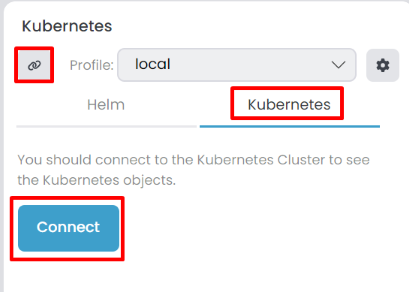

While connected, changing the current profile is not possible. Existing application services in the *Kubernetes* tab become visible when connected. To *Disconnect* you can click the *Chain* icon.


When you are connecting to a Kubernetes cluster, it automatically installs the WireGuard VPN to the Kubernetes cluster for a safe connection. You can specify the *wireGuardPassword* in the *Kubernetes Profile* -> *Secrets* tab or at a higher level such as *Solution Secrets* or *Global Secrets*. If you don't provide a password, it generates a random password and stores it in the *Kubernetes Profile* -> *Secrets*. However, if you try to connect to a cluster that already installed WireGuard VPN, then you should give the same password; otherwise, it won't connect. To see the random password, you can click the *eye* icon in the *Kubernetes Profile* -> *Secrets* tab.

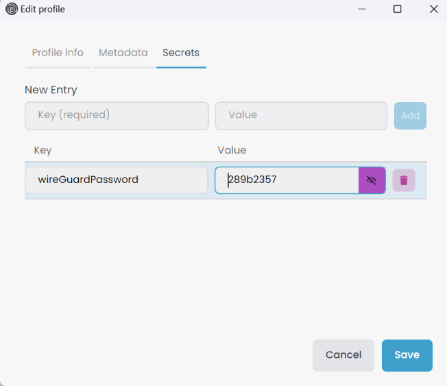

Since we're using the WireGuard VPN to connect to the Kubernetes cluster, we automatically append the Kubernetes services to your [hosts](https://en.wikipedia.org/wiki/Hosts_(file)) file. This enables seamless access to services, including [ClusterIP](https://kubernetes.io/docs/concepts/services-networking/service/#type-clusterip) types, using the specified *Kubernetes Service* names. For example, in this scenario, connecting to the SQL Server can be done with the server name `bookstore-local-sqlserver` via tools like [SQL Server Management Studio (SSMS)](https://learn.microsoft.com/en-us/sql/ssms/sql-server-management-studio-ssms). The default `sa` password for the SQL server is set to `myPassw@rd`.


After we connect to the SQL Server, we can see the databases in the *Object Explorer* panel. 

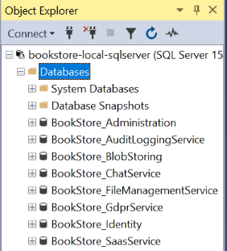

When connected to a Kubernetes cluster, applications establish a connection and begin sending [telemetry information](./monitoring-applications.md#collecting-telemetry-information) to ABP Studio. In the [Monitoring](./monitoring-applications.md#overall) panel, you can easily check the applications *State* and other details. Moreover, within the [Solution Runner](./running-applications.md) panel, look for the *Chain* icon with *(external)* information.


Upon disconnection from the cluster, we clean up the hosts file, excluding ingress hosts. This way, you can still access ingress hosts through your browser. For example, in this scenario, we can visit the `https://bookstore-local-web`.

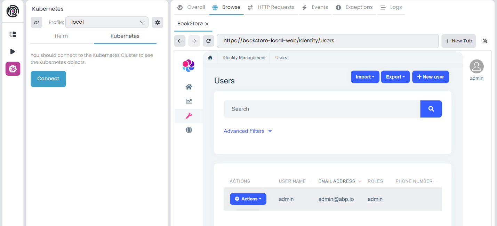

> When you list the services in the Kubernetes cluster with the `kubectl get svc` command, you should see the *abp-wg-easy* and *abp-wg-easy-vpn* services. After a while, if the *EXTERNAL-IP* is still *pending*, then it can't connect to the cluster. This could be caused by if you try to install the WireGuard VPN to a Docker Desktop Kubernetes cluster more than once. You can delete the previous WireGuard VPN by running the `helm uninstall abp-wg-easy` command in the previous namespace.

> Connecting to the Kubernetes cluster is limited to one instance of ABP Studio at a time. Trying to connect with another instance simultaneously won't work as expected.

### Intercept a Service

One of the best sides of the Kubernetes panel is that you can intercept a service. With this way you can debug and develop your specific application(s) without running all services in the local environment. To intercept a service, right click the service and select *Enable Interception* from the context-menu.

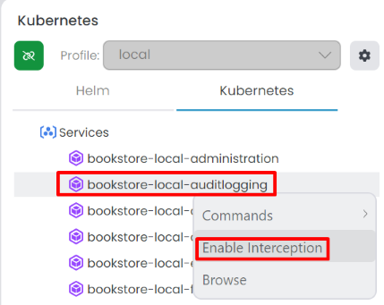

When intercepting a service, it start the interception process in the [background](./overview.md#background-tasks). After completion, you should see the *Intercept* icon next to the service name.

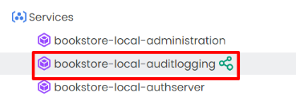

After intercepting the service, all requests to the service are redirected to the local environment. For example, in this scenario, the `bookstore-local-auditlogging` service is intercepted. When attempting to visit `https://bookstore-local-web/AuditLogs` in the browser, a *Bad Gateway* exception occurs because the `bookstore-local-auditlogging` service is not running in the local environment. To resolve this, open the `Acme.BookStore.AuditLoggingService` .NET solution in your IDE (e.g., Visual Studio), set `Acme.BookStore.AuditLoggingService` as the startup project, and run it (using F5 for debug mode or CTRL+F5 to run it without debugging).

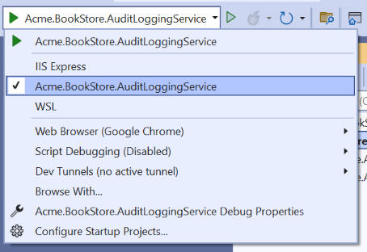

> You should start the application with Kestrel, not IIS Express. Otherwise, it won't work as expected. To do that, choice the *Acme.BookStore.AuditLoggingService* launch profile in your IDE.

After the application start on your local machine, revisit the Audit Logging page in the application, and you'll notice that it works as expected. ABP Studio handles the configuration of your machine and the application, allowing it to operate seamlessly as if it were inside the Kubernetes cluster.

Utilizing ABP Studio's interception feature, you have the flexibility to run the entire solution in a Kubernetes cluster while running only a single (or a few) services on your local machine using your IDE. This approach allows you to concentrate on running, testing, and debugging your service without concerning yourself with the configuration and launch details of the rest of the system.

You can disable interception by right clicking the service and selecting *Disable Interception* from the context-menu. Disconnecting from the Kubernetes cluster automatically disables all interceptions. 

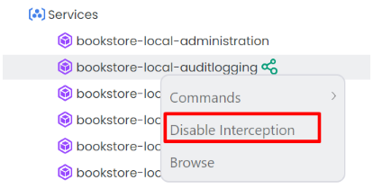

> When you debug the intercepted application if you're getting the `Volo.Authorization:010001 (Authorization failed! Given policy has not granted.)` exception, you should run the `create-tls-secret.ps1` script in the `abp-solution-path/etc/helm` folder. It creates self-signed certificates for the applications and adds them to the Kubernetes cluster. After that, you should restart the application.

### Redeploy a Chart

After you made some changes on your project, you can redeploy the chart to the Kubernetes cluster. To do that, right click the service  and select *Redeploy* from the context-menu. It builds the docker image for selected project and installs it again.

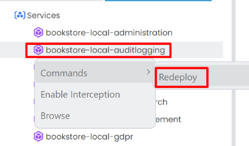

## Advanced Topics

### Adding a Custom Command

Custom commands can be added to both the *Helm* and *Kubernetes* tabs within the *Kubernetes* panel. For instance, when [redeploy](#redeploy-a-chart) a chart, it involves building the Docker image and reinstalling it. However, if you are working with a different Kubernetes cluster than Docker Desktop, you'll need to push the Docker image to the registry before the installation process. This can be achieved by incorporating a custom command into the *Kubernetes services*. Custom commands can be added to the *Chart Root*, *Main Chart*, and *Subchart* in the *Helm* tab, as well as to the *Service* in the *Kubernetes* tab.

To do that, open the ABP Solution (*.abpsln*) file with *Visual Studio Code* it's a JSON file and you'll see the existing commands in the `commands` section. Before adding a new command, create a powershell script in the `abp-solution-path/etc/helm` folder. For example, we create a `push-image.ps1` script to push the docker image to the registry. Then, add the following command to the `commands` section.

```JSON
    "kubernetesRedeployWithPushImage": { 
      "triggerTargets": [
        "KUBERNETES_SERVICE"
      ],
      "executionTargets": [
        "KUBERNETES_SERVICE"
      ],
      "displayName": " Redeploy with Push Image",
      "workingDirectory": "etc/helm",
      "terminalCommand": "./build-image.ps1 -ProjectPath {{chart.metadata.projectPath}} -ImageName {{chart.metadata.imageName}} -ProjectType {{chart.metadata.projectType}} &&& ./push-image.ps1 -ImageName {{chart.metadata.imageName}} &&& ./install.ps1 -ChartName {{mainChart.name}} -Namespace {{profile.namespace}} -ReleaseName {{mainChart.name}}-{{profile.name}} -DotnetEnvironment {{mainChart.metadata.dotnetEnvironment}}",
      "requireConfirmation": "true",
      "confirmationText": "Are you sure to redeploy with push image the related chart '{{chart.name}}' for the service '{{name}}'?",
      "condition": "{{chart != null && chart.metadata.projectPath != null && chart.metadata.imageName != null && chart.metadata.projectType != null}}"
    }
```

Once the command is added, reload the solution from *File* -> *Reload Solution* in the toolbar. After reloading, you will find the *Redeploy with Push Image* command in the context-menu of the service.


The JSON object has the following properties:

- `triggerTargets`: Specifies the trigger targets for the command. The added command will appear in these targets. You can add one or more trigger targets, accepting values such as *HELM_CHARTS_ROOT*, *HELM_MAIN_CHART*, *HELM_SUB_CHART* and *KUBERNETES_SERVICE*.
- `executionTargets`: Specifies the execution targets for the command. When executing the command on a root item, it will recursively execute the command for all children. Acceptable values include *HELM_CHARTS_ROOT*, *HELM_MAIN_CHART*, *HELM_SUB_CHART*, and *KUBERNETES_SERVICE*.
- `displayName`: Specifies the display name of the command.
- `workingDirectory`: Specifies the working directory of the command. It's relative to the solution path.
- `terminalCommand`: Specifies the terminal command for the custom command. The `&&&` operator can be used to run multiple commands in the terminal. Utilize the [Scriban](https://github.com/scriban/scriban/blob/master/doc/language.md) syntax to access input data, which varies based on the execution target.
- `requireConfirmation`: Specifies whether the command requires confirmation message before execution. Acceptable values include *true* and *false*.
- `confirmationText`: Specifies the confirmation text for the command. Utilize the [Scriban](https://github.com/scriban/scriban/blob/master/doc/language.md) syntax to access input data, which varies based on the execution target.
- `condition`: Specifies the condition for the command. If the condition returns *false*, it skips the current item and attempts to execute the command for the next item or child item. Utilize the [Scriban](https://github.com/scriban/scriban/blob/master/doc/language.md) syntax to access input data, which varies based on the execution target.

You can use the following variables in the scriban syntax based on the execution target:
  - `HELM_CHARTS_ROOT`: *profile*, *metadata*, *secrets*
  - `HELM_MAIN_CHART`: *profile*, *chart*, *metadata*, *secret*
  - `HELM_SUB_CHART`: *profile*, *chart*, *metadata*, *secret*
  - `KUBERNETES_SERVICE`: *name*, *profile*, *mainChart*, *chart*, *metadata*, *secret*
