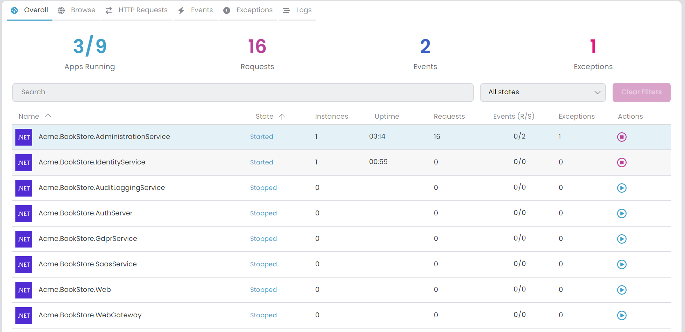

# ABP Studio: Monitoring Applications

ABP Studio offers a comprehensive centralized monitoring solution, enabling you to oversee all applications from a single interface. To see the monitoring tabs you can select the [Solution Runner](./running-applications.md) or *Kubernetes* from the left menu, monitoring tabs are automatically opened in the center. You can start the applications for monitoring. Various monitoring options are available, including [Overall](#overall), [Browse](#browse), [HTTP Requests](#http-requests), [Events](#events), [Exceptions](#exceptions), [Logs](#logs). 


## Collecting Telemetry Information

There are two application [types](./running-applications.md#abp-studio-running-applications): C# and CLI. Only C# applications can establish a connection with ABP Studio and transmit telemetry information via the `Volo.Abp.Studio.Client.AspNetCore` package. Upon starting C# applications, they attempt to establish a connection with ABP Studio. When connection successful, you should see a chain icon next to the application name in [Solution Runner](./running-applications.md#run-1). Applications can connect the ABP Studio with *Solution Runner* -> *C# Application* -> *Run* -> *Start* or  from an outside environment such as debugging with Visual Studio. Additionally, they can establish a connection from a Kubernetes Cluster through the ABP Studio [Kubernetes Integration: Connecting to the Cluster](./quick-starts/microservice.md#kubernetes-integration-connecting-to-the-cluster).

You can [configure](https://docs.abp.io/en/abp/latest/Options) the *AbpStudioClientOptions* to disable send telemetry information. The package automatically gets the [configuration](https://docs.abp.io/en/abp/latest/Configuration) from the `IConfiguration`. So, you can set your configuration inside the `appsettings.json`:

- `StudioUrl`: The ABP Studio URL. Mostly you don't need to change this value. The default value is `http://localhost:38271`.
- `IsLinkEnabled`: If this value is true, it starts the connection to ABP Studio and transmits telemetry information. You can switch this to false for deactivation. The default value is true.

```json
"AbpStudioClient": { 
 "StudioUrl": "http://abp-studio-proxy:38271",
 "IsLinkEnabled": false
}
```

Alternatively you can configure the standard *Options* pattern in the `ConfigureServices` method of the `YourApplicationModule` class.

```csharp
public override void ConfigureServices(ServiceConfigurationContext context)
{
    Configure<AbpStudioClientOptions>(options =>
    {
        options.IsLinkEnabled = false;
        //options.StudioUrl = "";
    });
}
```

## Overall

In this tab, you can view comprehensive overall information. You have the option to search by application name and filter by application state. To reset all filters, use the *Clear* button. When you apply a filter header informations gonna refresh by filtered applications.

- `Apps Running`: The number of applications running. It includes CLI and C# applications. In the example two C# microservice applications and one CLI application is running.
- `Requests`: The number of HTTP requests received by all applications.
- `Events`: The number of [Distributed Event](https://docs.abp.io/en/abp/latest/Distributed-Event-Bus) sent or received by all applications.
- `Exceptions`: The number of exceptions thrown by all applications.



In the data grid, details for each application are displayed. It's possible to sort rows by columns. When selecting a row, you can right-click to access the context menu, offering various actions. This menu allows for opening related tabs that are filtered by the selected application

- `Name`: The name of the application.
- `State`: The state of the application. It can take on several values such as *Scheduled*, *Starting*, *Started*, *Stopping* and *Stopped*. In the event of an application crash during its starting, the state is mark as *Scheduled*, we can cancel the starting process at that stage.
- `Instances`: Indicates the count of running instances for the application. This value is particularly helpful when scaling the application within a Kubernetes, providing visibility into the number of currently active instances.
- `Uptime`: The time elapsed since the application started.
- `Requests`: The number of HTTP requests received by the application.
- `Events (R/S)`: The number of [Distributed Event](https://docs.abp.io/en/abp/latest/Distributed-Event-Bus) received or sent by the application.
- `Exceptions`: The number of exceptions thrown by the application.
- `Actions`: The actions that can be performed on the application. You can start and stop by the application.

> For the events system, you can exclusively view the [Distributed Event Bus](https://docs.abp.io/en/abp/latest/Distributed-Event-Bus). Generally, the [Local Event Bus](https://docs.abp.io/en/abp/latest/Local-Event-Bus) is not included.

## Browse

ABP Studio includes a browser tool that allows to access websites and running applications. You can open new tabs to browse different websites or view active applications. It's a convenient utility access to web sites and applications without leaving ABP Studio. You can inspect the web page content using *Dev Tools*.

## HTTP Requests

Within this tab, you can view all *HTTP Requests* received by your applications. Clicking on a row enables you to view the details of each HTTP request. You have the option to filter requests using the search textbox or by selecting a specific application from the combobox. Additionally, clicking the gear icon allows you to ignore specific URLs by applying a regex pattern. The *Clear Requests* button removes all received requests.

## Events

In this tab, you can view all *Events* sent or received by your applications. Clicking on a row enables you to view the details of each event. You can filter them using the search textbox or by selecting a specific application. Additionally, you can choose the direction and source (inbox/outbox) of events. The *Clear Events* button removes all events.

## Exceptions

This tab displays all exceptions. Click on a row to inspect the details of each exception. You can filter them using the search textbox or by selecting a specific application. The *Clear Exceptions* button removes all exceptions.

## Logs

The *Logs* tab allows you to view all logs. To access logs, simply select an application. You can also apply filters using the search textbox or by selecting a specific log level. The *Clear* button removes all logs. If *Auto Scroll* is checked, the display automatically scrolls when new logs are received.
