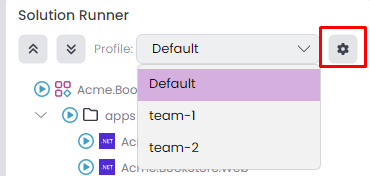
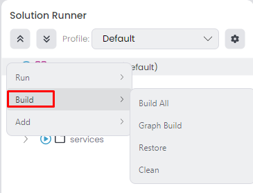
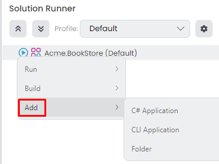
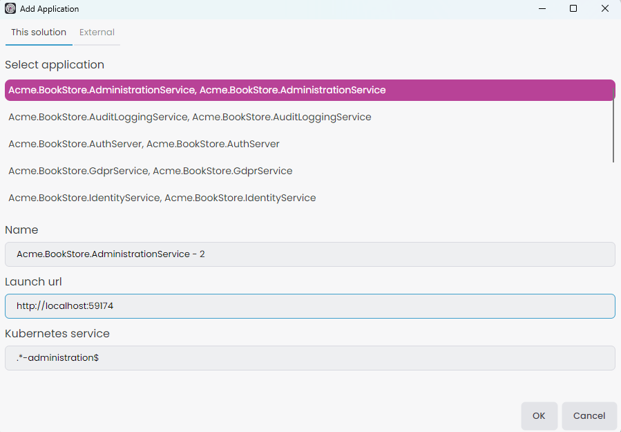
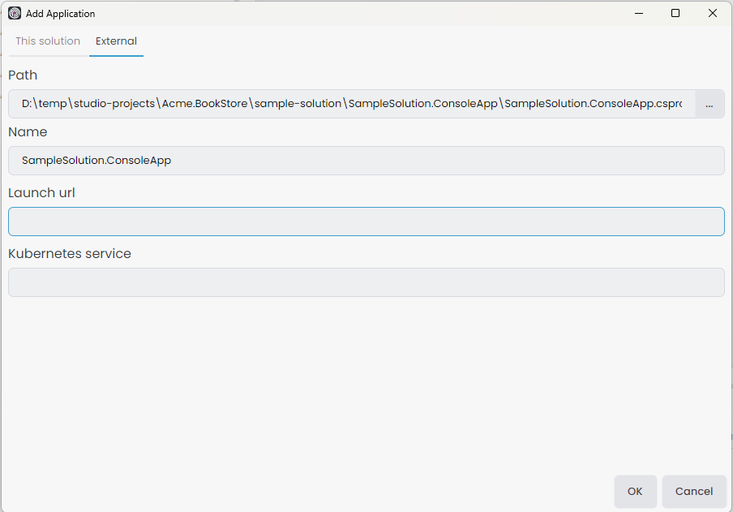
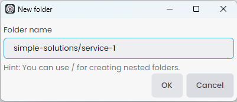

# Running Applications Using ABP Studio Solution Runner

Running application in ABP Studio is a straightforward process to start one or more applications easier. Navigate to the **Solution Runner** panel located in the left menu.

> The project structure might be different based on your selection. In an MVC microservice project, looks like the following.

The solution runner contains 4 different types to define tree structure.
- **Profile root** - `Acme.BookStore (Default)`.
- **Folder** - `apps`, `gateways`, `infrastructure`, `services`. 
- **C# Application** `Acme.BookStore.AuthServer`, `Acme.BookStore.Web`, `Acme.BookStore.WebGateway`, etc...
- **CLI Application** `Docker-Dependencies`

## Profile

We can add or remove profiles to define different profile roots, which is provide us to organize our tree structure as needed. We can collapse or expand the entire tree using the up and down arrow icons. The *Default* profile comes with the project creation, includes all projects in the tree to manage at once. You can view all profiles in the combobox and change the current profile. To edit, click the gear icon located on the right side.

It opens the *Manage Run Profiles* window. You can edit/delete existing profiles or add a new one.

When you click *Add New Profile*, it opens the *Create New Profile* window. You can provide an arbitrary profile name, which should only contain letters, numbers, underscores, dashes, and dots in the text. When you create a new profile, it stores the JSON file at the specified path. You can specify the path `abp-solution-path/etc/abp-studio/run-profiles` for microservice projects or `abp-solution-path/etc/run-profiles` for other project types to adhere to the standard format. Click *OK* button to save profile.

> You can change the current profile while applications are running in the previous profile. The applications continue to run under the previous profile. For example if we start the `Acme.BookStore.AdministrationService`, `Acme.BookStore.IdentityService` applications when current profile is *team-1* and after change the current profile to *team-2* the applications continue to run under *team-1*.

> When a profile is deleted while running some applications, those applications will be stopped. If we edit a profile while running some applications, only the applications associated with the edited profile will be stopped. However, applications running under a different profile will continue to run unaffected. Lastly if we add a new profile then all profiles runned applications gonna be stopped.

## Profile Root

After selecting the current profile, which is *Default* comes out of the box we can utilize the *Profile Root*. This allows us to execute collective commands and create various tree structures based on our specific needs. You can navigate to the profile root and right-click to view the context menu, which includes 3 options `Run`, `Build` and `Add`.

### Run

*Profile Root* -> *Run* context menu, there are 3 options available:

- `Start All`: Start all(CLI, C#) applications.
- `Stop All`: Stop all(CLI, C#) applications.
- `Build & Start All`: It builds each C# applications using the [dotnet build](https://learn.microsoft.com/en-us/dotnet/core/tools/dotnet-build) command in the [Background Tasks](./overview/index.md#background-tasks) and starts all(CLI, C#) applications after the build tasks are completed.

### Build

*Profile Root* -> *Build* context menu, there are 4 options available:

- `Build All`: It builds each C# applications using the [dotnet build](https://learn.microsoft.com/en-us/dotnet/core/tools/dotnet-build) command in the [Background Tasks](./overview/index.md#background-tasks).
- `Graph Build`: It builds each C# applications using the [dotnet build](https://learn.microsoft.com/en-us/dotnet/core/tools/dotnet-build) command with [graphBuild](https://learn.microsoft.com/en-us/visualstudio/msbuild/build-process-overview?view=vs-2022#graph-option) option in the [Background Tasks](./overview/index.md#background-tasks).
- `Restore`: It restores each C# applications using the [dotnet restore](https://learn.microsoft.com/en-us/dotnet/core/tools/dotnet-restore) command in the [Background Tasks](./overview/index.md#background-tasks).
- `Clean`: It cleans each C# applications using the [dotnet clean](https://learn.microsoft.com/en-us/dotnet/core/tools/dotnet-clean) command in the [Background Tasks](./overview/index.md#background-tasks).

### Add

We can add 3 different item type to *Profile Root* for defining the tree structure. Those options are `C# Application`, `CLI Application` and `Folder`.

#### C# Application

When we click the *Profile Root* -> *Add* -> *C# Application* it opens the *Add Application* window. We would be able to add two different way. You can add C# application in *This solution* tab with following way:

- `Select application`: First we have to select an application, you have the option to add the same application multiple times.
- `Name`: Give an arbitrary name to see in solution runner. This name should be unique for each profile even the selected application already exists.
- `Launch url`: Is the url when we want to browse.
- `Kubernetes service`: If you're not using the *Kubernetes* panel leave it empty. But if solution template is the [microservice](./solution-templates/microservice/index.md) we should give the correct regex pattern. It's necessary for browse, when we connect the kubernetes cluster we should browse the kubernetes services instead *Launch url*. You can copy the existing C# application *Kubernetes sevice* **[GIVE THE C# Applications Properties SECTION]** value.

You can click the `OK` button to add the C# application to the profile root.

The C# project doesn't have to be within the current [ABP Solution](./concepts.md#solution); it can even be outside. Also the project type could be anything such as [console app](https://learn.microsoft.com/en-us/dotnet/csharp/tutorials/console-teleprompter), [ASP.NET Core Razor Pages](https://learn.microsoft.com/en-us/aspnet/core/razor-pages/), etc. To add it, click on the *External* tab in *Add Application* window.

- `Path`: Provide the path to the .csproj file you wish to add. The path will be [normalized](https://learn.microsoft.com/en-us/dotnet/standard/io/file-path-formats#path-normalization), allowing the project location to be flexible, as long as it's accessible from the current [ABP Solution](./concepts.md#solution).
- `Name`: Give an arbitrary name to see in solution runner. This name should be unique for each profile.
- `Launch url`: Is the url when we want to browse. But if added project doesn't have launch url we can leave it empty.
- `Kubernetes service`: If you're not using the *Kubernetes* panel leave it empty. But if solution template is the [microservice](./solution-templates/microservice/index.md) and there is a helm chart for added application we should give the correct regex pattern. It's necessary for browse, when we connect the kubernetes cluster we should browse the services instead *Launch url*. Give the matching regex pattern for your helm chart kubernetes service name.

You can click the `OK` button to add the C# application to the profile root.

#### CLI Application

We can add any [powershell](https://learn.microsoft.com/en-us/powershell/module/microsoft.powershell.core) file to execute from the solution runner. With this flexibility we can prepare our infrastructure environment such as `Docker-Dependencies` or run different application types like `Angular`. You can add CLI applications with *Profile Root* -> *Add* -> *CLI Application*.

- `Name`: Give an arbitrary name to see in solution runner. This name should be unique for each profile.
- `Working directory`: Provide the start and stop commands file directory path. The path will be [normalized](https://learn.microsoft.com/en-us/dotnet/standard/io/file-path-formats#path-normalization), allowing the folder location to be flexible, as long as it's accessible from the current [ABP Solution](./concepts.md#solution).
- `Start command`: Give the poweshell file name that we wanna execute when we click the *Run* -> *Start*. We should start with local path prefix `./` if the powershell file directory in `Working directory` or if it's in nested folder we can give the path like `./sub-path/start.ps1`. Also we can give the argument like `./start.ps1 -parameter value -parameter2 value2`.
- `Stop command`: If there is a different stop command such as for docker `up.ps1` and `down.ps1` commands. We should give the stop powershell file name that we wanna execute when click the *Run* -> *Stop*. We should start with local path prefix `./` if the powershell file directory in `Working directory` or if it's in nested folder we can give the path like `./sub-path/stop.ps1`. Also we can give the argument like `./stop.ps1 -parameter value -parameter2 value2`.
- `Launch url`: If there's a launch URL at the end of this starting process, such as for angular project publishing an app at `http://localhost:4200`, to enable the browse option, we should provide the Launch URL.

> If the stop command isn't provided, the starting process automatically ends upon the completion of the executed start command. However, if the start command keeps running, for instance, with a command like `yarn start`, it will continue to run until we manually click *Run* -> *Stop*.

You can click the `OK` button to add the CLI application to the profile root.

#### Folder

When adding applications directly to the profile root, it can become disorganized, especially with numerous projects. Utilizing a folder structure allows us to organize applications more efficiently. This method enables executing collective commands within a specified folder. Click the *Profile Root* -> *Add* -> *Folder* it opens *New folder* window.

- `Folder name`: Give the folder name that we wanna see in solution runner. We can create nested folder with `/` character. This is a solution runner folder so, it doesn't create a real folder. Ensure each folder name is unique for each profile.

You can click the `OK` button to add the folder to the profile root.