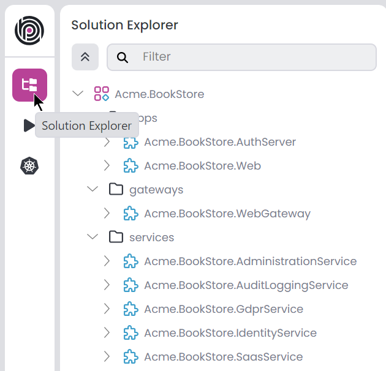

# ABP Studio: Solution Explorer

ABP Studio incorporates various [concepts](./concepts.md) and we're using them in the solution explorer. To ensure clarity, please review the [concepts](./concepts.md) documentation first. You can see the *Solution Explorer* on the left side of the ABP Studio. It displays an overview of your solution, you can manage your projects using the solution explorer. Simply navigate to the *Solution Explorer* panel in the left menu.

> The solution explorer structure might be different based on your selection. For example MVC microservice project, looks like the following. You can edit modules, packages and folders from the solution explorer.

## Solution

It is the main solution that you can open with ABP Studio, an ABP solution can contain multiple [modules](./concepts.md#module). You can create a new ABP solution using the *Create New Solution* button on the welcome page. You can also open an existing ABP solution using the *Open Solution* button on the welcome page. You can edit *Modules* and *Folders* using the solution explorer. Additionally, the solution explorer allows you to filter by *Folder*, *Module*, *Package*, and *Imports*.

- `Add`: You can add following options to your solution;
  - `New Folder`: Creates a new folder within the ABP Solution, allowing you to organize your modules.
  - `New Module`: Allows you to create a new module.
  - `Existing Module`: You can add existing module to your solution.
- `Rename`: Renames the solution.
- `Manage Secrets`: You can edit your solution secrets.
- `Reload`: Reloads the solution.
- `ABP Suite`: It opens the *Choose Module* window and you can select a module or continue without selecting a module. If you select a module, it will open the module in the ABP Suite. If you continue without selecting a module, it will open the ABP Suite without a module.
- `ABP CLI`
  - `Install Libs`: Install NPM Packages for UI projects in your solution.
  - `Upgrade ABP Packages`: Update all the ABP related NuGet and NPM packages in your solution.
  - `Clean`: Deletes all `BIN` and `OBJ` folders in your solution.
  - `Swith to`: It is switch your solution to the selected version of the ABP framework.
    - `Stable`: Switches your solution to the latest stable version.
    - `Preview`: Switches your solution to the preview version.
    - `Nightly Build`: Switches your solution to the nightly version.
- `Dotnet CLI`
  - `Build`: Builds each modules.
  - `Graph Build`: Builds each modules with [graphBuild](https://learn.microsoft.com/en-us/visualstudio/msbuild/build-process-overview?view=vs-2022#graph-option) option.
  - `Clean`: Cleans the output of the previous build for modules.
  - `Restore`: Restores the dependencies for modules.
- `Open With`
  - `Terminal`: Opens the terminal in the solution directory.
  - `Explorer`: Opens the file explorer in the solution directory.
