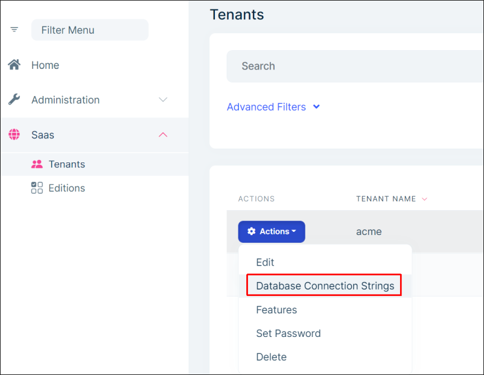
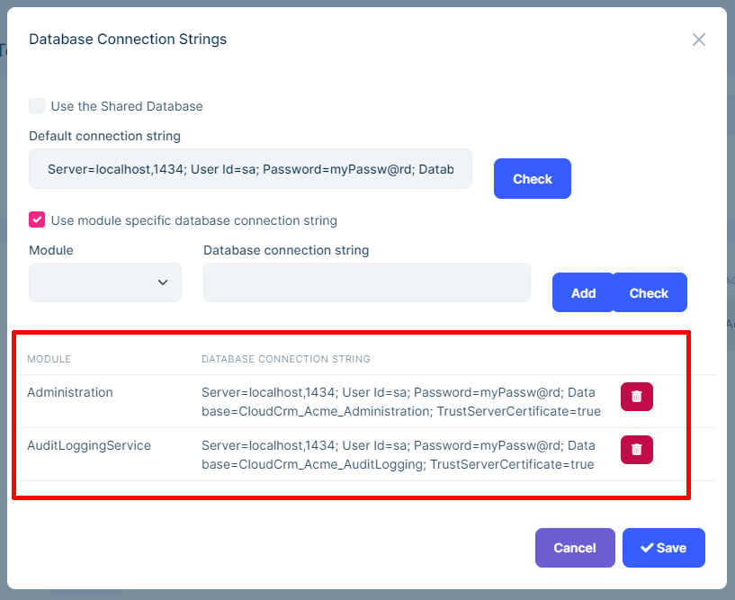
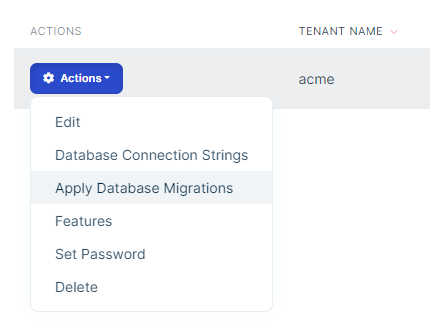

# Microservice Solution: Database Migrations

This document explains the database migration system that is designed and implemented for the ABP Studio Microservice solution template.

## Introduction

When you use a relational database, the database schema (tables, fields, views, etc) should be explicitly created before using it. In addition, whenever you deploy a new version of your service, the database schema should be updated if you made a change on it.

For example, if you have added a new field to a database table, you should also add that field to the production database before (or while) deploying your service to the production environment.

Managing the schema changes manually is not a good practice and error-prone in a highly dynamic system like a microservice solution. The Microservice solution template uses [Entity Framework migrations](https://learn.microsoft.com/en-us/ef/core/managing-schemas/migrations/) to maintain the database schema and automatically migrate it whenever you deploy a new version of your service/application.

In addition to the schema changes, you may also need to insert some initial (seed) data to some tables in order to make your server properly works. That process is called as [data seeding](https://docs.abp.io/en/abp/latest/Data-Seeding). The Microservice solution is also configured so it can seed such initial data on the application startup.

> If you are using **MongoDB** as your database provider, the schema migration is not needed (But you should care about some kind of data and schema migrations in case of you made a breaking change on your database schema - this is something depends on your application, so you should understand how to work with a document database like MongoDB). However, the data seeding system is still used to insert initial data to the database.

## Database Migrations on Service Startup

The microservice solution was designed so that there are more than one database. Typically, each microservice has its own database.

Every microservice is responsible to migrate its own database schema. They perform that responsibility by checking and applying database migrations on service startup.

> In this document, we will examine the Identity microservice as an example, but the document is valid for other services too.

For example, the Identity microservice's startup module class overrides the `OnPostApplicationInitializationAsync` method to trigger the migration operation:

````csharp
public override async Task
    OnPostApplicationInitializationAsync(ApplicationInitializationContext context)
{
    using var scope = context.ServiceProvider.CreateScope();
    await scope.ServiceProvider
        .GetRequiredService<IdentityServiceRuntimeDatabaseMigrator>()
        .CheckAndApplyDatabaseMigrationsAsync();
}
````

In this example, `IdentityServiceRuntimeDatabaseMigrator` class checks and applies the pending changes if available.

````csharp
public class IdentityServiceRuntimeDatabaseMigrator
    : EfCoreRuntimeDatabaseMigratorBase<IdentityServiceDbContext>
{
    private readonly IdentityServiceDataSeeder _identityServiceDataSeeder;

    /* The constructor code is omitted to keep it short */

    protected override async Task SeedAsync()
    {
        await _identityServiceDataSeeder.SeedAsync();
    }
}
````

Since the migration logic is very common, ABP Framework provides a base class to implement the fundamental migration logic. `IdentityServiceRuntimeDatabaseMigrator` inherits from the `EfCoreRuntimeDatabaseMigratorBase` class which perform the actual migration operation. 

Here, we are just overriding the `SeedAsync` method that runs just after the database schema migration. If you check the source code, you will see that `IdentityServiceDataSeeder` creates the `admin` user, `admin` role and their permissions, so you can be able to login to the application.

Let's explain how `EfCoreRuntimeDatabaseMigratorBase` behaves:

* First of all, **it re-tries the migration operation** in case of any failure. It tries 3 times in total, then re-throws the exception and causes the application crash. Since Kubernetes (or ABP Studio [solution runner](../../running-applications.md)) will re-start it on crash, it will continue to try until it succeed. Temporary failures are especially expected if the database server is not ready when the service starts. It waits a random value between 5 and 15 seconds before the next try.
* It uses a [distributed lock](https://docs.abp.io/en/abp/latest/Distributed-Locking) to ensure that the migration operation is performed only by one service instance in a time. This is especially important if you run multiple instances of your service, which is usual in a microservice system. It uses a unique distributed key name based on the `DatabaseName` property, so different databases can be migrated in parallel.
* It uses Entity Framework's API to get a list of pending migrations and migrates the database if there were pending migrations.
* It then seeds the database by calling the virtual `SeedAsync` method. Remember that we have overridden that method to seed the initial data for the identity microservice.
* Finally, if a database schema migration has applied, it publishes a distributed event, `AppliedDatabaseMigrationsEto`, with the `DatabaseName`. This event is then used by the [SaaS module](../../../modules/saas.md) to trigger migration of tenant databases in a multi-tenant system. See the *Database Migrations for Tenants* section in this document.

### Configuring the `EfCoreRuntimeDatabaseMigratorBase` Class

`EfCoreRuntimeDatabaseMigratorBase` works is optimized for common scenarios. However, you may want to fine-tune it in some cases.

The following properties are candidate to change in the constructor of your derived class (`IdentityServiceRuntimeDatabaseMigrator` for the Identity microservice):

* `AlwaysSeedTenantDatabases` (default value: `false`): If you don't have a database schema change, it doesn't trigger the `AppliedDatabaseMigrationsEto` event. So, if you don't have a database schema change, but have a new database seed, then the new seed code is not applied to the tenant databases. If you want to apply the seed always even if there is no database schema change, you can set that property to `true`. However, if you have many tenant databases, it will be very inefficient to run the database seed code in every service startup. Alternatively, you can use EF Core's `Add-Migration` command to add an empty database migration to trigger the schema change. Your migration history will grow unnecessarily, but the performance loss is a bigger problem otherwise.
* `MinValueToWaitOnFailure` (default value: `5000` as milliseconds): Minimum wait duration before re-trying the migrations in case of any failure.
* `MaxValueToWaitOnFailure` (default value: `15000` as milliseconds): Maximum wait duration before re-trying the migrations in case of any failure.
* `DatabaseName` (string): Every separate database must be a unique name in the system, so `EfCoreRuntimeDatabaseMigratorBase` can use the distributed locking system per database. This value is passed in the constructor of the `IdentityServiceRuntimeDatabaseMigrator` class and properly configured for the pre-built services. See also the *Database Configurations* section in this document.

## Database Migrations for Tenants

The microservice solution allows to create dedicated physical databases for each tenant for each microservice. This can be useful if you want to have dedicate resources for specific tenants or need to separate some tenant databases for security, isolation or other reasons.

> Tenants with their own databases per services may dramatically increase your database count and may make your system hard to monitor, backup and maintain. It is a serious system decision and we suggest to avoid it if you don't have to do.

If you have a separate database for a tenant for a microservice and if that microservice's database schema is changed, you must change the tenant's database schema too. Otherwise, your service may fail when it uses that tenant's database.

As explained above, `EfCoreRuntimeDatabaseMigratorBase` publishes a distributed event (`AppliedDatabaseMigrationsEto`) when it applied a database schema migration for a microservice database. That is then handled by the SaaS module. The SaaS module then finds all the tenants that have dedicated databases for that microservice database, and publishes `ApplyDatabaseMigrationsEto` events (one for each tenant). The `ApplyDatabaseMigrationsEto` events are then handled by the related microservice to migrate the related database for the given tenant. This is done by the `IdentityServiceDatabaseMigrationEventHandler` in the microservice project. `IdentityServiceDatabaseMigrationEventHandler` is inherited from the `EfCoreDatabaseMigrationEventHandlerBase` class which implements the actual migration logic. 

`EfCoreDatabaseMigrationEventHandlerBase` handles three types of events:

* `TenantCreatedEto`: Published when a new tenant is created.
* `TenantConnectionStringUpdatedEto`: Published when a connection string of a tenant has changed.
* `ApplyDatabaseMigrationsEto`: Published when a tenant database should be migrated, as explained above.

For all that events, we need to migrate the related database for the tenant (the migration system creates the initial database if it doesn't exists). The migration logic is like that:

* Switches to the related tenant context using the [`ICurrentTenant.Change` method](https://docs.abp.io/en/abp/latest/Multi-Tenancy#change-the-current-tenant).
* If the given tenant has a dedicated connection string for the current microservice, it migrates the database schema and seeds the initial data.
* In case a failure, it re-tries a maximum of 3 times by waiting a random duration between 5 and 15 seconds. It does that by ignoring the error and re-publishing the event that is handled.

### Connection String Update

As explained in the previous section, the migration system automatically creates and seeds the new database when you change connection string of a tenant. However, it doesn't move the data if old database has data in it. You should handle it yourself. You can override the `AfterTenantConnectionStringUpdated` method to take the necessary action.

### On Failures

As explained before, the migration system re-tries a maximum of 3 times on failures by waiting a random duration between 5 and 15 seconds. You can set `MinValueToWaitOnFailure` and `MaxValueToWaitOnFailure` as milliseconds to change these durations. Default try count can be changed by setting the `MaxEventTryCount` value.

If the maximum try count (`MaxEventTryCount`) is reached, then the re-try mechanism is stopped. In that case, the tenant database will remain old, since it couldn't be migrated. In such a case, it is expected from a system admin to understand the problem (maybe the connection string was wrong or the target database server is temporarily unreachable) and manually trigger the migration once the problem is resolved. See the *SaaS Module: The Tenant Management UI* section for details.

### SaaS Module: The Tenant Management UI

SaaS module provides the necessary UI to set and change connection string for tenants and trigger the database migrations.

#### The Connection String Management Modal

You can click to the *Database Connection Strings* command in the *Actions* dropdown button for a tenant in the *Tenants* page of the SaaS module:



It opens the *Database Connection Strings* modal as shown below:


Here, we can set a *Default connection string* for the tenant. The default connection string is used as a fallback value if you don't define a connection string for a specific microservice database.

If you only set the *Default connection string* for a tenant, all the microservices will use that single database for that tenant. They will create their tables inside that database and perform all operations on it. We suggest that approach since a tenant will have a single database, which is easier to manage.

If you want to set a database for each microservice for a tenant, then check the *Use module specific database connection string* checkbox as shown below:



Here, you can set a different connection string for each microservice. If you don't define a connection string for one of the services, it will use the *Default* connection string above. If you haven't defined a *Default* connection string, than the main database of the related microservice will be used.

> Tenants with their own databases per services may dramatically increase your database count and may make your system hard to monitor, backup and maintain. It is a serious system decision and we suggest to avoid it if you don't have to do.

When you make the changes and save the dialog, the necessary databases are automatically created and migrated. If you later update the connection string (for example if you change the database name), it will also trigger the database migration process again.

#### Manually Applying the Database Migrations

If you need to manually trigger the database migrations for a specific tenant, click the *Actions* dropdown for the related tenant and select the *Apply Database Migrations* command on the *Tenant Management* page of the SaaS module:



See the *On Failures* section above to understand why you may need to manually trigger that operation.

## Database Configurations

TODO: AbpDbContextOptions, DbContext structure, AbpDbConnectionOptions, etc.

## Rapid Failures on System Startup

TODO: ...