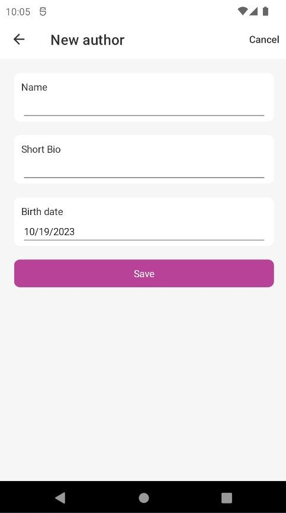
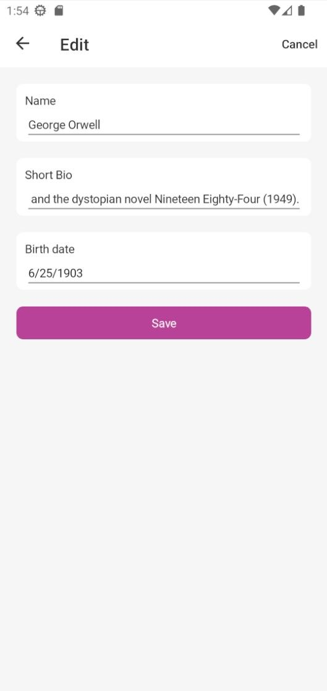
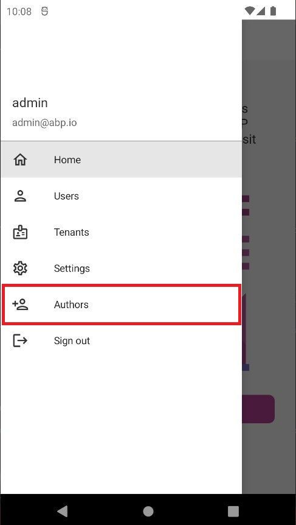
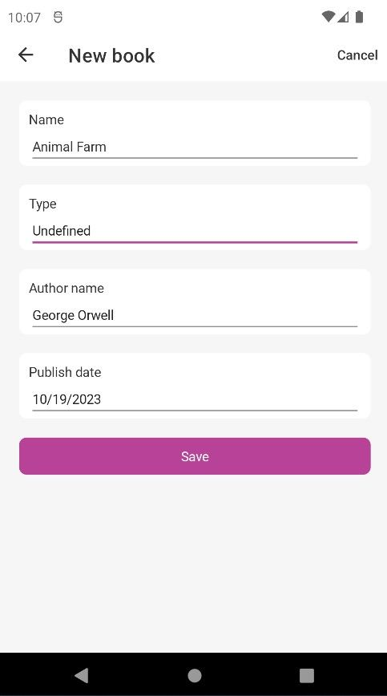
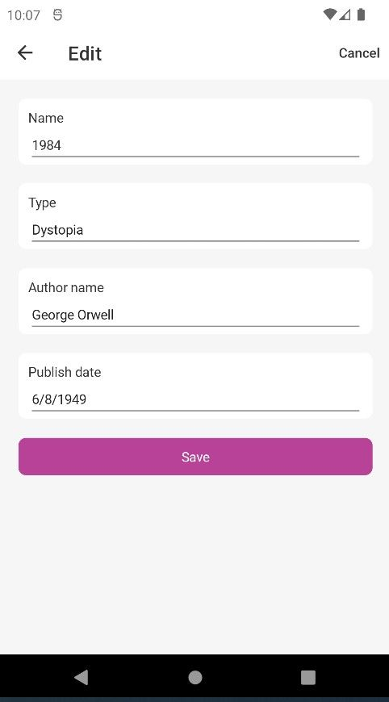
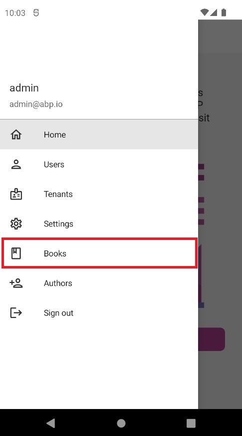

# Mobile Application Development Tutorial - MAUI

## About This Tutorial

This tutorial assumes that you have completed the [Web Application Development tutorial](../part-1.md) and built an ABP based application named `Acme.BookStore`. In this tutorial, we will only focus on the UI side of the `Acme.BookStore` application and we will implement the CRUD operations for a MAUI mobile application. This tutorial follows the [MVVM (Model-View-ViewModel) Pattern ](https://learn.microsoft.com/en-us/dotnet/architecture/maui/mvvm), which separates the UI from the business logic of an application.

## Download the Source Code

You can use the following link to download the source code of the application described in this article:

* [Acme.BookStore](https://abp.io/Account/Login?returnUrl=/api/download/samples/bookstore-maui-efcore-mobile)

> If you encounter the "filename too long" or "unzip" error on Windows, please see [this guide](https://docs.abp.io/en/abp/latest/KB/Windows-Path-Too-Long-Fix).

## Create the Authors Page - List & Delete Authors

Create a content page, `AuthorsPage.xaml` under the `Pages` folder of the `Acme.BookStore.Maui` project and change the content as given below:

### AuthorsPage.xaml

```xml
<?xml version="1.0" encoding="utf-8" ?>
<ContentPage xmlns="http://schemas.microsoft.com/dotnet/2021/maui"
             xmlns:x="http://schemas.microsoft.com/winfx/2009/xaml"
             x:Class="Acme.BookStore.Maui.Pages.AuthorsPage"
             xmlns:ext="clr-namespace:Acme.BookStore.Maui.Extensions"
             xmlns:viewModels="clr-namespace:Acme.BookStore.Maui.ViewModels"
             xmlns:author="clr-namespace:Acme.BookStore.Authors;assembly=Acme.BookStore.Application.Contracts"
             xmlns:u="http://schemas.enisn-projects.io/dotnet/maui/uraniumui"
             xmlns:toolkit="http://schemas.microsoft.com/dotnet/2022/maui/toolkit"
             x:Name="page"
             x:DataType="viewModels:AuthorPageViewModel"
             Title="{ext:Translate Authors}">
    <ContentPage.Behaviors>
        <toolkit:EventToCommandBehavior EventName="Appearing" Command="{Binding RefreshCommand}" />
    </ContentPage.Behaviors>
    <ContentPage.ToolbarItems>
        <ToolbarItem Text="{ext:Translate NewAuthor,StringFormat='+ {0}'}"
            Command="{Binding OpenCreateModalCommand}"
            IconImageSource="{OnIdiom Desktop={FontImageSource FontFamily=MaterialRegular, Glyph={x:Static u:MaterialRegular.Add}}}"/>
    </ContentPage.ToolbarItems>

    <Grid RowDefinitions="Auto,*" Padding="16,16,16,0">

        <!-- Search -->
        <Frame BorderColor="Transparent" Padding="0" HasShadow="False">
            <SearchBar Text="{Binding Input.Filter}" SearchCommand="{Binding RefreshCommand}" Placeholder="{ext:Translate Search}"/>
        </Frame>

        <RefreshView Grid.Row="1"
            IsRefreshing="{Binding IsBusy}"
            Command="{Binding RefreshCommand}">

            <CollectionView
                ItemsSource="{Binding Items}"
                SelectionMode="None">
                <CollectionView.Header>
                    <BoxView HeightRequest="16" Color="Transparent" />
                </CollectionView.Header>
                <CollectionView.ItemTemplate>
                    <DataTemplate x:DataType="author:AuthorDto">
                        <Grid ColumnDefinitions="Auto,*,Auto" Padding="4,0" Margin="0,8" ColumnSpacing="10">
                            <VerticalStackLayout Grid.Column="1" VerticalOptions="Center">
                                <Label Text="{Binding Name}" FontAttributes="Bold" />
                                <Label Text="{Binding ShortBio}" StyleClass="muted" />
                            </VerticalStackLayout>

                            <ImageButton Grid.Column="2" VerticalOptions="Center" Margin="0,16"
                                Command="{Binding BindingContext.ShowActionsCommand, Source={x:Reference page}}"
                                CommandParameter="{Binding .}" HeightRequest="24">
                                <ImageButton.Source>
                                    <FontImageSource FontFamily="MaterialRegular"
                                        Glyph="{x:Static u:MaterialRegular.More_vert}"
                                        Color="{AppThemeBinding Light={StaticResource ForegroundDark}, Dark={StaticResource ForegroundLight}}" />
                                </ImageButton.Source>
                            </ImageButton>
                        </Grid>
                    </DataTemplate>
                </CollectionView.ItemTemplate>

                <CollectionView.Footer>
                    <VerticalStackLayout>
                        <ActivityIndicator HorizontalOptions="Center"
                            IsRunning="{Binding IsLoadingMore}"
                            Margin="20"/>

                        <ContentView Margin="0,0,0,8" IsVisible="{OnIdiom Default=False, Desktop=True}" HorizontalOptions="Center">
                            <Button IsVisible="{Binding CanLoadMore}"  
                                StyleClass="TextButton" Text="{ext:Translate LoadMore}"
                                Command="{Binding LoadMoreCommand}"/>
                        </ContentView>
                    </VerticalStackLayout>
                </CollectionView.Footer>
            </CollectionView>
        </RefreshView>
    </Grid>
</ContentPage>
```

This is a simple page that lists Authors, allows opening a create modal to create a new author, editing an existing one and deleting one. 


### AuthorsPage.xaml.cs

Let's create the `AuthorsPage.xaml.cs` code-behind class and copy paste the content below:

```csharp
using Acme.BookStore.Maui.ViewModels;
using Volo.Abp.DependencyInjection;

namespace Acme.BookStore.Maui.Pages;

public partial class AuthorsPage : ContentPage, ITransientDependency
{
	public AuthorsPage(AuthorPageViewModel vm)
	{
		InitializeComponent();
		BindingContext = vm;
	}
}
```

Here, we register our pages with a `Transient` lifetime, so we can use it later on for navigation purposes and indicating the binding source (`BindingContext`) as the `AuthorPageViewModel` to get full benefit from [the MVVM pattern](https://learn.microsoft.com/en-us/dotnet/architecture/maui/mvvm). We haven't created the `AuthorPageViewModel` class yet, so let's create it.

### AuthorPageViewModel.cs

Create a view model class, `AuthorPageViewModel` under the `ViewModels` folder of the project and change the content as follows:

```csharp
using Acme.BookStore.Authors;
using Acme.BookStore.Maui.Messages;
using Acme.BookStore.Maui.Pages;
using CommunityToolkit.Mvvm.ComponentModel;
using CommunityToolkit.Mvvm.Input;
using CommunityToolkit.Mvvm.Messaging;
using System.Collections.ObjectModel;
using Volo.Abp.DependencyInjection;
using Volo.Abp.Http.Client;
using Volo.Abp.Threading;

namespace Acme.BookStore.Maui.ViewModels
{
    public partial class AuthorPageViewModel : BookStoreViewModelBase,
        IRecipient<AuthorCreateMessage>, //create
        IRecipient<AuthorEditMessage>, //edit
        ITransientDependency
    {
        [ObservableProperty]
        private bool isBusy;

        [ObservableProperty]
        bool isLoadingMore;

        [ObservableProperty]
        bool canLoadMore;

        public GetAuthorListDto Input { get; } = new();

        public ObservableCollection<AuthorDto> Items { get; } = new();

        protected IAuthorAppService AuthorAppService { get; }

        protected SemaphoreSlim SemaphoreSlim { get; } = new SemaphoreSlim(1, 1);

        public AuthorPageViewModel(IAuthorAppService authorAppService)
        {
            AuthorAppService = authorAppService;

            WeakReferenceMessenger.Default.Register<AuthorCreateMessage>(this);
            WeakReferenceMessenger.Default.Register<AuthorEditMessage>(this);
        }

        [RelayCommand]
        async Task OpenCreateModal()
        {
            await Shell.Current.GoToAsync(nameof(AuthorCreatePage));
        }

        [RelayCommand]
        async Task OpenEditModal(Guid authorId)
        {
            await Shell.Current.GoToAsync($"{nameof(AuthorEditPage)}?Id={authorId}");
        }

        [RelayCommand]
        async Task Refresh()
        {
            await GetAuthorsAsync();
        }

        [RelayCommand]
        async Task ShowActions(AuthorDto author)
        {
            var result = await App.Current!.MainPage!.DisplayActionSheet(
                L["Actions"],
                L["Cancel"],
                null,
                L["Edit"], L["Delete"]);

            if (result == L["Edit"])
            {
                await OpenEditModal(author.Id);
            }

            if (result == L["Delete"])
            {
                await Delete(author);
            }
        }

        [RelayCommand]
        async Task Delete(AuthorDto author)
        {
            var confirmed = await Shell.Current.CurrentPage.DisplayAlert(
                L["Delete"],
                string.Format(L["AuthorDeletionConfirmationMessage"].Value, author.Name),
                L["Delete"],
                L["Cancel"]);

            if (!confirmed)
            {
                return;
            }

            try
            {
                await AuthorAppService.DeleteAsync(author.Id);
            }
            catch (AbpRemoteCallException remoteException)
            {
                HandleException(remoteException);
            }

            await GetAuthorsAsync();
        }

        private async Task GetAuthorsAsync()
        {
            IsBusy = true;

            try
            {
                Input.SkipCount = 0;

                var result = await AuthorAppService.GetListAsync(Input);

                Items.Clear();
                foreach (var user in result.Items)
                {
                    Items.Add(user);
                }

                CanLoadMore = result.Items.Count >= Input.MaxResultCount;

            }
            catch (AbpRemoteCallException remoteException)
            {
                HandleException(remoteException);
            }
            finally
            {
                IsBusy = false;
            }
        }

        [RelayCommand]
        async Task LoadMore()
        {
            if (!CanLoadMore)
            {
                return;
            }

            try
            {
                using (await SemaphoreSlim.LockAsync())
                {
                    IsLoadingMore = true;

                    Input.SkipCount += Input.MaxResultCount;

                    var result = await AuthorAppService.GetListAsync(Input);

                    CanLoadMore = result.Items.Count >= Input.MaxResultCount;

                    foreach (var tenant in result.Items)
                    {
                        Items.Add(tenant);
                    }
                }
            }
            catch (Exception ex)
            {
                HandleException(ex);
            }
            finally
            {
                IsLoadingMore = false;
            }
        }

        public void Receive(AuthorCreateMessage message)
        {
            MainThread.BeginInvokeOnMainThread(async () =>
            {
                await GetAuthorsAsync();
            });
        }

        public void Receive(AuthorEditMessage message)
        {
            MainThread.BeginInvokeOnMainThread(async () =>
            {
                await GetAuthorsAsync();
            });
        }
    }
}
```

The `AuthorPageViewModel` class is where all the logic behind the `Authors` page lays. Here, we do the following steps:

* We have fetched all authors from the database and set those records into the `Items` property, which is a type of `ObservableCollection<AuthorDto>`, so whenever the authors list changes then the *CollectionView* will be refreshed.
* We have defined the `OpenCreateModal` and `OpenEditModal` methods to navigate to the create modal and edit modal pages (_we will create them in the following sections_).
* We have defined the `ShowActions` method to allow editing or deleting a specific author.
* We have created the `Delete` method, which deletes a specific author and re-renders the grid.
* And finally, we have implemented the `IRecipient<AuthorCreateMessage>` and `IRecipient<AuthorEditMessage>` interfaces to refresh the grid after creating a new author or editing an existing one. (We will create the `AuthorCreateMessage` and `AuthorEditMessage` classes in the following sections)

### Registering Author Page Routes

Open the `AppShell.xaml.cs` file under the `Acme.BookStore.Maui` project and register the create modal and edit modal pages' routes:

```csharp
using Acme.BookStore.Maui.Pages;
using Acme.BookStore.Maui.ViewModels;
using Volo.Abp.DependencyInjection;

namespace Acme.BookStore.Maui;

public partial class AppShell : Shell, ITransientDependency
{
    public AppShell(ShellViewModel vm)
    {
        BindingContext = vm;

        InitializeComponent();

        //other routes...

        //Authors
        Routing.RegisterRoute(nameof(AuthorCreatePage), typeof(AuthorCreatePage));
        Routing.RegisterRoute(nameof(AuthorEditPage), typeof(AuthorEditPage));
    }
}
```

Since we need to navigate to the create modal and edit modal pages whenever the action buttons are clicked, we need to register those pages with their routes. We can do this in the `AppShell.xaml.cs` file, which is responsible for providing the navigation of the application.

## Creating a New Author

Create a new content page, `AuthorCreatePage.xaml` under the `Pages` folder of the `Acme.BookStore.Maui` project and change the content as given below:

### AuthorCreatePage.xaml

```xml
<?xml version="1.0" encoding="utf-8" ?>
<ContentPage xmlns="http://schemas.microsoft.com/dotnet/2021/maui"
             xmlns:x="http://schemas.microsoft.com/winfx/2009/xaml"
             xmlns:ext="clr-namespace:Acme.BookStore.Maui.Extensions"
             x:Class="Acme.BookStore.Maui.Pages.AuthorCreatePage"
             xmlns:viewModels="clr-namespace:Acme.BookStore.Maui.ViewModels"
             xmlns:toolkit="http://schemas.microsoft.com/dotnet/2022/maui/toolkit"
             x:DataType="viewModels:AuthorCreateViewModel"
             Title="{ext:Translate NewAuthor}">
    
    <ContentPage.ToolbarItems>
        <ToolbarItem Text="{ext:Translate Cancel}" Command="{Binding CancelCommand}"/>
    </ContentPage.ToolbarItems>

    <ScrollView>
        <VerticalStackLayout Padding="20" Spacing="20">

            <Border StyleClass="AbpInputContainer">
                <VerticalStackLayout>
                    <Label Text="{ext:Translate Name}" />
                    <Entry Text="{Binding Author.Name}" />
                </VerticalStackLayout>
            </Border>

            <Border StyleClass="AbpInputContainer">
                <VerticalStackLayout>
                    <Label Text="{ext:Translate ShortBio}" />
                    <Entry Text="{Binding Author.ShortBio}" />
                </VerticalStackLayout>
            </Border>

            <Border StyleClass="AbpInputContainer">
                <VerticalStackLayout>
                    <Label Text="{ext:Translate BirthDate}" />
                    <DatePicker Date="{Binding Author.BirthDate}"/>
                </VerticalStackLayout>
            </Border>

            <Grid>
                <Button Text="{ext:Translate Save}" Command="{Binding CreateCommand}" />
                <ActivityIndicator IsRunning="{Binding IsBusy}" IsVisible="{Binding IsBusy}" />
            </Grid>
        </VerticalStackLayout>
    </ScrollView>
</ContentPage>
```

In this page, we have defined the form elements that are needed to create an author such as `Name`, `ShortBio` and `BirthDate`. Whenever a user clicks the *Save* button, the **CreateCommand** will be triggered and will create a new author, if the operation goes successfully. 



Let's define the `AuthorCreateViewModel` as the *BindingContext* of this page and then define the logic of the **CreateCommand**.

### AuthorCreatePage.xaml.cs

Create the `AuthorCreatePage.xaml.cs` code-behind class and copy paste the content below:

```csharp
using Acme.BookStore.Maui.ViewModels;
using Volo.Abp.DependencyInjection;

namespace Acme.BookStore.Maui.Pages;

public partial class AuthorCreatePage : ContentPage, ITransientDependency
{
	public AuthorCreatePage(AuthorCreateViewModel vm)
	{
		InitializeComponent();
		BindingContext = vm;
	}
}
```

### AuthorCreateViewModel.cs

Create a view model class, `AuthorCreateViewModel` under the `ViewModels` folder of the project and change the content as follows:

```csharp
using Acme.BookStore.Authors;
using Acme.BookStore.Maui.Messages;
using CommunityToolkit.Mvvm.ComponentModel;
using CommunityToolkit.Mvvm.Input;
using CommunityToolkit.Mvvm.Messaging;
using Volo.Abp.DependencyInjection;

namespace Acme.BookStore.Maui.ViewModels
{
    public partial class AuthorCreateViewModel : BookStoreViewModelBase, ITransientDependency
    {
        [ObservableProperty]
        private bool isBusy;

        public CreateAuthorDto Author { get; set; } = new();

        protected IAuthorAppService AuthorAppService { get; }

        public AuthorCreateViewModel(IAuthorAppService authorAppService)
        {
            AuthorAppService = authorAppService;

            Author.BirthDate = DateTime.Now;
        }

        [RelayCommand]
        async Task Cancel()
        {
            await Shell.Current.GoToAsync("..");
        }

        [RelayCommand]
        async Task Create()
        {
            try
            {
                IsBusy = true;

                await AuthorAppService.CreateAsync(Author);
                await Shell.Current.GoToAsync("..");
                WeakReferenceMessenger.Default.Send(new AuthorCreateMessage(Author));
            }
            catch (Exception ex)
            {
                HandleException(ex);
            }
            finally
            {
                IsBusy = false;
            }
        }
    }
}
```

Here, we do the following steps:

* This class simply injects and uses the `IAuthorAppService` to create a new author.
* We have created two methods for the actions in the **AuthorCreatePage**, which are the `Cancel` and `Create` methods.
* The `Cancel` method simply returns to the previous page, **AuthorPage**.
* The `Create` method creates a new author whenever the *Save* button is clicked on the **AuthorCreatePage**.

### AuthorCreateMessage.cs

Create a class, `AuthorCreateMessage` under the `Messages` folder of the project and change the content as follows:

```csharp
using Acme.BookStore.Authors;
using CommunityToolkit.Mvvm.Messaging.Messages;

namespace Acme.BookStore.Maui.Messages
{
    public class AuthorCreateMessage : ValueChangedMessage<CreateAuthorDto>
    {
        public AuthorCreateMessage(CreateAuthorDto value) : base(value)
        {
        }
    }
}
```

This class is used to represent a message that we're gonna use to trigger a return result after author creation. Then, we subscribe to this message and update the grid on the **AuthorsPage**.

## Updating an Author

Create a new content page, `AuthorEditPage.xaml` under the `Pages` folder of the `Acme.BookStore.Maui` project and change the content as given below:

### AuthorEditPage.xaml

```xml
<?xml version="1.0" encoding="utf-8" ?>
<ContentPage xmlns="http://schemas.microsoft.com/dotnet/2021/maui"
             xmlns:ext="clr-namespace:Acme.BookStore.Maui.Extensions"
             xmlns:x="http://schemas.microsoft.com/winfx/2009/xaml"
             x:Class="Acme.BookStore.Maui.Pages.AuthorEditPage"
             xmlns:viewModels="clr-namespace:Acme.BookStore.Maui.ViewModels"
             xmlns:identity="clr-namespace:Acme.BookStore.Authors;assembly=Acme.BookStore.Application.Contracts"
             xmlns:toolkit="http://schemas.microsoft.com/dotnet/2022/maui/toolkit"
             x:DataType="viewModels:AuthorEditViewModel"
             Title="{ext:Translate Edit}">
    
    <ContentPage.ToolbarItems>
        <ToolbarItem Text="{ext:Translate Cancel}" Command="{Binding CancelCommand}"/>
    </ContentPage.ToolbarItems>

    <ScrollView>
        <VerticalStackLayout>
            <Border StyleClass="AbpInputContainer">
                <VerticalStackLayout>
                    <Label Text="{ext:Translate Name}" />
                    <Entry Text="{Binding Author.Name}" />
                </VerticalStackLayout>
            </Border>

            <Border StyleClass="AbpInputContainer">
                <VerticalStackLayout>
                    <Label Text="{ext:Translate ShortBio}" />
                    <Entry Text="{Binding Author.ShortBio}" />
                </VerticalStackLayout>
            </Border>

            <Border StyleClass="AbpInputContainer">
                <VerticalStackLayout>
                    <Label Text="{ext:Translate BirthDate}" />
                    <DatePicker Date="{Binding Author.BirthDate}"/>
                </VerticalStackLayout>
            </Border>

            <Grid>
                <Button Text="{ext:Translate Save}" Command="{Binding UpdateCommand}" />
                <ActivityIndicator IsRunning="{Binding IsSaving}" IsVisible="{Binding IsSaving}" />
            </Grid>
        </VerticalStackLayout>
    </ScrollView>
</ContentPage>
```

In this page, we have defined the form elements that are needed to edit an author such as `Name`, `ShortBio` and `BirthDate`. Whenever a user clicks the *Save* button, the **UpdateCommand** will be triggered and will update an existing author, if the operation goes successfully. 



Let's define the `AuthorEditViewModel` as the *BindingContext* of this page and then define the logic of the **UpdateCommand**.

### AuthorEditPage.xaml.cs

Create the `AuthorEditPage.xaml.cs` code-behind class and copy paste the content below:

```csharp
using Acme.BookStore.Maui.ViewModels;
using Volo.Abp.DependencyInjection;

namespace Acme.BookStore.Maui.Pages;

public partial class AuthorEditPage : ContentPage, ITransientDependency
{
	public AuthorEditPage(AuthorEditViewModel vm)
	{
		InitializeComponent();
		BindingContext = vm;
	}
}
```

### AuthorEditViewModel.cs

Create a view model class, `AuthorEditViewModel` under the `ViewModels` folder of the project and change the content as follows:

```csharp
using Acme.BookStore.Authors;
using Acme.BookStore.Maui.Messages;
using CommunityToolkit.Mvvm.ComponentModel;
using CommunityToolkit.Mvvm.Input;
using CommunityToolkit.Mvvm.Messaging;
using Volo.Abp.DependencyInjection;

namespace Acme.BookStore.Maui.ViewModels
{
    [QueryProperty("Id", "Id")]
    public partial class AuthorEditViewModel : BookStoreViewModelBase, ITransientDependency
    {
        [ObservableProperty]
        public string? id;

        [ObservableProperty]
        private bool isBusy;

        [ObservableProperty]
        private bool isSaving;

        [ObservableProperty]
        private UpdateAuthorDto? author;

        protected IAuthorAppService AuthorAppService { get; }

        public AuthorEditViewModel(IAuthorAppService authorAppService)
        {
            AuthorAppService = authorAppService;
        }

        async partial void OnIdChanged(string? value)
        {
            IsBusy = true;
            await GetAuthor();
            IsBusy = false;
        }

        [RelayCommand]
        async Task GetAuthor()
        {
            try
            {
                var authorId = Guid.Parse(Id!);
                var authorDto = await AuthorAppService.GetAsync(authorId);

                Author = new UpdateAuthorDto
                {
                    BirthDate = authorDto.BirthDate,
                    Name = authorDto.Name,
                    ShortBio = authorDto.ShortBio
                };
            }
            catch (Exception ex)
            {
                HandleException(ex);
            }
        }

        [RelayCommand]
        async Task Cancel()
        {
            await Shell.Current.GoToAsync("..");
        }

        [RelayCommand]
        async Task Update()
        {
            try
            {
                IsSaving = true;

                await AuthorAppService.UpdateAsync(Guid.Parse(Id!), Author!);
                await Shell.Current.GoToAsync("..");
                WeakReferenceMessenger.Default.Send(new AuthorEditMessage(Author!));
            }
            catch (Exception ex)
            {
                HandleException(ex);
            }
            finally
            {
                IsSaving = false;
            }
        }
    }
}
```

Here, we do the following steps:

* This class simply injects and uses the `IAuthorAppService` to update an existing author.
* We have created three methods for the actions in the **AuthorEditPage**, which are the `GetAuthor`, `Cancel` and `Update` methods.
* The `GetAuthor` method is used to get the author from the `Id` query parameter and set it to the `Author` property.
* The `Cancel` method simply returns to the previous page, **AuthorPage**.
* The `Update` method updates an existing author whenever the *Save* button is clicked on the **AuthorEditPage**.

### AuthorEditMessage.cs

Create a class, `AuthorEditMessage` under the `Messages` folder of the project and change the content as follows:

```csharp
using Acme.BookStore.Authors;
using CommunityToolkit.Mvvm.Messaging.Messages;

namespace Acme.BookStore.Maui.Messages
{
    public class AuthorEditMessage : ValueChangedMessage<UpdateAuthorDto>
    {
        public AuthorEditMessage(UpdateAuthorDto value) : base(value)
        {
        }
    }
}
```

This class is used to represent a message that we're gonna use to trigger a return result after an author is updated. Then, we subscribe to this message and update the grid on the **AuthorsPage**.

## Add Author Menu Item to the Main Menu

Open the `AppShell.xaml` file and add the following code under the *Settings* menu item:

### AppShell.xaml

```xml
    <FlyoutItem Title="{ext:Translate Authors}" IsVisible="{Binding HasAuthorsPermission}"
                Icon="{FontImageSource FontFamily=MaterialOutlined, Glyph={x:Static u:MaterialOutlined.Person_add}, Color={AppThemeBinding Light={StaticResource ForegroundDark}, Dark={StaticResource ForegroundLight}}}">
        <Tab>
            <ShellContent Route="authors"
                          ContentTemplate="{DataTemplate pages:AuthorsPage}"/>
        </Tab>
    </FlyoutItem>
```

This code block adds a new *Authors* menu item under the *Settings* menu item. We need to show this menu item only when the required permission is granted. So, let's update the `ShellViewModel.cs` class and check if the permission is granted or not.

### ShellViewModel.cs

```csharp
public partial class ShellViewModel : BookStoreViewModelBase, ITransientDependency
{
    //Add these two lines below
    [ObservableProperty]
    bool hasAuthorsPermission = true;

    //...

    [RelayCommand]
    private async Task UpdatePermissions()
    {
        HasUsersPermission = await AuthorizationService.IsGrantedAsync(IdentityPermissions.Users.Default);
        HasTenantsPermission = await AuthorizationService.IsGrantedAsync(SaasHostPermissions.Tenants.Default);

        //Add the line below
        HasAuthorsPermission = await AuthorizationService.IsGrantedAsync(BookStorePermissions.Authors.Default);
    }

    //...
}
```



## Create the Books Page - List & Delete Books

Create a new content page, `BooksPage.xaml` under the `Pages` folder of the `Acme.BookStore.Maui` project and change the content as given below:

### BooksPage.xaml

```xml
<?xml version="1.0" encoding="utf-8" ?>
<ContentPage xmlns="http://schemas.microsoft.com/dotnet/2021/maui"
             xmlns:x="http://schemas.microsoft.com/winfx/2009/xaml"
             x:Class="Acme.BookStore.Maui.Pages.BooksPage"
             xmlns:ext="clr-namespace:Acme.BookStore.Maui.Extensions"
             xmlns:viewModels="clr-namespace:Acme.BookStore.Maui.ViewModels"
             xmlns:book="clr-namespace:Acme.BookStore.Books;assembly=Acme.BookStore.Application.Contracts"
             xmlns:u="http://schemas.enisn-projects.io/dotnet/maui/uraniumui"
             xmlns:toolkit="http://schemas.microsoft.com/dotnet/2022/maui/toolkit"
             x:Name="page"
             x:DataType="viewModels:BookPageViewModel"
             Title="{ext:Translate Books}">

    <ContentPage.Behaviors>
        <toolkit:EventToCommandBehavior EventName="Appearing" Command="{Binding RefreshCommand}" />
    </ContentPage.Behaviors>

    <ContentPage.ToolbarItems>
        <ToolbarItem Text="{ext:Translate NewBook,StringFormat='+ {0}'}"
            Command="{Binding OpenCreateModalCommand}"
            IconImageSource="{OnIdiom Desktop={FontImageSource FontFamily=MaterialRegular, Glyph={x:Static u:MaterialRegular.Add}}}"/>
    </ContentPage.ToolbarItems>

    <Grid RowDefinitions="Auto,*" 
            StyleClass="Max720"
            Padding="16,16,16,0">

        <!-- List -->
        <RefreshView Grid.Row="1"
            IsRefreshing="{Binding IsBusy}"
            Command="{Binding RefreshCommand}">

            <CollectionView
                ItemsSource="{Binding Items}"
                SelectionMode="None"
                RemainingItemsThreshold="2"
                RemainingItemsThresholdReachedCommand="{Binding LoadMoreCommand}">
                <CollectionView.Header>
                    <!-- Padding from top -->
                    <BoxView HeightRequest="16" Color="Transparent" />
                </CollectionView.Header>
                <CollectionView.ItemTemplate>
                    <DataTemplate x:DataType="book:BookDto">
                        <Grid ColumnDefinitions="*,Auto" Padding="4,0" Margin="0,8" HeightRequest="36" ColumnSpacing="10">
                            <VerticalStackLayout Grid.Column="0" VerticalOptions="Center">
                                <Label Text="{Binding Name}" FontAttributes="Bold" />
                                <Label Text="{Binding Type}" StyleClass="muted" />
                            </VerticalStackLayout>

                            <ImageButton Grid.Column="1" VerticalOptions="Center" HeightRequest="24" WidthRequest="24" BackgroundColor="Transparent"
                                Command="{Binding BindingContext.ShowActionsCommand, Source={x:Reference page}}"
                                CommandParameter="{Binding .}">
                                <ImageButton.Source>
                                    <FontImageSource FontFamily="MaterialRegular"
                                        Glyph="{x:Static u:MaterialRegular.More_vert}"
                                        Color="{AppThemeBinding Light={StaticResource ForegroundDark}, Dark={StaticResource ForegroundLight}}" />
                                </ImageButton.Source>
                            </ImageButton>
                        </Grid>
                    </DataTemplate>
                </CollectionView.ItemTemplate>

                <CollectionView.EmptyView>
                    <Image Source="empty.png" 
                           MaximumWidthRequest="400"
                           HorizontalOptions="Center"
                           Opacity=".5"/>
                </CollectionView.EmptyView>

                <CollectionView.Footer>
                    <VerticalStackLayout>
                        <ActivityIndicator HorizontalOptions="Center"
                             IsRunning="{Binding IsLoadingMore}" IsVisible="{Binding IsLoadingMore}"
                             Margin="20"/>

                        <ContentView Margin="0,0,0,8" IsVisible="{OnIdiom Default=False, Desktop=True}" HorizontalOptions="Center">
                            <Button IsVisible="{Binding CanLoadMore}" StyleClass="TextButton" Text="{ext:Translate LoadMore}"
                                Command="{Binding LoadMoreCommand}"  />
                        </ContentView>
                    </VerticalStackLayout>
                </CollectionView.Footer>
            </CollectionView>
        </RefreshView>
    </Grid>
</ContentPage>
```

This is a simple page that lists books, allows opening a create modal to create a new book, editing an existing one and deleting one. 


### BooksPage.xaml.cs

Create the `BooksPage.xaml.cs` code-behind class and copy paste content below:

```cs
using Acme.BookStore.Maui.ViewModels;
using Volo.Abp.DependencyInjection;

namespace Acme.BookStore.Maui.Pages;

public partial class BooksPage : ContentPage, ITransientDependency
{
	public BooksPage(BookPageViewModel vm)
	{
		InitializeComponent();
		BindingContext = vm;
	}
}
```

### BookPageViewModel.cs

Create a view model class, `BookPageViewModel` under the `ViewModels` folder of the project and change the content as follows:

```csharp
using Acme.BookStore.Books;
using Acme.BookStore.Maui.Messages;
using Acme.BookStore.Maui.Pages;
using CommunityToolkit.Mvvm.ComponentModel;
using CommunityToolkit.Mvvm.Input;
using CommunityToolkit.Mvvm.Messaging;
using System.Collections.ObjectModel;
using Volo.Abp.Application.Dtos;
using Volo.Abp.DependencyInjection;
using Volo.Abp.Http.Client;
using Volo.Abp.Threading;

namespace Acme.BookStore.Maui.ViewModels
{
    public partial class BookPageViewModel : BookStoreViewModelBase,
        IRecipient<BookCreateMessage>, //create
        IRecipient<BookEditMessage>, //edit
        ITransientDependency
    {
        [ObservableProperty]
        bool isBusy;

        [ObservableProperty]
        bool isLoadingMore;

        [ObservableProperty]
        bool canLoadMore = true;

        public ObservableCollection<BookDto> Items { get; } = new();

        public PagedAndSortedResultRequestDto Input { get; } = new();

        protected IBookAppService BookAppService { get; }

        protected SemaphoreSlim SemaphoreSlim { get; } = new SemaphoreSlim(1, 1);

        public BookPageViewModel(IBookAppService bookAppService)
        {
            BookAppService = bookAppService;

            WeakReferenceMessenger.Default.Register<BookCreateMessage>(this);
            WeakReferenceMessenger.Default.Register<BookEditMessage>(this);
        }

        [RelayCommand]
        async Task OpenCreateModal()
        {
            await Shell.Current.GoToAsync(nameof(BookCreatePage));
        }

        [RelayCommand]
        async Task OpenEditModal(Guid id)
        {
            await Shell.Current.GoToAsync($"{nameof(BookEditPage)}?Id={id}");
        }

        [RelayCommand]
        async Task Refresh()
        {
            try
            {
                IsBusy = true;

                using (await SemaphoreSlim.LockAsync())
                {
                    Input.SkipCount = 0;

                    var books = await BookAppService.GetListAsync(Input);
                    Items.Clear();

                    foreach (var book in books.Items)
                    {
                        Items.Add(book);
                    }

                    CanLoadMore = books.Items.Count >= Input.MaxResultCount;
                }
            }
            catch (AbpRemoteCallException remoteException)
            {
                HandleException(remoteException);
            }
            finally
            {
                IsBusy = false;
            }
        }

        [RelayCommand]
        async Task LoadMore()
        {
            if (!CanLoadMore)
            {
                return;
            }

            try
            {
                using (await SemaphoreSlim.LockAsync())
                {
                    IsLoadingMore = true;

                    Input.SkipCount += Input.MaxResultCount;

                    var books = await BookAppService.GetListAsync(Input);

                    CanLoadMore = books.Items.Count >= Input.MaxResultCount;

                    foreach (var book in books.Items)
                    {
                        Items.Add(book);
                    }
                }
            }
            catch (Exception ex)
            {
                HandleException(ex);
            }
            finally
            {
                IsLoadingMore = false;
            }
        }

        [RelayCommand]
        async Task ShowActions(BookDto entity)
        {
            var result = await App.Current!.MainPage!.DisplayActionSheet(
                L["Actions"],
                L["Cancel"],
                null,
                L["Edit"], L["Delete"]);

            if (result == L["Edit"])
            {
                await OpenEditModal(entity.Id);
            }

            if (result == L["Delete"])
            {
                await Delete(entity);
            }
        }

        [RelayCommand]
        async Task Delete(BookDto entity)
        {
            if (Application.Current is { MainPage: { } })
            {
                var confirmed = await Shell.Current.CurrentPage.DisplayAlert(
                    L["Delete"],
                    string.Format(L["BookDeletionConfirmationMessage"], entity.Name),
                    L["Delete"],
                    L["Cancel"]);

                if (!confirmed)
                {
                    return;
                }

                try
                {
                    await BookAppService.DeleteAsync(entity.Id);
                }
                catch (AbpRemoteCallException remoteException)
                {
                    HandleException(remoteException);
                }

                await Refresh();
            }
        }

        public async void Receive(BookCreateMessage message)
        {
            await Refresh();
        }

        public async void Receive(BookEditMessage message)
        {
            await Refresh();
        }
    }
}
```

The `BookPageViewModel` class is where all the logic behind the `Books` page lays. Here, we do the following steps:

* We have fetched all the books from the database and set those records into the `Items` property, which is a type of `ObservableCollection<BookDto>`, so whenever the book list changes then the *CollectionView* will be refreshed.
* We have defined the `OpenCreateModal` and `OpenEditModal` methods to navigate to the create modal and edit modal pages (_we will create them in the following sections_).
* We have defined the `ShowActions` method to allow editing or deleting a certain book.
* We have created the `Delete` method, which deletes a specific book and re-renders the grid.
* And finally, we have implemented the `IRecipient<BookCreateMessage>` and `IRecipient<BookEditMessage>` interfaces to refresh the grid after creating a new book or editing an existing one. (We will create the `BookCreateMessage` and `BookEditMessage` classes in the following sections)

### Registering Book Page Routes

Open the `AppShell.xaml.cs` file under the `Acme.BookStore.Maui` project and register the create modal and edit modal page routes:

```csharp
using Acme.BookStore.Maui.Pages;
using Acme.BookStore.Maui.ViewModels;
using Volo.Abp.DependencyInjection;

namespace Acme.BookStore.Maui;

public partial class AppShell : Shell, ITransientDependency
{
    public AppShell(ShellViewModel vm)
    {
        BindingContext = vm;

        InitializeComponent();

        //other routes...

        //Authors
        Routing.RegisterRoute(nameof(AuthorCreatePage), typeof(AuthorCreatePage));
        Routing.RegisterRoute(nameof(AuthorEditPage), typeof(AuthorEditPage));

        //Books - register book page routes
        Routing.RegisterRoute(nameof(BookCreatePage), typeof(BookCreatePage));
        Routing.RegisterRoute(nameof(BookEditPage), typeof(BookEditPage));
    }
}
```

Since, we need to navigate to the create modal and edit modal pages whenever the action buttons are clicked, we need to register those pages with their routes. We can do this in the `AppShell.xaml.cs` file, which is responsible for providing the navigation of the application.

## Creating a New Book

Create a new content page, `BookCreatePage.xaml` under the `Pages` folder of the `Acme.BookStore.Maui` project and change the content as given below:

### BookCreatePage.xaml

```xml
<?xml version="1.0" encoding="utf-8" ?>
<ContentPage xmlns="http://schemas.microsoft.com/dotnet/2021/maui"
             xmlns:x="http://schemas.microsoft.com/winfx/2009/xaml"
             xmlns:ext="clr-namespace:Acme.BookStore.Maui.Extensions"
             x:Class="Acme.BookStore.Maui.Pages.BookCreatePage"
             xmlns:viewModels="clr-namespace:Acme.BookStore.Maui.ViewModels"
             xmlns:toolkit="http://schemas.microsoft.com/dotnet/2022/maui/toolkit"
             x:DataType="viewModels:BookCreateViewModel"
             Title="{ext:Translate NewBook}">

    <ContentPage.Behaviors>
        <toolkit:EventToCommandBehavior EventName="Appearing" Command="{Binding GetAuthorsCommand}"/>
    </ContentPage.Behaviors>

    <ContentPage.Resources>
        <ResourceDictionary>
            <toolkit:IsEqualConverter x:Key="IsEqualConverter" />
        </ResourceDictionary>
    </ContentPage.Resources>

    <ContentPage.ToolbarItems>
        <ToolbarItem Text="{ext:Translate Cancel}" Command="{Binding CancelCommand}"/>
    </ContentPage.ToolbarItems>

    <ScrollView>
        <VerticalStackLayout Padding="20" Spacing="20">

            <Border StyleClass="AbpInputContainer">
                <VerticalStackLayout>
                    <Label Text="{ext:Translate Name}" />
                    <Entry Text="{Binding Book.Name}" />
                </VerticalStackLayout>
            </Border>

            <Border StyleClass="AbpInputContainer">
                <VerticalStackLayout>
                    <Label Text="{ext:Translate Type}" />
                    <Picker x:Name="bookType" ItemsSource="{Binding Types}" SelectedItem="{Binding Book.Type}"/>
                </VerticalStackLayout>
            </Border>

            <Border StyleClass="AbpInputContainer">
                <VerticalStackLayout>
                    <Label Text="{ext:Translate AuthorName}" />
                    <Picker ItemsSource="{Binding Authors}" SelectedItem="{Binding SelectedAuthor}" ItemDisplayBinding="{Binding Name}"/>
                </VerticalStackLayout>
            </Border>

            <Border StyleClass="AbpInputContainer">
                <VerticalStackLayout>
                    <Label Text="{ext:Translate PublishDate}" />
                    <DatePicker Date="{Binding Book.PublishDate}"/>
                </VerticalStackLayout>
            </Border>

            <Grid>
                <Button Text="{ext:Translate Save}" Command="{Binding CreateCommand}" />
                <ActivityIndicator IsRunning="{Binding IsBusy}" IsVisible="{Binding IsBusy}" />
            </Grid>
        </VerticalStackLayout>
    </ScrollView>
</ContentPage>
```

In this page, we have defined the form elements that are needed to create a book such as `Name`, `Type`, `AuthorId` and `PublishDate`. Whenever a user clicks the *Save* button, the **CreateCommand** will be triggered and will create a new book, if the operation goes successfully. 



Let's define the `BookCreateViewModel` as the *BindingContext* of this page and then define the logic of the **CreateCommand**.

### BookCreatePage.xaml.cs

```csharp
using Acme.BookStore.Maui.ViewModels;
using Volo.Abp.DependencyInjection;

namespace Acme.BookStore.Maui.Pages;

public partial class BookCreatePage : ContentPage, ITransientDependency
{
	public BookCreatePage(BookCreateViewModel vm)
	{
		InitializeComponent();
		BindingContext = vm;
	}
}
```

### BookCreateViewModel.cs

Create a view model class, `BookCreateViewModel` under the `ViewModels` folder of the project and change the content as follows:

```csharp
using Acme.BookStore.Books;
using CommunityToolkit.Mvvm.ComponentModel;
using CommunityToolkit.Mvvm.Input;
using CommunityToolkit.Mvvm.Messaging;
using System.Collections.ObjectModel;
using Volo.Abp.DependencyInjection;
using Acme.BookStore.Maui.Messages;

namespace Acme.BookStore.Maui.ViewModels
{
    public partial class BookCreateViewModel : BookStoreViewModelBase, ITransientDependency
    {
        [ObservableProperty]
        private bool isBusy;

        [ObservableProperty]
        private ObservableCollection<AuthorLookupDto> authors = default!;

        [ObservableProperty]
        private AuthorLookupDto selectedAuthor = default!;

        public CreateUpdateBookDto Book { get; set; } = new();

        public BookType[] Types { get; } = new[]
        {
            BookType.Undefined,
            BookType.Adventure,
            BookType.Biography,
            BookType.Poetry,
            BookType.Fantastic,
            BookType.ScienceFiction,
            BookType.Science,
            BookType.Dystopia,
            BookType.Horror
        };

        protected IBookAppService BookAppService { get; }

        public BookCreateViewModel(IBookAppService bookAppService)
        {
            BookAppService = bookAppService;
        }

        [RelayCommand]
        async Task GetAuthors()
        {
            try
            {
                Authors = new((await BookAppService.GetAuthorLookupAsync()).Items);
            }
            catch (Exception ex)
            {
                HandleException(ex);
            }
        }

        [RelayCommand]
        async Task Cancel()
        {
            await Shell.Current.GoToAsync("..");
        }

        [RelayCommand]
        async Task Create()
        {
            try
            {
                IsBusy = true;
                Book.AuthorId = SelectedAuthor!.Id;

                await BookAppService.CreateAsync(Book);
                await Shell.Current.GoToAsync("..");

                WeakReferenceMessenger.Default.Send(new BookCreateMessage(Book));
            }
            catch (Exception ex)
            {
                HandleException(ex);
            }
            finally
            {
                IsBusy = false;
            }
        }
    }
}
```

Here, we do the following steps:

* This class simply injects and uses the `IBookAppService` to create a new book.
* We have created two methods for the actions in the **BookCreatePage**, which are the `Cancel` and `Create` methods.
* The `Cancel` method simply returns to the previous page, **BooksPage**.
* The `Create` method creates a new book whenever the *Save* button is clicked on the **BookCreatePage**.

### BookCreateMessage.cs

Create a class, `BookCreateMessage` under the `Messages` folder of the project and change the content as follows:

```csharp
using Acme.BookStore.Books;
using CommunityToolkit.Mvvm.Messaging.Messages;

namespace Acme.BookStore.Maui.Messages
{
    public class BookCreateMessage : ValueChangedMessage<CreateUpdateBookDto>
    {
        public BookCreateMessage(CreateUpdateBookDto value) : base(value)
        {
        }
    }
}
```

This class is used to represent a message that we're gonna use to trigger a return result after book creation. Then, we subscribe to this message and update the grid on the **BooksPage**.

## Updating a Book

Create a new content page, `BookEditPage.xaml` under the `Pages` folder of the `Acme.BookStore.Maui` project and change the content as given below:

### BookEditPage.xaml

```xml
<?xml version="1.0" encoding="utf-8" ?>
<ContentPage xmlns="http://schemas.microsoft.com/dotnet/2021/maui"
             xmlns:x="http://schemas.microsoft.com/winfx/2009/xaml"
             xmlns:ext="clr-namespace:Acme.BookStore.Maui.Extensions"
             x:Class="Acme.BookStore.Maui.Pages.BookEditPage"
             xmlns:viewModels="clr-namespace:Acme.BookStore.Maui.ViewModels"
             xmlns:toolkit="http://schemas.microsoft.com/dotnet/2022/maui/toolkit"
             x:DataType="viewModels:BookEditViewModel"
             Title="{ext:Translate Edit}">
    
    <ContentPage.Resources>
        <ResourceDictionary>
            <toolkit:IsEqualConverter x:Key="IsEqualConverter" />
        </ResourceDictionary>
    </ContentPage.Resources>

    <ContentPage.ToolbarItems>
        <ToolbarItem Text="{ext:Translate Cancel}" Command="{Binding CancelCommand}"/>
    </ContentPage.ToolbarItems>

    <ScrollView>
        <VerticalStackLayout Padding="20" Spacing="20">

            <Border StyleClass="AbpInputContainer">
                <VerticalStackLayout>
                    <Label Text="{ext:Translate Name}" />
                    <Entry Text="{Binding Book.Name}" />
                </VerticalStackLayout>
            </Border>

            <Border StyleClass="AbpInputContainer">
                <VerticalStackLayout>
                    <Label Text="{ext:Translate Type}" />
                    <Picker x:Name="bookType" ItemsSource="{Binding Types}" SelectedItem="{Binding Book.Type}" />
                </VerticalStackLayout>
            </Border>

            <Border StyleClass="AbpInputContainer">
                <VerticalStackLayout>
                    <Label Text="{ext:Translate AuthorName}" />
                    <Picker ItemsSource="{Binding Authors}" SelectedItem="{Binding SelectedAuthor}" ItemDisplayBinding="{Binding Name}"/>
                </VerticalStackLayout>
            </Border>

            <Border StyleClass="AbpInputContainer">
                <VerticalStackLayout>
                    <Label Text="{ext:Translate PublishDate}" />
                    <DatePicker Date="{Binding Book.PublishDate}"/>
                </VerticalStackLayout>
            </Border>

            <Grid>
                <Button Text="{ext:Translate Save}" Command="{Binding UpdateCommand}" />
                <ActivityIndicator IsRunning="{Binding IsBusy}" IsVisible="{Binding IsBusy}" />
            </Grid>
        </VerticalStackLayout>
    </ScrollView>
</ContentPage>
```

In this page, we have defined the form elements that are needed to edit a book such as `Name`, `Type`, `AuthorId` and `PublishDate`. Whenever a user clicks the *Save* button, the **UpdateCommand** will be triggered and will update an existing book, if the operation goes successfully. 



Let's define the `BookEditViewModel` as the *BindingContext* of this page and then define the logic of the **UpdateCommand**.

### BookEditPage.xaml.cs

```csharp
using Acme.BookStore.Maui.ViewModels;
using Volo.Abp.DependencyInjection;

namespace Acme.BookStore.Maui.Pages;

public partial class BookEditPage : ContentPage, ITransientDependency
{
	public BookEditPage(BookEditViewModel vm)
	{
		InitializeComponent();
		BindingContext = vm;
	}
}
```

### BookEditViewModel.cs

Create a view model class, `BookEditViewModel` under the `ViewModels` folder of the project and change the content as follows:

```csharp
using Acme.BookStore.Books;
using Acme.BookStore.Maui.Messages;
using CommunityToolkit.Mvvm.ComponentModel;
using CommunityToolkit.Mvvm.Input;
using CommunityToolkit.Mvvm.Messaging;
using System.Collections.ObjectModel;
using Volo.Abp.DependencyInjection;

namespace Acme.BookStore.Maui.ViewModels
{
    [QueryProperty("Id", "Id")]
    public partial class BookEditViewModel : BookStoreViewModelBase, ITransientDependency
    {
        [ObservableProperty]
        public string? id;

        [ObservableProperty]
        private bool isBusy;

        [ObservableProperty]
        private bool isSaving;

        [ObservableProperty]
        private ObservableCollection<AuthorLookupDto> authors = new();

        [ObservableProperty]
        private AuthorLookupDto? selectedAuthor;

        [ObservableProperty]
        public CreateUpdateBookDto book;

        public BookType[] Types { get; } = new[]
        {
            BookType.Undefined,
            BookType.Adventure,
            BookType.Biography,
            BookType.Poetry,
            BookType.Fantastic,
            BookType.ScienceFiction,
            BookType.Science,
            BookType.Dystopia,
            BookType.Horror
        };

        protected IBookAppService BookAppService { get; }

        public BookEditViewModel(IBookAppService bookAppService)
        {
            BookAppService = bookAppService;
        }

        async partial void OnIdChanged(string? value)
        {
            IsBusy = true;
            await GetBook();
            await GetAuthors();
            IsBusy = false;
        }

        [RelayCommand]
        async Task GetBook()
        {
            try
            {
                var bookId = Guid.Parse(Id!);
                var bookDto = await BookAppService.GetAsync(bookId);

                Book = new CreateUpdateBookDto
                {
                    AuthorId = bookDto.AuthorId,
                    Name = bookDto.Name,
                    Price = bookDto.Price,
                    PublishDate = bookDto.PublishDate,
                    Type = bookDto.Type
                };
            }
            catch (Exception ex)
            {
                HandleException(ex);
            }
        }

        [RelayCommand]
        async Task GetAuthors()
        {
            try
            {
                Authors = new((await BookAppService.GetAuthorLookupAsync()).Items);
                SelectedAuthor = Authors.FirstOrDefault(x => x.Id == Book?.AuthorId);
            }
            catch (Exception ex)
            {
                HandleException(ex);
            }
        }

        [RelayCommand]
        async Task Cancel()
        {
            await Shell.Current.GoToAsync("..");
        }

        [RelayCommand]
        async Task Update()
        {
            try
            {
                IsSaving = true;
                Book!.AuthorId = SelectedAuthor!.Id;

                await BookAppService.UpdateAsync(Guid.Parse(Id!), Book);
                await Shell.Current.GoToAsync("..");
                WeakReferenceMessenger.Default.Send(new BookEditMessage(Book));
            }
            catch (Exception ex)
            {
                HandleException(ex);
            }
            finally
            {
                IsSaving = false;
            }
        }
    }
}
```

Here, we do the following steps:

* This class simply injects and uses the `IBookAppService` to updating an existing book.
* We have created four methods for the actions in the **BookEditPage**, which are the `GetBook`, `GetAuthors`, `Cancel` and `Update` methods.
* The `GetBook` method is used to get the book from the `Id` query parameter and set it to the `Book` property.
* The `GetAuthors` method is used to get the author lookup to list the authors in a picker.
* The `Cancel` method simply returns to the previous page, **BooksPage**.
* The `Update` method updates an existing book whenever the *Save* button is clicked on the **BookEditPage**.

### BookEditMessage.cs

Create a class, `BookEditMessage` under the `Messages` folder of the project and change the content as follows:

```csharp
using Acme.BookStore.Books;
using CommunityToolkit.Mvvm.Messaging.Messages;

namespace Acme.BookStore.Maui.Messages
{
    public class BookEditMessage : ValueChangedMessage<CreateUpdateBookDto>
    {
        public BookEditMessage(CreateUpdateBookDto value) : base(value)
        {
        }
    }
}
```

This class is used to represent a message that we're gonna use to trigger a return result after a book is updated. Then, we subscribe to this message and update the grid on the **BooksPage**.

## Add Book Menu Item to the Main Menu

Open the `AppShell.xaml` file and add the following code before the *Authors* menu item:

### AppShell.xaml

```xml
    <FlyoutItem Title="{ext:Translate Books}" IsVisible="{Binding HasBooksPermission}"
                Icon="{FontImageSource FontFamily=MaterialOutlined, Glyph={x:Static u:MaterialOutlined.Book}, Color={AppThemeBinding Light={StaticResource ForegroundDark}, Dark={StaticResource ForegroundLight}}}">
        <Tab>
            <ShellContent Route="books"
                          ContentTemplate="{DataTemplate pages:BooksPage}"/>
        </Tab>
    </FlyoutItem>
```

This code block adds a new *Books* menu item before the *Authors* menu item. We need to show this menu item only when the required permission is granted. So, let's update the `ShellViewModel.cs` class and check if the permission is granted or not.

### ShellViewModel.cs

```csharp
public partial class ShellViewModel : BookStoreViewModelBase, ITransientDependency
{
    //Add these two lines below
    [ObservableProperty]
    bool hasBooksPermission = true;

    //...

    [RelayCommand]
    private async Task UpdatePermissions()
    {
        HasUsersPermission = await AuthorizationService.IsGrantedAsync(IdentityPermissions.Users.Default);
        HasTenantsPermission = await AuthorizationService.IsGrantedAsync(SaasHostPermissions.Tenants.Default);
        HasAuthorsPermission = await AuthorizationService.IsGrantedAsync(BookStorePermissions.Authors.Default);

        //Add the line below
        HasBooksPermission = await AuthorizationService.IsGrantedAsync(BookStorePermissions.Books.Default);
    }

    //...
}
```



## Run the Application

That's all! You can run the application and login. Then you can navigate through pages, list, create, update and/or delete authors and books.
