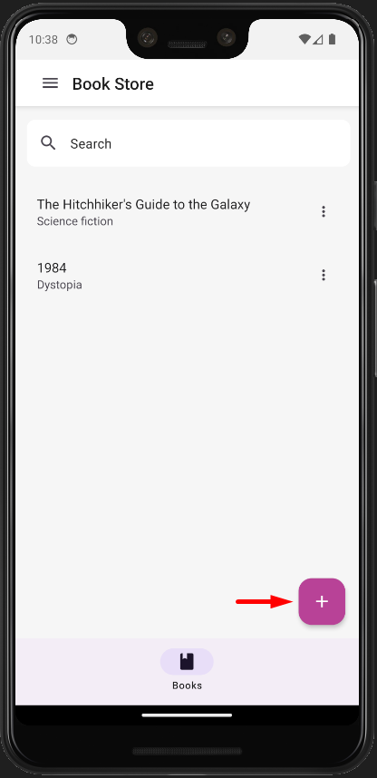
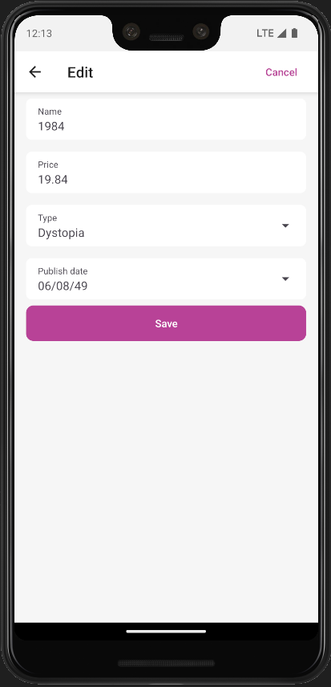
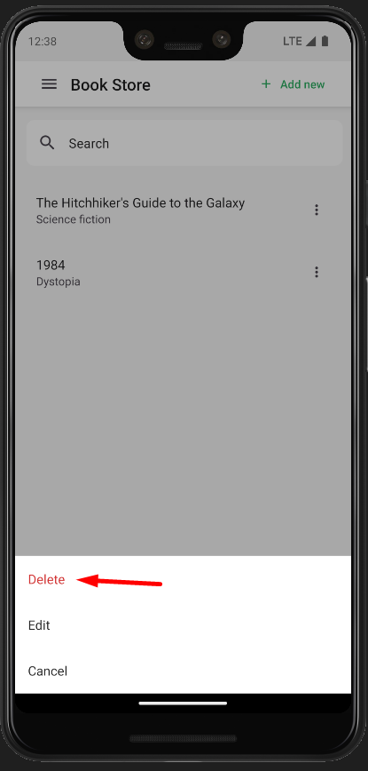
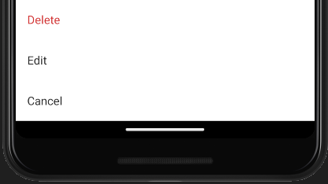
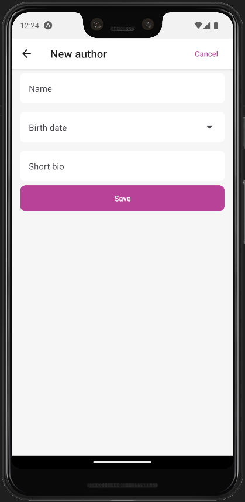

# Mobile Application Development Tutorial - React Native

## About This Tutorial

- This tutorial assumes that you have completed the [Web Application Development tutorial](https://docs.abp.io/en/commercial/latest/tutorials/book-store/part-1?UI=NG&DB=Mongo) and built an ABP based application named `Acme.BookStore`. In this tutorial, we will only focus on the UI side of the `Acme.BookStore` application and will implement the CRUD operations.
- Before starting, please make sure that the [React Native Development Environment](https://docs.abp.io/en/commercial/latest/getting-started-react-native) is ready on your machine.

## Download the Source Code

You can use the following link to download the source code of the application described in this article:

- [Acme.BookStore](https://abp.io/Account/Login?returnUrl=/api/download/samples/bookstore-react-native-mongodb)

> If you encounter the "filename too long" or "unzip" error on Windows, please see [this guide](https://docs.abp.io/en/abp/latest/KB/Windows-Path-Too-Long-Fix).

## The Book List Page

In react native there is no dynamic proxy generation, that's why we need to create the BookAPI proxy manually under the `./src/api` folder.

```js
import api from "./API";

export const getList = () => api.get("/api/app/book").then(({ data }) => data);

export const get = (id) =>
  api.get(`/api/app/book/${id}`).then(({ data }) => data);

export const create = (input) =>
  api.post("/api/app/book", input).then(({ data }) => data);

export const update = (input, id) =>
  api.put(`/api/app/book/${id}`, input).then(({ data }) => data);

export const remove = (id) =>
  api.delete(`/api/app/book/${id}`).then(({ data }) => data);
```

### Add the `Book Store` menu item to the navigation

For the create menu item, navigate to `./src/navigators/DrawerNavigator.js` file and add `BookStoreStack` to `Drawer.Navigator` component.

```js
//Other imports..
import BookStoreStackNavigator from "./BookStoreNavigator";

const Drawer = createDrawerNavigator();

export default function DrawerNavigator() {
  return (
    <Drawer.Navigator
      initialRouteName="Home"
      drawerContent={DrawerContent}
      defaultStatus="closed"
    >
      {/*Added Screen*/}
      <Drawer.Screen
        name="BookStoreStack"
        component={BookStoreStackNavigator}
        options={{ header: () => null }}
      />
      {/*Added Screen*/}
    </Drawer.Navigator>
  );
}
```

Create the `BookStoreStackNavigator` in `./src/navigators/BookStoreNavigator.js`, this navigator will be used for the BookStore menu item.

```js
import React from "react";
import { SafeAreaView } from "react-native-safe-area-context";
import { createNativeStackNavigator } from "@react-navigation/native-stack";
import i18n from "i18n-js";
import HamburgerIcon from "../components/HamburgerIcon/HamburgerIcon";
import BookStoreScreen from "../screens/Books/BookStoreScreen";

const Stack = createNativeStackNavigator();

export default function BookStoreStackNavigator() {
  return (
    <SafeAreaView style={{ flex: 1 }}>
      <Stack.Navigator initialRouteName="BookStore">
        <Stack.Screen
          name="BookStore"
          component={BookStoreScreen}
          options={({ navigation }) => ({
            title: i18n.t("BookStore::Menu:BookStore"),
            headerLeft: () => <HamburgerIcon navigation={navigation} />,
          })}
        />
      </Stack.Navigator>
    </SafeAreaView>
  );
}
```

- BookStoreScreen will be used to store the `books` and `authors` page

Add the `BookStoreStack` to the screens object in the `./src/components/DrawerContent/DrawerContent.js` file. The DrawerContent component will be used to render the menu items.

```js
// Imports..
const screens = {
  HomeStack: { label: "::Menu:Home", iconName: "home" },
  DashboardStack: {
    label: "::Menu:Dashboard",
    requiredPolicy: "BookStore.Dashboard",
    iconName: "chart-areaspline",
  },
  UsersStack: {
    label: "AbpIdentity::Users",
    iconName: "account-supervisor",
    requiredPolicy: "AbpIdentity.Users",
  },
  //Add this property
  BookStoreStack: {
    label: "BookStore::Menu:BookStore",
    iconName: "book",
  },
  //Add this property
  TenantsStack: {
    label: "Saas::Tenants",
    iconName: "book-outline",
    requiredPolicy: "Saas.Tenants",
  },
  SettingsStack: {
    label: "AbpSettingManagement::Settings",
    iconName: "cog",
    navigation: null,
  },
};
// Other codes..
```


### Create Book List page

Before creating the book list page, we need to create the `BookStoreScreen.js` file under the `./src/screens/BookStore` folder. This file will be used to store the `books` and `authors` page.

```js
import React from "react";
import i18n from "i18n-js";
import { BottomNavigation } from "react-native-paper";
import BooksScreen from "./Books/BooksScreen";

const BooksRoute = () => <BooksScreen />;

function BookStoreScreen({ navigation }) {
  const [index, setIndex] = React.useState(0);
  const [routes] = React.useState([
    {
      key: "books",
      title: i18n.t("BookStore::Menu:Books"),
      focusedIcon: "book",
      unfocusedIcon: "book-outline",
    },
  ]);

  const renderScene = BottomNavigation.SceneMap({
    books: BooksRoute,
  });

  return (
    <BottomNavigation
      navigationState={{ index, routes }}
      onIndexChange={setIndex}
      renderScene={renderScene}
    />
  );
}
export default BookStoreScreen;
```

Create the `BooksScreen.js` file under the `./src/screens/BookStore/Books` folder.

```js
import React from "react";
import { useSelector } from "react-redux";
import { View } from "react-native";
import { useTheme, List } from "react-native-paper";
import { getBooks } from "../../api/BookAPI";
import i18n from "i18n-js";
import DataList from "../../components/DataList/DataList";
import { createAppConfigSelector } from "../../store/selectors/AppSelectors";

function BooksScreen({ navigation }) {
  const theme = useTheme();
  const currentUser = useSelector(createAppConfigSelector())?.currentUser;

  return (
    <View style={{ flex: 1, backgroundColor: theme.colors.background }}>
      {currentUser?.isAuthenticated && (
        <DataList
          navigation={navigation}
          fetchFn={getBooks}
          render={({ item }) => (
            <List.Item
              key={item.id}
              title={item.name}
              description={i18n.t("BookStore::Enum:BookType." + item.type)}
            />
          )}
        />
      )}
    </View>
  );
}
export default BooksScreen;
```

- `getBooks` function is used to fetch the books from the server.
- `i18n` API to localize the given key. It uses the incoming resource from the `application-localization` endpoint.
- `DataList` component takes the `fetchFn` property that we'll give to the API request function, it's used to fetch data and maintain the logic of lazy loading etc.


## Creating a New Book

### Add the `@react-native-community/datetimepicker` package for the date functionality.

```bash
yarn expo install @react-native-community/datetimepicker

//or

npx expo install @react-native-community/datetimepicker
```

### Add the `CreateUpdateBook` Screen to the BookStoreNavigator

Like the `BookStoreScreen` we need to add the `CreateUpdateBookScreen` to the `./src/navigators/BookStoreNavigator.js` file.

```js
//Other codes

import { Button } from "react-native-paper"; //Added this line

import CreateUpdateBookScreen from "../screens/BookStore/Books/CreateUpdateBook/CreateUpdateBookScreen"; //Added this line

//Other codes

export default function BookStoreStackNavigator() {
  return (
    <SafeAreaView style={{ flex: 1 }}>
      <Stack.Navigator initialRouteName="BookStore">
        {/*Other screens*/}

        {/* Added this screen */}
        <Stack.Screen
          name="CreateUpdateBook"
          component={CreateUpdateBookScreen}
          options={({ route, navigation }) => ({
            title: i18n.t(
              route.params?.bookId ? "BookStore::Edit" : "BookStore::NewBook"
            ),
            headerRight: () => (
              <Button
                mode="text"
                onPress={() => navigation.navigate("BookStore")}
              >
                {i18n.t("AbpUi::Cancel")}
              </Button>
            ),
          })}
        />
      </Stack.Navigator>
    </SafeAreaView>
  );
}
```

To navigate to the `CreateUpdateBookScreen`, we need to add the `CreateUpdateBook` button to the `BooksScreen.js` file.

```js
//Other imports..

import {
  // rest imports..,
  StyleSheet,
} from "react-native";

import {
  // rest imports..,
  AnimatedFAB,
} from "react-native-paper";

function BooksScreen({ navigation }) {
  //Other codes..

  return (
    <View style={{ flex: 1, backgroundColor: theme.colors.background }}>
      {/* Other codes..*/}

      {/* Included Code */}
      {currentUser?.isAuthenticated && (
        <AnimatedFAB
          icon={"plus"}
          label={i18n.t("BookStore::NewBook")}
          color="white"
          extended={false}
          onPress={() => navigation.navigate("CreateUpdateBook")}
          visible={true}
          animateFrom={"right"}
          iconMode={"static"}
          style={[styles.fabStyle, { backgroundColor: theme.colors.primary }]}
        />
      )}
      {/* Included Code */}
    </View>
  );
}

//Added lines
const styles = StyleSheet.create({
  container: {
    flexGrow: 1,
  },
  fabStyle: {
    bottom: 16,
    right: 16,
    position: "absolute",
  },
});
//Added lines

export default BooksScreen;
```

After adding the `CreateUpdateBook` button, we need to add the `CreateUpdateBookScreen.js` file under the `./src/screens/BookStore/Books/CreateUpdateBook` folder.

```js
import PropTypes from "prop-types";
import React from "react";

import { create } from "../../../../api/BookAPI";
import LoadingActions from "../../../../store/actions/LoadingActions";
import { createLoadingSelector } from "../../../../store/selectors/LoadingSelectors";
import { connectToRedux } from "../../../../utils/ReduxConnect";
import CreateUpdateBookForm from "./CreateUpdateBookForm";

function CreateUpdateBookScreen({ navigation, startLoading, clearLoading }) {
  const submit = (data) => {
    startLoading({ key: "save" });

    create(data)
      .then(() => navigation.goBack())
      .finally(() => clearLoading());
  };

  return <CreateUpdateBookForm submit={submit} />;
}

CreateUpdateBookScreen.propTypes = {
  startLoading: PropTypes.func.isRequired,
  clearLoading: PropTypes.func.isRequired,
};

export default connectToRedux({
  component: CreateUpdateBookScreen,
  stateProps: (state) => ({ loading: createLoadingSelector()(state) }),
  dispatchProps: {
    startLoading: LoadingActions.start,
    clearLoading: LoadingActions.clear,
  },
});
```

- In this page we'll store logic, send post/put requests, get the selected book data and etc.
- This page will wrap the `CreateUpdateBookFrom` component and pass the submit function with other properties.

Create a `CreateUpdateBookForm.js` file under the `./src/screens/BookStore/Books/CreateUpdateBook` folder and add the following code to it.

```js
import React, { useRef, useState } from "react";
import {
  Platform,
  KeyboardAvoidingView,
  StyleSheet,
  View,
  ScrollView,
} from "react-native";

import { useFormik } from "formik";
import i18n from "i18n-js";
import PropTypes from "prop-types";
import * as Yup from "yup";
import { useTheme, TextInput } from "react-native-paper";
import DateTimePicker from "@react-native-community/datetimepicker";

import { FormButtons } from "../../../../components/FormButtons";
import ValidationMessage from "../../../../components/ValidationMessage/ValidationMessage";
import AbpSelect from "../../../../components/Select/Select";

const validations = {
  name: Yup.string().required("AbpValidation::ThisFieldIsRequired."),
  price: Yup.number().required("AbpValidation::ThisFieldIsRequired."),
  type: Yup.string().nullable().required("AbpValidation::ThisFieldIsRequired."),
  publishDate: Yup.string()
    .nullable()
    .required("AbpValidation::ThisFieldIsRequired."),
};

const props = {
  underlineStyle: { backgroundColor: "transparent" },
  underlineColor: "#333333bf",
};

function CreateUpdateBookForm({ submit }) {
  const theme = useTheme();

  const [bookTypeVisible, setBookTypeVisible] = useState(false);
  const [publishDateVisible, setPublishDateVisible] = useState(false);

  const nameRef = useRef();
  const priceRef = useRef();
  const typeRef = useRef();
  const publishDateRef = useRef();

  const inputStyle = {
    ...styles.input,
    backgroundColor: theme.colors.primaryContainer,
  };
  const bookTypes = new Array(8).fill(0).map((_, i) => ({
    id: i + 1,
    displayName: i18n.t(`BookStore::Enum:BookType.${i + 1}`),
  }));

  const onSubmit = (values) => {
    if (!bookForm.isValid) {
      return;
    }

    submit({ ...values });
  };

  const bookForm = useFormik({
    enableReinitialize: true,
    validateOnBlur: true,
    validationSchema: Yup.object().shape({
      ...validations,
    }),
    initialValues: {
      name: "",
      price: "",
      type: "",
      publishDate: null,
    },
    onSubmit,
  });

  const isInvalidControl = (controlName = null) => {
    if (!controlName) {
      return;
    }

    return (
      ((!!bookForm.touched[controlName] && bookForm.submitCount > 0) ||
        bookForm.submitCount > 0) &&
      !!bookForm.errors[controlName]
    );
  };

  const onChange = (event, selectedDate) => {
    if (!selectedDate) {
      return;
    }

    setPublishDateVisible(false);

    if (event && event.type !== "dismissed") {
      bookForm.setFieldValue("publishDate", selectedDate, true);
    }
  };

  return (
    <View style={{ flex: 1, backgroundColor: theme.colors.background }}>
      <AbpSelect
        key="typeSelect"
        title={i18n.t("BookStore::Type")}
        visible={bookTypeVisible}
        items={bookTypes}
        hasDefualtItem={true}
        hideModalFn={() => setBookTypeVisible(false)}
        selectedItem={bookForm.values.type}
        setSelectedItem={(id) => {
          bookForm.setFieldValue("type", id, true);
          bookForm.setFieldValue(
            "typeDisplayName",
            bookTypes.find((f) => f.id === id)?.displayName || null,
            false
          );
        }}
      />

      {publishDateVisible && (
        <DateTimePicker
          testID="publishDatePicker"
          value={bookForm.values.publishDate || new Date()}
          mode={"date"}
          is24Hour={true}
          onChange={onChange}
        />
      )}

      <KeyboardAvoidingView
        behavior={Platform.OS === "ios" ? "padding" : "margin"}
      >
        <ScrollView keyboardShouldPersistTaps="handled">
          <View style={styles.input.container}>
            <TextInput
              mode="flat"
              ref={nameRef}
              error={isInvalidControl("name")}
              onSubmitEditing={() => priceRef.current.focus()}
              returnKeyType="next"
              onChangeText={bookForm.handleChange("name")}
              onBlur={bookForm.handleBlur("name")}
              value={bookForm.values.name}
              autoCapitalize="none"
              label={i18n.t("BookStore::Name")}
              style={inputStyle}
              {...props}
            />
            {isInvalidControl("name") && (
              <ValidationMessage>{bookForm.errors.name}</ValidationMessage>
            )}
          </View>

          <View style={styles.input.container}>
            <TextInput
              mode="flat"
              ref={priceRef}
              error={isInvalidControl("price")}
              onSubmitEditing={() => typeRef.current.focus()}
              returnKeyType="next"
              onChangeText={bookForm.handleChange("price")}
              onBlur={bookForm.handleBlur("price")}
              value={bookForm.values.price}
              autoCapitalize="none"
              label={i18n.t("BookStore::Price")}
              style={inputStyle}
              {...props}
            />
            {isInvalidControl("price") && (
              <ValidationMessage>{bookForm.errors.price}</ValidationMessage>
            )}
          </View>

          <View style={styles.input.container}>
            <TextInput
              ref={typeRef}
              label={i18n.t("BookStore::Type")}
              right={
                <TextInput.Icon
                  onPress={() => setBookTypeVisible(true)}
                  icon="menu-down"
                />
              }
              style={inputStyle}
              editable={false}
              value={bookForm.values.typeDisplayName}
              {...props}
            />
            {isInvalidControl("type") && (
              <ValidationMessage>{bookForm.errors.type}</ValidationMessage>
            )}
          </View>

          <View style={styles.input.container}>
            <TextInput
              ref={publishDateRef}
              label={i18n.t("BookStore::PublishDate")}
              right={
                <TextInput.Icon
                  onPress={() => setPublishDateVisible(true)}
                  icon="menu-down"
                />
              }
              style={inputStyle}
              editable={false}
              value={bookForm.values.publishDate?.toLocaleDateString()}
              {...props}
            />
            {isInvalidControl("publishDate") && (
              <ValidationMessage>
                {bookForm.errors.publishDate}
              </ValidationMessage>
            )}
          </View>

          <FormButtons style={styles.button} submit={bookForm.handleSubmit} />
        </ScrollView>
      </KeyboardAvoidingView>
    </View>
  );
}

const styles = StyleSheet.create({
  input: {
    container: {
      margin: 8,
      marginLeft: 16,
      marginRight: 16,
    },
    borderRadius: 8,
    borderTopLeftRadius: 8,
    borderTopRightRadius: 8,
  },
  button: {
    marginLeft: 16,
    marginRight: 16,
  },
});

CreateUpdateBookForm.propTypes = {
  submit: PropTypes.func.isRequired,
};

export default CreateUpdateBookForm;
```

- `formik` will manage the form state, validation and value changes.
- `Yup` allows for the build validation schema.
- `AbpSelect` component is used to select the book type.
- `submit` method will pass the form values to the `CreateUpdateBookScreen` component.




## Update a Book

We need the navigation parameter for the get bookId and then navigate it again after the Create & Update operation. That's why we'll pass the navigation parameter to the `BooksScreen` component.

```js
//Imports..

//Add navigation parameter
const BooksRoute = (nav) => <BooksScreen navigation={nav} />;

function BookStoreScreen({ navigation }) {
  //Other codes..

  const renderScene = BottomNavigation.SceneMap({
    books: () => BooksRoute(navigation), //Use this way
  });

  //Other codes..
}

export default BookStoreScreen;
```

Replace the code below in the `BookScreen.js` file under the `./src/screens/BookStore/Books` folder.

```js
import React from "react";
import { useSelector } from "react-redux";
import { Alert, View, StyleSheet } from "react-native";
import { useTheme, List, IconButton, AnimatedFAB } from "react-native-paper";
import { useActionSheet } from "@expo/react-native-action-sheet";
import i18n from "i18n-js";

import { getList } from "../../../api/BookAPI";
import DataList from "../../../components/DataList/DataList";
import { createAppConfigSelector } from "../../../store/selectors/AppSelectors";

function BooksScreen({ navigation }) {
  const theme = useTheme();
  const currentUser = useSelector(createAppConfigSelector())?.currentUser;
  const { showActionSheetWithOptions } = useActionSheet();

  const openContextMenu = (item) => {
    const options = [];

    options.push(i18n.t("AbpUi::Edit"));
    options.push(i18n.t("AbpUi::Cancel"));

    showActionSheetWithOptions(
      {
        options,
        cancelButtonIndex: options.length - 1,
      },
      (index) => {
        switch (options[index]) {
          case i18n.t("AbpUi::Edit"):
            edit(item);
            break;
        }
      }
    );
  };

  const edit = (item) => {
    navigation.navigate("CreateUpdateBook", { bookId: item.id });
  };

  return (
    <View style={{ flex: 1, backgroundColor: theme.colors.background }}>
      {currentUser?.isAuthenticated && (
        <DataList
          navigation={navigation}
          fetchFn={getList}
          render={({ item }) => (
            <List.Item
              key={item.id}
              title={item.name}
              description={i18n.t("BookStore::Enum:BookType." + item.type)}
              right={(props) => (
                <IconButton
                  {...props}
                  icon="dots-vertical"
                  rippleColor={"#ccc"}
                  size={20}
                  onPress={() => openContextMenu(item)}
                />
              )}
            />
          )}
        />
      )}

      {currentUser?.isAuthenticated && (
        <AnimatedFAB
          icon={"plus"}
          label={i18n.t("BookStore::NewBook")}
          color="white"
          extended={false}
          onPress={() => navigation.navigate("CreateUpdateBook")}
          visible={true}
          animateFrom={"right"}
          iconMode={"static"}
          style={[styles.fabStyle, { backgroundColor: theme.colors.primary }]}
        />
      )}
    </View>
  );
}

const styles = StyleSheet.create({
  container: {
    flexGrow: 1,
  },
  fabStyle: {
    bottom: 16,
    right: 16,
    position: "absolute",
  },
});

export default BooksScreen;
```

Replace code below for `CreateUpdateBookScreen.js` file under the `./src/screens/BookStore/Books/CreateUpdateBook/`

```js
import PropTypes from "prop-types";
import React, { useEffect, useState } from "react";

import { get, create, update } from "../../../../api/BookAPI";
import LoadingActions from "../../../../store/actions/LoadingActions";
import { createLoadingSelector } from "../../../../store/selectors/LoadingSelectors";
import { connectToRedux } from "../../../../utils/ReduxConnect";
import CreateUpdateBookForm from "./CreateUpdateBookForm";

function CreateUpdateBookScreen({
  navigation,
  route,
  startLoading,
  clearLoading,
}) {
  const { bookId } = route.params || {};
  const [book, setBook] = useState(null);

  const submit = (data) => {
    startLoading({ key: "save" });

    (data.id ? update(data, data.id) : create(data))
      .then(() => navigation.goBack())
      .finally(() => clearLoading());
  };

  useEffect(() => {
    if (bookId) {
      startLoading({ key: "fetchBookDetail" });

      get(bookId)
        .then((response) => setBook(response))
        .finally(() => clearLoading());
    }
  }, [bookId]);

  return <CreateUpdateBookForm submit={submit} book={book} />;
}

CreateUpdateBookScreen.propTypes = {
  startLoading: PropTypes.func.isRequired,
  clearLoading: PropTypes.func.isRequired,
};

export default connectToRedux({
  component: CreateUpdateBookScreen,
  stateProps: (state) => ({ loading: createLoadingSelector()(state) }),
  dispatchProps: {
    startLoading: LoadingActions.start,
    clearLoading: LoadingActions.clear,
  },
});
```

- `get` method is used to fetch the book details from the server.
- `update` method is used to update the book on the server.
- `route` parameter will be used to get the bookId from the navigation.

Replace the `CreateUpdateBookForm.js` file with the code below. We'll use this file for the create and update operations.

```js
//Imports..

//validateSchema

//props

function CreateUpdateBookForm({
  submit,
  book = null, //Add book parameter with default value
}) {
  //Other codes..

  const bookForm = useFormik({
    enableReinitialize: true,
    validateOnBlur: true,
    validationSchema: Yup.object().shape({
      ...validations,
    }),
    initialValues: {
      //Update initialValues
      ...book,
      name: book?.name || "",
      price: book?.price.toString() || "",
      type: book?.type || "",
      typeDisplayName:
        book?.type && i18n.t("BookStore::Enum:BookType." + book.type),
      publishDate: (book?.publishDate && new Date(book?.publishDate)) || null,
      //Update initialValues
    },
    onSubmit,
  });

  //Others codes..
}

//Other codes..
```

- `book` is a nullable property. It'll store the selected book, if the book parameter is null then we'll create a new book.




## Delete a Book

Replace the code below in the `BooksScreen.js` file under the `./src/screens/BookStore/Books` folder.

```js
import React, { useState } from "react";
import { useSelector } from "react-redux";
import { Alert, View, StyleSheet } from "react-native";
import { useTheme, List, IconButton, AnimatedFAB } from "react-native-paper";
import { useActionSheet } from "@expo/react-native-action-sheet";
import i18n from "i18n-js";

import { getList, remove } from "../../../api/BookAPI";
import DataList from "../../../components/DataList/DataList";
import { createAppConfigSelector } from "../../../store/selectors/AppSelectors";

function BooksScreen({ navigation }) {
  const theme = useTheme();
  const currentUser = useSelector(createAppConfigSelector())?.currentUser;

  const [refresh, setRefresh] = useState(null);
  const { showActionSheetWithOptions } = useActionSheet();

  const openContextMenu = (item) => {
    const options = [];

    options.push(i18n.t("AbpUi::Delete"));
    options.push(i18n.t("AbpUi::Edit"));
    options.push(i18n.t("AbpUi::Cancel"));

    showActionSheetWithOptions(
      {
        options,
        cancelButtonIndex: options.length - 1,
        destructiveButtonIndex: options.indexOf(i18n.t("AbpUi::Delete")),
      },
      (index) => {
        switch (options[index]) {
          case i18n.t("AbpUi::Edit"):
            edit(item);
            break;
          case i18n.t("AbpUi::Delete"):
            removeOnClick(item);
            break;
        }
      }
    );
  };

  const removeOnClick = (item) => {
    Alert.alert("Warning", i18n.t("BookStore::AreYouSureToDelete"), [
      {
        text: i18n.t("AbpUi::Cancel"),
        style: "cancel",
      },
      {
        style: "default",
        text: i18n.t("AbpUi::Ok"),
        onPress: () => {
          remove(item.id).then(() => {
            setRefresh((refresh ?? 0) + 1);
          });
        },
      },
    ]);
  };

  const edit = (item) => {
    navigation.navigate("CreateUpdateBook", { bookId: item.id });
  };

  return (
    <View style={{ flex: 1, backgroundColor: theme.colors.background }}>
      {currentUser?.isAuthenticated && (
        <DataList
          navigation={navigation}
          fetchFn={getList}
          trigger={refresh}
          render={({ item }) => (
            <List.Item
              key={item.id}
              title={item.name}
              description={i18n.t("BookStore::Enum:BookType." + item.type)}
              right={(props) => (
                <IconButton
                  {...props}
                  icon="dots-vertical"
                  rippleColor={"#ccc"}
                  size={20}
                  onPress={() => openContextMenu(item)}
                />
              )}
            />
          )}
        />
      )}

      {currentUser?.isAuthenticated && (
        <AnimatedFAB
          icon={"plus"}
          label={i18n.t("BookStore::NewBook")}
          color="white"
          extended={false}
          onPress={() => navigation.navigate("CreateUpdateBook")}
          visible={true}
          animateFrom={"right"}
          iconMode={"static"}
          style={[styles.fabStyle, { backgroundColor: theme.colors.primary }]}
        />
      )}
    </View>
  );
}

const styles = StyleSheet.create({
  container: {
    flexGrow: 1,
  },
  fabStyle: {
    bottom: 16,
    right: 16,
    position: "absolute",
  },
});

export default BooksScreen;
```

- `Delete` option is added to context menu list
- `removeOnClick` method will handle the delete process. It'll show an alert before the delete operation.




## Authorization

### Hide Books item in tab

Add `grantedPolicies` to the policies variable from the `appConfig` store

```js
//Other imports..
import { useSelector } from "react-redux";

function BookStoreScreen({ navigation }) {
  const [index, setIndex] = React.useState(0);
  const [routes, setRoutes] = React.useState([]);

  const currentUser = useSelector((state) => state.app.appConfig.currentUser);
  const policies = useSelector(
    (state) => state.app.appConfig.auth.grantedPolicies
  );

  const renderScene = BottomNavigation.SceneMap({
    books: () => BooksRoute(navigation),
  });

  React.useEffect(() => {
    if (!currentUser?.isAuthenticated || !policies) {
      setRoutes([]);
      return;
    }

    let _routes = [];

    if (!!policies["BookStore.Books"]) {
      _routes.push({
        key: "books",
        title: i18n.t("BookStore::Menu:Books"),
        focusedIcon: "book",
        unfocusedIcon: "book-outline",
      });
    }

    setRoutes([..._routes]);
  }, [Object.keys(policies)?.filter((f) => f.startsWith("BookStore")).length]);

  return (
    routes?.length > 0 && (
      <BottomNavigation
        navigationState={{ index, routes }}
        onIndexChange={setIndex}
        renderScene={renderScene}
      />
    )
  );
}

export default BookStoreScreen;
```

- In the `useEffect` function we'll check the `currentUser` and `policies` variables.
- useEffect's conditions will be the policies of the `BookStore` permission group.
- `Books` tab will be shown if the user has the `BookStore.Books` permission


### Hide the New Book Button

`New Book` button is placed in the BooksScreen as a `+` icon button. For the toggle visibility of the button, we need to add the `policies` variable to the `BooksScreen` component like the `BookStoreScreen` component. Open the `BooksScreen.js` file in the `./src/screens/BookStore/Books` folder and include the code below.

```js
//Imports..

function BooksScreen({ navigation }) {
  const policies = useSelector(createAppConfigSelector())?.auth?.grantedPolicies;

  //Other codes..

  return (
    {/*Other codes..*/}

    {currentUser?.isAuthenticated &&
      !!policies['BookStore.Books.Create'] && //Add this line
      (
        <AnimatedFAB
          icon={'plus'}
          label={i18n.t('BookStore::NewBook')}
          color="white"
          extended={false}
          onPress={() => navigation.navigate('CreateUpdateBook')}
          visible={true}
          animateFrom={'right'}
          iconMode={'static'}
          style={[styles.fabStyle, { backgroundColor: theme.colors.primary }]}
        />
      )
    }
  )
}
```

- Now the `+` icon button will be shown if the user has the `BookStore.Books.Create` permission.


### Hide the Edit and Delete Actions

Update your code as below in the `./src/screens/BookStore/Books/BooksScreen.js` file. We'll check the `policies` variables for the `Edit` and `Delete` actions.

```js
function BooksScreen() {
  //...

  const openContextMenu = (item) => {
    const options = [];

    if (policies["BookStore.Books.Delete"]) {
      options.push(i18n.t("AbpUi::Delete"));
    }

    if (policies["BookStore.Books.Update"]) {
      options.push(i18n.t("AbpUi::Edit"));
    }

    options.push(i18n.t("AbpUi::Cancel"));
  };

  //...
}
```



## Author

### Create API Proxy

```js
./src/api/AuthorAPI.js

import api from './API';

export const getList = () => api.get('/api/app/author').then(({ data }) => data);

export const get = id => api.get(`/api/app/author/${id}`).then(({ data }) => data);

export const create = input => api.post('/api/app/author', input).then(({ data }) => data);

export const update = (input, id) => api.put(`/api/app/author/${id}`, input).then(({ data }) => data);

export const remove = id => api.delete(`/api/app/author/${id}`).then(({ data }) => data);
```

## The Author List Page

### Add Authors Tab to BookStoreScreen

Open the `./src/screens/BookStore/BookStoreScreen.js` file and update it with the code below.

```js
//Other imports
import AuthorsScreen from "./Authors/AuthorsScreen";

//Other Routes..
const AuthorsRoute = (nav) => <AuthorsScreen navigation={nav} />;

function BookStoreScreen({ navigation }) {
  //Other codes..

  const renderScene = BottomNavigation.SceneMap({
    books: () => BooksRoute(navigation),
    authors: () => AuthorsRoute(navigation), //Added this line
  });

  //Added this
  if (!!policies["BookStore.Authors"]) {
    _routes.push({
      key: "authors",
      title: i18n.t("BookStore::Menu:Authors"),
      focusedIcon: "account-supervisor",
      unfocusedIcon: "account-supervisor-outline",
    });
  }
  //Added this
}

export default BookStoreScreen;
```

Create a `AuthorsScreen.js` file under the `./src/screens/BookStore/Authors` folder and add the code below to it.

```js
import React, { useState } from "react";
import { useSelector } from "react-redux";
import { Alert, View, StyleSheet } from "react-native";
import { useTheme, List, IconButton, AnimatedFAB } from "react-native-paper";
import { useActionSheet } from "@expo/react-native-action-sheet";
import i18n from "i18n-js";

import { getList, remove } from "../../../api/AuthorAPI";
import DataList from "../../../components/DataList/DataList";
import { createAppConfigSelector } from "../../../store/selectors/AppSelectors";

function AuthorsScreen({ navigation }) {
  const theme = useTheme();
  const currentUser = useSelector(createAppConfigSelector())?.currentUser;
  const policies = useSelector(createAppConfigSelector())?.auth
    ?.grantedPolicies;

  const [refresh, setRefresh] = useState(null);
  const { showActionSheetWithOptions } = useActionSheet();

  const openContextMenu = (item) => {
    const options = [];

    if (policies["BookStore.Authors.Delete"]) {
      options.push(i18n.t("AbpUi::Delete"));
    }

    if (policies["BookStore.Authors.Edit"]) {
      options.push(i18n.t("AbpUi::Edit"));
    }

    options.push(i18n.t("AbpUi::Cancel"));

    showActionSheetWithOptions(
      {
        options,
        cancelButtonIndex: options.length - 1,
        destructiveButtonIndex: options.indexOf(i18n.t("AbpUi::Delete")),
      },
      (index) => {
        switch (options[index]) {
          case i18n.t("AbpUi::Edit"):
            edit(item);
            break;
          case i18n.t("AbpUi::Delete"):
            removeOnClick(item);
            break;
        }
      }
    );
  };

  const removeOnClick = ({ id } = {}) => {
    Alert.alert("Warning", i18n.t("BookStore::AreYouSureToDelete"), [
      {
        text: i18n.t("AbpUi::Cancel"),
        style: "cancel",
      },
      {
        style: "default",
        text: i18n.t("AbpUi::Ok"),
        onPress: () => {
          remove(id).then(() => {
            setRefresh((refresh ?? 0) + 1);
          });
        },
      },
    ]);
  };

  const edit = ({ id } = {}) => {
    navigation.navigate("CreateUpdateAuthor", { authorId: id });
  };

  return (
    <View style={{ flex: 1, backgroundColor: theme.colors.background }}>
      {currentUser?.isAuthenticated && (
        <DataList
          navigation={navigation}
          fetchFn={getList}
          trigger={refresh}
          render={({ item }) => (
            <List.Item
              key={item.id}
              title={item.name}
              description={
                item.shortBio || new Date(item.birthDate)?.toLocaleDateString()
              }
              right={(props) => (
                <IconButton
                  {...props}
                  icon="dots-vertical"
                  rippleColor={"#ccc"}
                  size={20}
                  onPress={() => openContextMenu(item)}
                />
              )}
            />
          )}
        />
      )}

      {currentUser?.isAuthenticated && policies["BookStore.Authors.Create"] && (
        <AnimatedFAB
          icon={"plus"}
          label={i18n.t("BookStore::NewAuthor")}
          color="white"
          extended={false}
          onPress={() => navigation.navigate("CreateUpdateAuthor")}
          visible={true}
          animateFrom={"right"}
          iconMode={"static"}
          style={[styles.fabStyle, { backgroundColor: theme.colors.primary }]}
        />
      )}
    </View>
  );
}

const styles = StyleSheet.create({
  container: {
    flexGrow: 1,
  },
  fabStyle: {
    bottom: 16,
    right: 16,
    position: "absolute",
  },
});

export default AuthorsScreen;
```

Create a `CreateUpdateAuthorScreen.js` file under the `./src/screens/BookStore/Authors/CreateUpdateAuthor` folder and add the code below to it.

```js
import PropTypes from "prop-types";
import React, { useEffect, useState } from "react";

import { get, create, update } from "../../../../api/AuthorAPI";
import LoadingActions from "../../../../store/actions/LoadingActions";
import { createLoadingSelector } from "../../../../store/selectors/LoadingSelectors";
import { connectToRedux } from "../../../../utils/ReduxConnect";
import CreateUpdateAuthorForm from "./CreateUpdateAuthorForm";

function CreateUpdateAuthorScreen({
  navigation,
  route,
  startLoading,
  clearLoading,
}) {
  const { authorId } = route.params || {};
  const [author, setAuthor] = useState(null);

  const submit = (data) => {
    startLoading({ key: "save" });

    (data.id ? update(data, data.id) : create(data))
      .then(() => navigation.goBack())
      .finally(() => clearLoading());
  };

  useEffect(() => {
    if (authorId) {
      startLoading({ key: "fetchAuthorDetail" });

      get(authorId)
        .then((response) => setAuthor(response))
        .finally(() => clearLoading());
    }
  }, [authorId]);

  return <CreateUpdateAuthorForm submit={submit} author={author} />;
}

CreateUpdateAuthorScreen.propTypes = {
  startLoading: PropTypes.func.isRequired,
  clearLoading: PropTypes.func.isRequired,
};

export default connectToRedux({
  component: CreateUpdateAuthorScreen,
  stateProps: (state) => ({ loading: createLoadingSelector()(state) }),
  dispatchProps: {
    startLoading: LoadingActions.start,
    clearLoading: LoadingActions.clear,
  },
});
```

Create a `CreateUpdateAuthorForm.js` file under the `./src/screens/BookStore/Authors/CreateUpdateAuthor` folder and add the code below to it.

```js
import React, { useRef, useState } from "react";
import {
  Platform,
  KeyboardAvoidingView,
  StyleSheet,
  View,
  ScrollView,
} from "react-native";

import { useFormik } from "formik";
import i18n from "i18n-js";
import PropTypes from "prop-types";
import * as Yup from "yup";
import { useTheme, TextInput } from "react-native-paper";
import DateTimePicker from "@react-native-community/datetimepicker";

import { FormButtons } from "../../../../components/FormButtons";
import ValidationMessage from "../../../../components/ValidationMessage/ValidationMessage";

const validations = {
  name: Yup.string().required("AbpValidation::ThisFieldIsRequired."),
  birthDate: Yup.string()
    .nullable()
    .required("AbpValidation::ThisFieldIsRequired."),
};

const props = {
  underlineStyle: { backgroundColor: "transparent" },
  underlineColor: "#333333bf",
};

function CreateUpdateAuthorForm({ submit, author = null }) {
  const theme = useTheme();

  const [birthDateVisible, setPublishDateVisible] = useState(false);

  const nameRef = useRef();
  const birthDateRef = useRef();
  const shortBioRef = useRef();

  const inputStyle = {
    ...styles.input,
    backgroundColor: theme.colors.primaryContainer,
  };

  const onSubmit = (values) => {
    if (!authorForm.isValid) {
      return;
    }

    submit({ ...values });
  };

  const authorForm = useFormik({
    enableReinitialize: true,
    validateOnBlur: true,
    validationSchema: Yup.object().shape({
      ...validations,
    }),
    initialValues: {
      ...author,
      name: author?.name || "",
      birthDate: (author?.birthDate && new Date(author?.birthDate)) || null,
      shortBio: author?.shortBio || "",
    },
    onSubmit,
  });

  const isInvalidControl = (controlName = null) => {
    if (!controlName) {
      return;
    }

    return (
      ((!!authorForm.touched[controlName] && authorForm.submitCount > 0) ||
        authorForm.submitCount > 0) &&
      !!authorForm.errors[controlName]
    );
  };

  const onChange = (event, selectedDate) => {
    if (!selectedDate) {
      return;
    }

    setPublishDateVisible(false);

    if (event && event.type !== "dismissed") {
      authorForm.setFieldValue("birthDate", selectedDate, true);
    }
  };

  return (
    <View style={{ flex: 1, backgroundColor: theme.colors.background }}>
      {birthDateVisible && (
        <DateTimePicker
          testID="birthDatePicker"
          value={authorForm.values.birthDate || new Date()}
          mode={"date"}
          is24Hour={true}
          onChange={onChange}
        />
      )}

      <KeyboardAvoidingView
        behavior={Platform.OS === "ios" ? "padding" : "margin"}
      >
        <ScrollView keyboardShouldPersistTaps="handled">
          <View style={styles.input.container}>
            <TextInput
              mode="flat"
              ref={nameRef}
              error={isInvalidControl("name")}
              onSubmitEditing={() => birthDateRef.current.focus()}
              returnKeyType="next"
              onChangeText={authorForm.handleChange("name")}
              onBlur={authorForm.handleBlur("name")}
              value={authorForm.values.name}
              autoCapitalize="none"
              label={i18n.t("BookStore::Name")}
              style={inputStyle}
              {...props}
            />
            {isInvalidControl("name") && (
              <ValidationMessage>{authorForm.errors.name}</ValidationMessage>
            )}
          </View>

          <View style={styles.input.container}>
            <TextInput
              ref={birthDateRef}
              label={i18n.t("BookStore::BirthDate")}
              onSubmitEditing={() => shortBioRef.current.focus()}
              right={
                <TextInput.Icon
                  onPress={() => setPublishDateVisible(true)}
                  icon="menu-down"
                />
              }
              style={inputStyle}
              editable={false}
              value={authorForm.values.birthDate?.toLocaleDateString()}
              {...props}
            />
            {isInvalidControl("birthDate") && (
              <ValidationMessage>
                {authorForm.errors.birthDate}
              </ValidationMessage>
            )}
          </View>

          <View style={styles.input.container}>
            <TextInput
              mode="flat"
              ref={shortBioRef}
              error={isInvalidControl("shortBio")}
              onSubmitEditing={() => authorForm.handleSubmit()}
              returnKeyType="next"
              onChangeText={authorForm.handleChange("shortBio")}
              onBlur={authorForm.handleBlur("shortBio")}
              value={authorForm.values.shortBio}
              autoCapitalize="none"
              label={i18n.t("BookStore::ShortBio")}
              style={inputStyle}
              {...props}
            />
          </View>

          <FormButtons style={styles.button} submit={authorForm.handleSubmit} />
        </ScrollView>
      </KeyboardAvoidingView>
    </View>
  );
}

const styles = StyleSheet.create({
  input: {
    container: {
      margin: 8,
      marginLeft: 16,
      marginRight: 16,
    },
    borderRadius: 8,
    borderTopLeftRadius: 8,
    borderTopRightRadius: 8,
  },
  button: {
    marginLeft: 16,
    marginRight: 16,
  },
});

CreateUpdateAuthorForm.propTypes = {
  author: PropTypes.object,
  submit: PropTypes.func.isRequired,
};

export default CreateUpdateAuthorForm;
```





## Add `Author` Relation To Book

Update BookAPI proxy file and include `getAuthorLookup` method

```js
import api from "./API";

export const getList = () => api.get("/api/app/book").then(({ data }) => data);

//Add this
export const getAuthorLookup = () =>
  api.get("/api/app/book/author-lookup").then(({ data }) => data);
//Add this

export const get = (id) =>
  api.get(`/api/app/book/${id}`).then(({ data }) => data);

export const create = (input) =>
  api.post("/api/app/book", input).then(({ data }) => data);

export const update = (input, id) =>
  api.put(`/api/app/book/${id}`, input).then(({ data }) => data);

export const remove = (id) =>
  api.delete(`/api/app/book/${id}`).then(({ data }) => data);
```

### Add `AuthorName` to the Book List

Open `BooksScreen.js` file under the `./src/screens/BookStore/Books` and update code below.

```js
//Improts

function BooksScreen({ navigation }) {
  //Other codes..

  return (
    //Other codes
    <DataList
      navigation={navigation}
      fetchFn={getList}
      trigger={refresh}
      render={({ item }) => (
        <List.Item
          key={item.id}
          title={item.name}
          //Update here
          description={`${item.authorName} | ${i18n.t(
            "BookStore::Enum:BookType." + item.type
          )}`}
          //Update here
          right={(props) => (
            <IconButton
              {...props}
              icon="dots-vertical"
              rippleColor={"#ccc"}
              size={20}
              onPress={() => openContextMenu(item)}
            />
          )}
        />
      )}
    />
    //Other codes
  );
}
```

- `item.authorName` placed beside book type in the book list.

### Pass authors to the `CreateUpdateBookForm`

```js
import {
  getAuthorLookup, //Add this line
  get,
  create,
  update,
} from "../../../../api/BookAPI";
import CreateUpdateBookForm from "./CreateUpdateBookForm";

function CreateUpdateBookScreen({
  navigation,
  route,
  startLoading,
  clearLoading,
}) {
  //Add this variable
  const [authors, setAuthors] = useState([]);

  //Fetch authors from author-lookup endpoint
  useEffect(() => {
    getAuthorLookup().then(({ items } = {}) => setAuthors(items));
  }, []);

  //Pass author list to Form
  return <CreateUpdateBookForm submit={submit} book={book} authors={authors} />;
}
//Other codes..
```

- We'll define `authors` prop in the `CreateUpdateBookForm` component and it will be used for Authors dropdown.
- In the useEffect function we'll fetch authors from the server and set `authors` variable.

### Add `authorId` field to Book Form

```js
const validations = {
  authorId: Yup.string()
    .nullable()
    .required("AbpValidation::ThisFieldIsRequired."),
  //Other validators
};

//Add `authors` parameter
function CreateUpdateBookForm({ submit, book = null, authors = [] }) {
  //Add this variable for authors list
  const [authorSelectVisible, setAuthorSelectVisible] = useState(false);

  const authorIdRef = useRef(); //Add this line

  //Update form
  const bookForm = useFormik({
    enableReinitialize: true,
    validateOnBlur: true,
    validationSchema: Yup.object().shape({
      ...validations,
    }),
    initialValues: {
      //Add these
      authorId: book?.authorId || "",
      author: authors.find((f) => f.id === book?.authorId)?.name || "",
      //Add these
    },
    onSubmit,
  });

  //Other codes..

  //Add `AbpSelect` component and TextInput for authors
  return (
    <View style={{ flex: 1, backgroundColor: theme.colors.background }}>
      <AbpSelect
        key="authorSelect"
        title={i18n.t("BookStore::Authors")}
        visible={authorSelectVisible}
        items={authors.map(({ id, name }) => ({ id, displayName: name }))}
        hasDefualtItem={true}
        hideModalFn={() => setAuthorSelectVisible(false)}
        selectedItem={bookForm.values.authorId}
        setSelectedItem={(id) => {
          bookForm.setFieldValue("authorId", id, true);
          bookForm.setFieldValue(
            "author",
            authors.find((f) => f.id === id)?.name || null,
            false
          );
        }}
      />

      <KeyboardAvoidingView
        behavior={Platform.OS === "ios" ? "padding" : "margin"}
      >
        <ScrollView keyboardShouldPersistTaps="handled">
          <View style={styles.input.container}>
            <TextInput
              ref={authorIdRef}
              error={isInvalidControl("authorId")}
              label={i18n.t("BookStore::Author")}
              right={
                <TextInput.Icon
                  onPress={() => setAuthorSelectVisible(true)}
                  icon="menu-down"
                />
              }
              style={inputStyle}
              editable={false}
              value={bookForm.values.author}
              {...props}
            />
            {isInvalidControl("authorId") && (
              <ValidationMessage>{bookForm.errors.authorId}</ValidationMessage>
            )}
          </View>
        </ScrollView>
      </KeyboardAvoidingView>
    </View>
  );
}
CreateUpdateBookForm.propTypes = {
  authors: PropTypes.array.isRequired, //Include this
};

export default CreateUpdateBookForm;
```

- Create authors dropdown input with `AbpSelect` component.
- Display selected author in the `TextInput`


That's all. Just run the application and try to create or edit an author.
